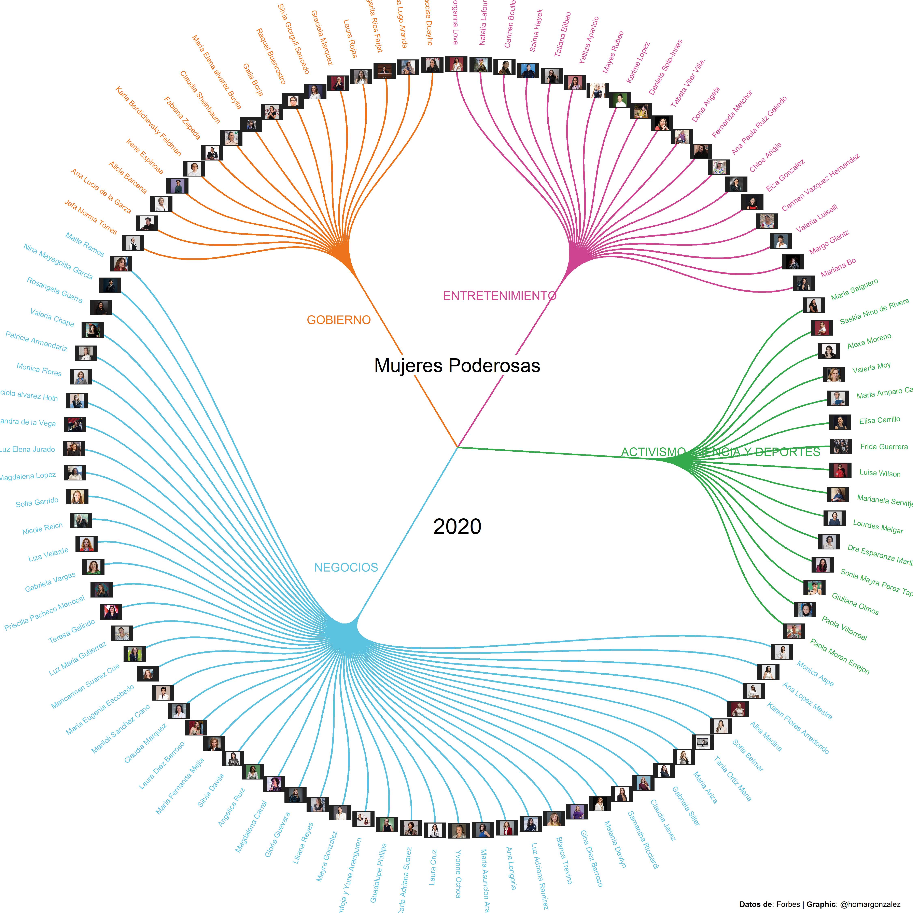

## Inspiración

El pasado 8 de marzo se conmemoró el día internacional de la mujer, por lo que me topé en twitter con diversas publicaciones sobre el tema. Entre dichas publicaciones me llamó la atención esta publicación sobre las mujeres que han recibido un premio Nobel:



<blockquote class="twitter-tweet">
Image processing is greatly inspired by <a href="https://twitter.com/jakekaupp?ref_src=twsrc%5Etfw">@jakekaupp</a> previous <a href="https://twitter.com/hashtag/TidyTuesday?src=hash&amp;ref_src=twsrc%5Etfw">#TidyTuesday</a> contribution. I Highly recommend exploring it! <a href="https://t.co/yxkimSgczh">https://t.co/yxkimSgczh</a>
&mdash; Amit Levinson (@Amit_Levinson) <a href="https://twitter.com/Amit_Levinson/status/1368830439545307136?ref_src=twsrc%5Etfw">March 8, 2021</a></blockquote> 

A pesar de que en dicha publicación viene el código, me llamó aún más la atención la gráfica del top 100 de mujeres de acuerdo a la BBC:

<blockquote class="twitter-tweet">
For this weeks <a href="https://twitter.com/hashtag/TidyTuesday?src=hash&amp;ref_src=twsrc%5Etfw">#TidyTuesday</a> I made another (3rd one this year) celebrating the BBC’s Top 100 Women of 2020.  Code @ <a href="https://t.co/1BhlhPnYyC">https://t.co/1BhlhPnYyC</a> <a href="https://twitter.com/hashtag/rstats?src=hash&amp;ref_src=twsrc%5Etfw">#rstats</a> <a href="https://twitter.com/hashtag/r4ds?src=hash&amp;ref_src=twsrc%5Etfw">#r4ds</a> <a href="https://twitter.com/hashtag/dataviz?src=hash&amp;ref_src=twsrc%5Etfw">#dataviz</a> <a href="https://t.co/MHNzABG6WP">pic.twitter.com/MHNzABG6WP</a>
&mdash; Jake Kaupp (@jakekaupp) <a href="https://twitter.com/jakekaupp/status/1337113343878975493?ref_src=twsrc%5Etfw">December 10, 2020</a></blockquote> 

Con dicho código en mano para hacer la [gráfica final](https://github.com/jkaupp/tidytuesdays/blob/master/2020/week50/R/analysis.R) decidí emprender un pequeño proyecto y hacer una gráfica similar para las mujeres de México.

## Mujeres Poderosas 2020

La revista Forbes publicó, a finales de 2020, una lista con las [100 mujeres más poderosas de México de 2020](https://www.forbes.com.mx/mujeres-poderosas-2020/), donde reconoce la labor de distintas mujeres, cuya labor va del ambito de activismo social, deportes, artistas, personal médico, ejecutivas de empresas, entre otras mujeres que destacaron durante 2020. Cabe señalar que en la [edición impresa](https://issuu.com/forbeslatam/docs/forbes_junio_2020/1?ff=&showOtherPublicationsAsSuggestions=true&backgroundColorFullscreen=%000000&utm_source=descarga&utm_medium=revista&utm_campaign=junio) no ví una lista completa con todas las mujeres, así como tampoco ninguna visualización, lo cual reforzó la idea de continuar con este mini proyecto.

## Desarrollo

El código de la gráfica final está en , y dado que su base de datos ya incluye los nombres de las mujeres, su categoría y los urls de las fotos, para conseguir dichos datos de Forbes, tuve que hacer un poco de de WebScrapping. Si bien ya hice un ejercicio sobre eso [aquí](https://gonzalezhomar.netlify.app/post/mi-primer-mapa/), me topé con al insertar la dirección URL en solicitud normal (Request), la página no se generaba de forma completa.

Por lo anterior tuve que utilizar el paquete Selenium, con el controlador de Chrome, e ir localizando los objetos que tenían la información que requería. Una vez localizados los objetos, los guarde en listas, el nombre, el puesto y la URL de la foto de cada mujer en las 20 páginas que mostraba cada lista. Luego, con el mismo Selenium avance de página, hasta completar el barrido de las 100 mujeres, misma que guarde en un csv. 

Con las direcciones URL de las imagenes, tuve que volver a usar Selenium para visitar los sitios que tiene cada imagen. Lo intenté hacer con  sin éxito, aunque supongo que tiene que ver con como se genera el sitio y que tampoco con el paquete de Request pude generar el código de la página de manera completa. Por ingeniudad no encontré la función para descargar la imagen con el mismo controlador de Chrome, por lo que use el controlador de Firefox y tome capturas de pantalla. Seguramente existe una función más eficiente, pero de momento me funcionó para descargar todas las imagenes.

Los datos los limpié a mano y generé una clasificación que más o menos intenta organizar a las 100 mujeres por grupos. Me decidí por 4 grupos: negocios, gobierno, entretenimiento y en el grupo final, las activistas, cientificas y deportistas. Esto con la finalidad de generar las mismas 4 clasificaciones que tiene el código en . 

Luego de algo de prueba y error con , descubrí que es bastante útil comentar partes de la gráfica para identificar cuál es la línea que tiene el error. Al final, la depuración que hice a mano, la volví a realizar para quitar acentos y la ñ, los cuales también me generaban error (nunca te olvidaré [Doña Angela](https://www.youtube.com/channel/UCJjyyWFwUIOfKhb35WgCqVg)).

El resultado final es la siguiente gráfica:

Seguramente mediante un programa de diseño se puede mejorar mucho la imagen. También debería corregir que los nombres aparezcan completos por aquellos que se salen de los margenes y corregir las imagenes para que no tengan esos bordes negros, pero por el momento estoy satisfecho con el resultado. Dejo el código en el siguiente [repositorio](https://github.com/gonzalezhomar/mujerespoderosas) por si hay sugerencias.

## Post-Data

Este es un tip bastante útil a la hora de trabajar con JupyterLab. Por omisión no guarde el código con el cual estaba trabajando para hacer el Web Scrapping, y al día siguiente que volví a iniciar la notebook, estaba en blanco. Para recuperar el código ingrese a JupyterLab y abrí una nueva terminal. Al usar la flecha hacia arriba me aparecía el último código ejecutado. Dado que una notebook corre el código por bloque, solo tuve dar arriba la última corrida que había hecho de la información.