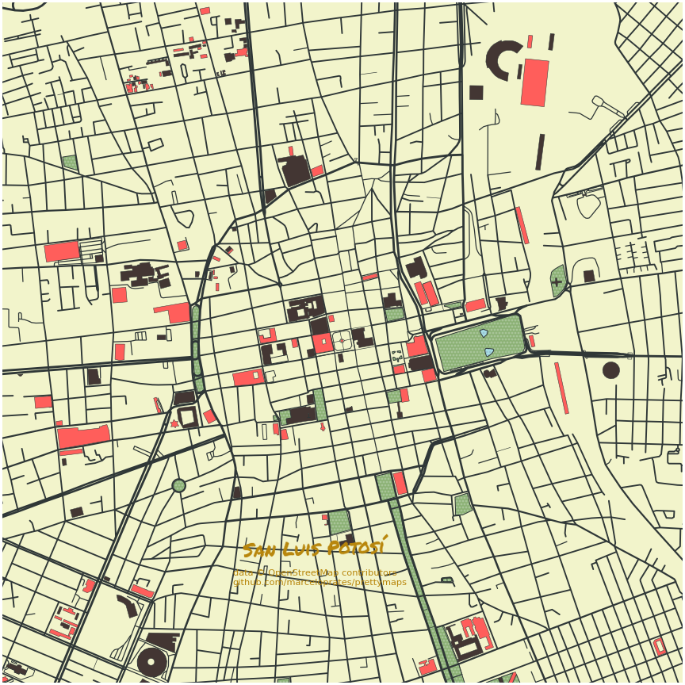

## 1. Introducción

¿Alguna vez han visto algo y han dicho "¡quiero hacerlo!"? Pues me tope con este tweet y me sucedió exactamente eso:





Sin embargo, ¡ah, la instalación! Eso fue lo complicado.

## 2. Instalación

El detalle es que prettymaps no es una librería de Python, es un proyecto que se encuentra en Github [aquí](https://github.com/marceloprates/prettymaps). Siguiendo su instalación, debería de ser muy fácil corriendo la siguiente celda:

```python
! pip install git+https://github.com/abey79/vsketch#egg=vsketch
! pip install git+https://github.com/marceloprates/prettymaps.git
```

Desde que vi que el comando para instalar es con **pip** y no en **conda**, cree un ambiente para poder probarlo sin arruinar el resto de los programas que uso.

```python
conda create -n pmaps
conda activate pmaps
conda install jupyterlab
jupyter lab
```

En la ventana de **jupyter** corrí la celda de instalación, pero aún así no funcionó:

```python
! pip install git+https://github.com/abey79/vsketch#egg=vsketch
! pip install git+https://github.com/marceloprates/prettymaps.git
```

Tuve que instalar Fiona y GDAL, descargando sus correspondientes versiones de [aquí](https://www.lfd.uci.edu/~gohlke/pythonlibs/). Los depósite en mis documentos y en la terminal de python corrí:

```python
pip -m install 'GDAL‑3.3.2‑cp38‑cp38‑win_amd64.whl'
pip -m install 'Fiona‑1.8.20‑cp38‑cp38‑win_amd64.whl'
```

Luego corrí la celda de instalación y parecía funcionar porque ya no me generó error, pero la celda de importación no funcionó: 

```python
import sys; sys.path.append('../')
import warnings
warnings.filterwarnings('ignore')
# Prettymaps
from prettymaps import *
# Vsketch
import vsketch
# OSMNX
import osmnx as ox
# Matplotlib-related
import matplotlib.font_manager as fm
from matplotlib import pyplot as plt
from descartes import PolygonPatch
# Shapely
from shapely.geometry import *
from shapely.affinity import *
from shapely.ops import unary_union
```

Me marcaba que no estaba instalado shapely, así que tuve que desinstalar *shapely* y volverlo a instalar:

```python
pip uninstall shapely
conda install shapely
```

Y finalmente, voila, ¡importación correcta!


## 3. Galería

Disculpe usted, mi sesgo guanajuatense.

### Ciudad de México


### Tijuana


### Ciudad Juárez


### Monterrey


### Guadalajara


### León


### Puebla


### Querétaro


### San Luis Potosí



### Guanajuato


### San Miguel de Allende


### Irapuato


### Abasolo


