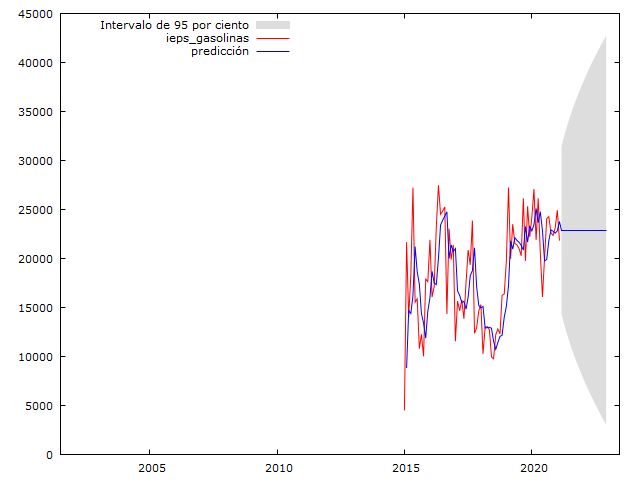

## 1. Motivación

Inspirado por otros [proyectos similares](https://medium.com/mlearning-ai/sarima-vs-prophet-forecasting-time-series-b121e1e2bd37), decidí hacer este proyecto para comparar diferentes metodologías a la hora de realizar proyecciones. Para este ejercicio realizaré estimaciones de los principales impuestos que se recaudan en México con distintas herramientas, para posteriormente evaluar los resultados de cada metodología y cada herramienta. 

Gracias a mi formación como economista, conozco distintas herramientas que permiten analizar series de tiempo y hacer diferentes pronósticos. Sin embargo, desde que incursione en Medium, me he encontrado herramientas que hacen mucho del trabajo de forma [automática](https://towardsdatascience.com/hands-on-time-series-forecasting-with-python-d4cdcabf8aac) y [mucho más sencilla](https://towardsdatascience.com/forecasting-in-python-with-facebook-prophet-29810eb57e66). Si bien ya hay comparaciones entre [como la que señalé antes](https://medium.com/mlearning-ai/sarima-vs-prophet-forecasting-time-series-b121e1e2bd37), decidí comparar las 3 principales herramientas que conozco, por lo que en esta primera parte, se realizará el análisis siguiendo la metodología de la vieja escuela.

## 2. ¿Qué es la vieja escuela?

Con vieja escuela, me refiero a la metodología que aprendí en los salones de clases, que sigue la idea de la [metodología de Box-Jenkins](https://es.wikipedia.org/wiki/Metodología_de_Box-Jenkins), de la cual tomaré como referencia precisamente un artículo desarrollado por mis profesores donde se estiman [la elasticidad ingreso de los impuestos federales en México](https://www.researchgate.net/publication/46548261_Elasticidad_ingreso_de_los_impuestos_federales_en_Mexico_Efectos_en_la_recaudacion_federal_participable) y sus efectos en la Recaudación Federal Participable. Me refiero a esta metodología como vieja escuela, debido a que el proceso de análisis es bastante manual en comparación con otras herramientas que mostraré más adelante.

Esto es de gran importancia para las Entidades Federativas, porque a partir de la Recaudación Federal Participable (RFP) se determinan las participaciones que reciben las Entidades, mismas que son la principal fuente de ingresos de que disponen. Para este proyecto sólo señalaré que la RFP depende de los impuestos federales y de los ingresos petroleros que tiene el Gobierno Federal: Impuesto Sobre la Renta, ISR, que es un impuesto a los ingresos; Impuesto al Valor Agregado, IVA, que es un impuesto al consumo; el Impuesto Especial sobre Producción y Servicios, IEPS, que son impuestos específicos para disminuir el consumo de ciertos bienes, como son el alcohol, el tabaco y las gasolinas; y los ingresos petroleros que recibe el Gobierno Federal vía el Fondo Mexicano del Petroleo para la Estabilización y el Desarrollo. 

Por lo anterior, es de gran importancia hacer pronósticos de dichas contribuciones. Sobre este tema podría determe más, y de hecho, espero poder hacerlo futuras entradas y escribir más sobre la RFP, las participaciones y las finanzas públicas.

## 3. Datos

Al igual que el trabajo que tomaré como base, usaré el Producto Interno Bruto (PIB) de México que publica el [Instituto Nacional de Estadística y Geografía (INEGI)](https://www.inegi.org.mx/temas/pib/) como variable para explicar el ISR y el IVA. De hecho, de esa misma fuente tomaré el Índice de Precios Ímplicito (IPI) para convertir las series de ISR e IVA a términos reales.

Los datos para la RFP los tomé de las [Estadísticas Oportunas de Finanzas Públicas](http://presto.hacienda.gob.mx/EstoporLayout/estadisticas.jsp) de donde se pueden consultar las series que componen dicha RFP a partir de 2002. Cabe señalar que existe un desfase de 2 meses entre dichos impuestos (según la RFP) con el período que lo causa, puesto que el ISR de marzo, corresponde a la recaudación de febrero, que a su vez, corresponde con la actividad del mes de enero. De esta manera se construyó la serie trimestral para alinearla con el PIB. Lamentablemente por ello, al momento de escribir esto, no existe ninguna observación para el año de 2021, y de hecho, la información pública más reciente llega precisamente hasta el mes de febrero de 2021, que con los 2 meses de desfase, corresponde precisamente a diciembre de 2020.

Por otro lado, el trabajo que tomo como base, construyó las series hacia atrás, desde 1980; sin embargo, yo sólo tomaré los datos de los impuestos de la fuente señalada para evitar distorciones que pueden ocurrir por los cambios ímplicitos en la composición de estos impuestos (ver la sección más adelante de quiebres estructurales). 

## 4. Análisis de Series de Tiempo

No daré un curso completo de series de tiempo (aún), por lo que sólo replicaré los [resultados que había señalado antes,](https://www.researchgate.net/publication/46548261_Elasticidad_ingreso_de_los_impuestos_federales_en_Mexico_Efectos_en_la_recaudacion_federal_participable), paso a paso. Para este trabajo "artesanal" utilizaré el software de uso libre [Gretl](http://gretl.sourceforge.net).

### 4.1 Estacionariedad de las Variables

Al graficar las series, se observa que parecen tener un componente de tendencia:

Si las series en efecto, tienen un componente de tendendencia el análisis que se haga sobre ellas no será valido. Para verificar la tendencia, se puede aplicar la prueba de contraste aumentado de Dickey Fuller (ADF-GLS), con lo que se concluye que todas las series, con excepción del IEPS federal a las gasolinas y diésel tienen raíz unitaria, pero esta se elimina al tomar las series en primera diferencia (* denota un valor p menor al 0.10, ** denota un valor p menor al 0.05 y *** denota un valor p menor al 0.01):

|                     | Series en niveles   |               | Series en 1a diferencia |              |
|---------------------|---------------------|---------------|-------------------------|--------------|
|                     | Estadístico ADF-GLS | Decisión      | Estadístico ADF-GLS     | Decisión     |
| PIB Real            | 0.551355            | Raíz Unitaria | -3.94495***             | Estacionaria |
| ISR                 | 0.429026            | Raíz Unitaria | -8.86314***             | Estacionaria |
| IVA                 | 0.977611            | Raíz Unitaria | -8.9659***              | Estacionaria |
| IEPS Gasolinas      | -2.20862*           | Estacionaria  |                         |              |
| IEPS Tabacos        | 0.778939            | Raíz Unitaria | -12.9321***             | Estacionaria |
| IEPS Bebidas        | -0.819642           | Raíz Unitaria | -4.11971***             | Estacionaria |
| IEPS Cervezas       | -0.0204768          | Raíz Unitaria | -6.62772***             | Estacionaria |
| Ingresos Petroleros | -1.11749            | Raíz Unitaria | -10.7126***             | Estacionaria |                                         

### 4.2 Cointegración de las Series

Una vez que se tienen los resultados de las series, se puede verificar si las series en efecto están relacionadas y es correcto utilizar a una para explicar a la otra. Para ello, utilizaré la prueba de cointegración de Engle-Granger. En esta prueba se verifica primero que las dos series a utilizar tengan raíz unitaria (paso que ya se realizó), luego se verifica si al hacer la regresión por Mínimos Cuadrados Ordinarios (MCO) entre ellas, su residual es estacionario. Los resultados se muestran a continuación:

| Variable Dependiente | Variable Explícativa| ADF-GLS de res. MCO | Decisión |
|--------------------- |---------------------|---------------|--------|
| ISR                  | PIB Real            | -3.33379** | Estacionaria |
| IVA                  | PIB Real            | -3.76450** | Estacionaria |
| IEPS Tabacos         | PIB Real            | -3.28787   | Raíz Unitaria |
| IEPS Bebidas         | PIB Real            | -3.23097   | Raíz Unitaria |
| IEPS Cervezas        | PIB Real            | -2.41072   | Raíz Unitaria |
| Ingresos Petroleros  | PIB Real            | -2.10293   | Raíz Unitaria |

Por lo tanto, y dado que los residuales del MCO en el caso del ISR y del IVA con el PIB son estacionarios, se considera correcto utilizar el PIB como variable para explicar el ISR y el IVA; dado que se tiene el caso contrario para el resto de los impuestos y de los ingresos petroleros, no se utilizará el PIB como variable explicativa para las otras variables.

### 4.3 Quiebres Estructurales

Por otro lado, es necesario identificar si las series que se analizan presentan cambios estructurales que pueden deberse a mofificaciones legislativas u otro hechos que sean económicamente relevantes. Para revisar esto, se hace primero una regresión entre las variables que se van a analizar, en este caso, ISR e IVA, y la variable explicativa PIB. Luego se aplican las pruebas CUSUM y CUSUMQ para identificar posibles quiebres. Luego se verifican con la prueba de Chow

| Variable  | Quiebres CUSUM  | Quiebres CUSUMQ    | Valor p, prueba de Chow |
|---------- |-----------      |---------------|--------|
| ISR       | 2008-T1  | 2012-T1, 2014-T1, 2017-T2     | 2008-T1***,  2012-T1***, 2014-T1***, 2017-T2*** |
| IVA       | 2018-T1         | 2010-T1     | 2018-T1, 2010-T1*** |

Como resultado de las pruebas, la prueba de Chow indica que todos los quiebres son significativos, mientras que en el caso del IVA, solo es significativo el quiebre del primer trimestre de 2010. Con estos resultados hay que voltear a los cambios institucionales para identificar cuáles cambios coinciden con eventos económicos. 

En el caso del IVA, el quiebre significativo coincide con el incremento general de la tasa del IVA del 15% al 16%. Por lo anterior, se considera adecuado agregar una variable explicativa, que indique la tasa del impuesto antes de 2010 (15%) y después (16%). De hecho, antes de 2002, la tasa estuvo cambiando entre 10% y 15%, pero mi muestra no llega hasta esas fechas.  

Para el caso del ISR, y en cuanto a los quiebres identificados, únicamente identifico la reforma del ISR que entró en vigor a partir de 2014. Como resultado de dicha reforma, se tuvo una Ley del Impuesto Sobre la Renta completamente nueva, por lo que se considera adecuado a utilizar una variable dummy que indica el período en el cual entro en vígor la última reforma del ISR (1 a partir de 2014).

De hecho, en ambos análisis del ISR y del IVA, también hice el análisis de incluir una variable dummy que señalara que los últimos 3 trimestres de 2020, donde hubo crisis económica, pero resultó no ser significativa, por lo que no la consideré en el modelo final. Esto se debe a que a través del PIB ya se incluyé el efecto económico de la crisis en la estimación.

Para el caso de las otras variables no se realiza la prueba CUSUM pues no se tiene variable explícativa. Sin embargo, sí hice un ajuste en el IEPS federal a gasolinas y diésel intencionalmente para dejar fuera la parte de la serie anterior a 2015. Esto lo hago porque justo en ese año hubo una reforma importante en ese impuesto para cobrarlo a cuotas por litro, mientras que antes de dicha reforma, el IEPS se utilizaba para controlar el precio de las gasolinas, e incluso podía llegar a ser negativo (subsidio al precio final).

## 5. Modelo ARIMA

Una vez analizada la estacionariedad de las series, la cointegración y los quiebres estructurales, procedo a realizar la estimación del modelo. Los análisis que hice hasta ahora, son bastantes puntuales, los hice, obtuve el resultado y con un poco de análisis tengo una propuesta de modelo. Sin embargo, dado que estoy trabajando con series de tiempo, tengo que buscar un modelo ARIMA que explique correctamente los datos que tengo.

Los modelos ARIMA deben su nombre a sus tres componentes: AR por autoregresivos, I por Integrados y MA por media móvil (moving average), y pueden incluir retardos de primer orden, que se suelen denotar (p,d,q) o de orden de integración que se denotan (P,D,Q). Con ello hay 6 variables a elegir y esta parte me parece bastante artística: hay que elegir una especificación, hacer pruebas para ver que el modelo sea correcto y comparar distintos modelos. 

Aquí podría detenerme mucho más tiempo, pero me auxiliaré de una herramienta que tiene Gretl, el análisis ARIMA X-13 (que se descarga por separado, aunque dentro del mismo Gretl aparezca como X-12) y que de cada serie, genera una propuesta de modelo ARIMA. Solo en el caso del ISR y del IVA, además del resultado del modelo ARIMA X-13, agregué el PIB y las variables explicativas que señalé antes. De hecho, para tener una mejor estimación y debido a que no tengo variables explicativas para el resto de los impuestos, me regresaré a trabajar con sus series mensuales. Los resultados del modelo son los siguientes:

| Variable Dependiente | Modelo ARIMA   | Criterio de Akaike |
|--------------------- |----------------|---------------|
| ISR                  | (0,0,1)(0,1,0) | 1,850.4  | 
| IVA                  | (0,1,1)(0,1,1) | 1,549.8  |
| IEPS Gasolinas       | (0,1,1)        | 1,435.23 |
| IEPS Tabacos         | (3,0,1)(0,1,1) | 3,952.27 |
| IEPS Bebidas         | (0,1,1)(0,1,1) | 3,143.71 |
| IEPS Cervezas        | (0,0,0)(0,1,1) | 3,237.04 |
| Ingresos Petroleros  | (2,1,2)(1,0,0) | 4,957.82 |

Cada uno de estos modelos los dejo guardados en un archivo de sesión de Gretl, que junto con su archivo de datos se encuentra disponible en el [siguiente repositorio.](https://github.com/gonzalezhomar/articulos_pronosticos). Lamentablemente las estimaciones que arrojan dichos modelos tienen muchos coeficientes poco significativos y se podría trabajar más en ellos para mejorar su estimación. De momento no lo hago, para ajustarme al resultado que arroja esta metodología.

También podría hacer el análisis no en niveles, sino en logaritmos para obtener la elasticidad (si cambia 1% del PIB en que porcentaje cambiarían los ingresos), pero aquí me separó del trabajo fuente, para únicamente quedarme con el pronóstico en niveles.

## 6. Conclusión y Pronósticos

Para estimar hacia adelante, necesito observaciones futuras del PIB, mismas que construí con base en la proyección del Banco de México, el cual estima un crecimiento de 4.8% para 2021 en la diapositiva 30 de su último [informe trimestral octubre- diciembre 2020.](https://www.banxico.org.mx/publicaciones-y-prensa/informes-trimestrales/%7B18B4DAE3-6904-B869-BECC-0556489711D8%7D.pdf) Con base en dicha proyección del PIB, los pronósticos del ISR y del IVA, así como los del IEPS y los petroleros que no dependen del PIB, son los siguientes:

Sin embargo, de momento solo quiero la próxima observación del ISR y del IVA, cuya serie es trimestral y las próximas 3 del resto de los ingresos; con ello la primera estimación para el primer trimestre de 2021 sería la siguiente:

| Variable  | Primer Trimestre 2021   |
|--------------------- |---------------:|
| ISR                  | 484,002.95     |
| IVA                  | 234,892.56     |
| IEPS Gasolinas       | 68,678.40      |
| IEPS Tabacos         | 3,889.50       |
| IEPS Bebidas         | 4,973.40       |
| IEPS Cervezas        | 7,954.10       |
| Ingresos Petroleros  | 39,429.80      |

Estas son las proyecciones que obtuve con esta metodología "a la vieja escuela". En el próximo capítulo presentaré otra metodología y otros resultados, con el objetivo de comparar 3 metodologías y ver cuál de ellas, resulta ser la mejor proyección. Pero eso, lo sabré hasta el 30 de junio. Por el momento, eso es to, eso es to, eso es todo amigos.