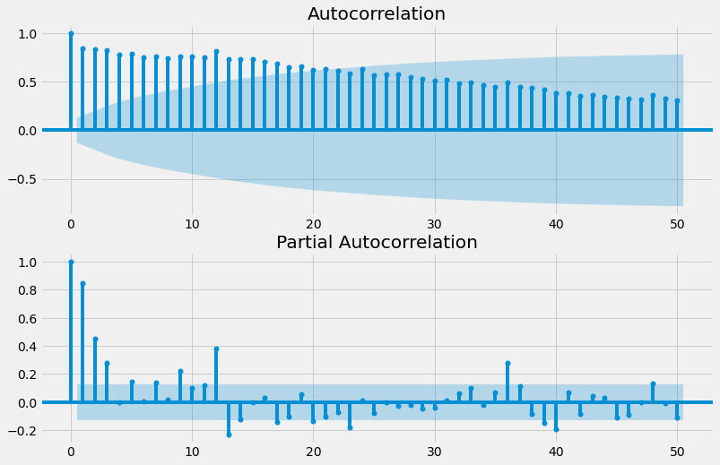

## 1. Introducción

En la [parte 1](https://gonzalezhomar.netlify.app/post/pronostico_1_manual/) presente el problema de hacer pronósticos para los principales impuestos de México, abordando el tema desde una metodología "a la vieja escuela". En esta parte 2 se tratará el mismo problema utilizando Python con las librerias statsmodels y *pmdarima*. En la [parte 3](https://gonzalezhomar.netlify.app/post/pronostico_3_prophet/) se hará el mismo ejercicio, utilizando la herramienta Prophet desarrollada por Facebook.

Daré por sentado la construcción de la base de datos y buena parte del análisis estadístico que ya realicé en la parte 1, por lo que me citaré a mi mismo cuando así lo consideré... yo mismo... jeje. Buena parte del código que utilizó en esta parte está inspirado en [esta publicación de Medium](https://towardsdatascience.com/hands-on-time-series-forecasting-with-python-d4cdcabf8aac), con algunos ajustes que consideré oportunos. La *notebook* con el código completo de esta publicación se puede encontrar en mi repositorio de [Github](https://github.com/gonzalezhomar/articulos_pronosticos) o la pueden ver directamente [aquí](https://nbviewer.jupyter.org/github/gonzalezhomar/articulos_pronosticos/blob/main/Pronostico_2.ipynb).

## 2. ¿Nueva Escuela?

El trabajo de la parte 1, la hice utilizando el software de uso libre [Gretl](http://gretl.sourceforge.net) y todo el análisis de series de tiempo lo hice "manualmente." Con ello me refiero a que para realizar cada paso, seleccionaba una opción dentro del programa mediante un clic, cambiando opciones y leyendo los resultados que aparecian en diversas ventanas que arrojaba el mismo Gretl. Al final, conjuntar los resultados fue un trabajo que resultó igualmente complicado, por lo que en esta parte podré agregar muchas más gráficas.

Sin embargo, y como señalé en [otra publicación](https://gonzalezhomar.netlify.app/post/Sobre_Notebooks_y_Ciencia_de_Datos/), interfaces como Jupyter me parecen un gran avance en la publicación de contenido científico. Las *notebooks*, ya sea que hayan sido generadas con Jupyter o con otros programas similares, consisten en una mezcla de código de programación, resultados de dicho código, texto explícativo y contenido científico fácilmente reproducible. 

De esta manera, si organizó bien mis datos y el código necesario para analizarlos, puedo actualizar fácilmente el análisis al actualizar los datos y puedo ver los resultados en una misma pantalla. De esta manera, escribo las instrucciones 1 vez y me sirven para repetir el mismo análisis toda la vida. Espero que pronto se puedan integrar Jupyter y Gretl, como ya se puede integrar [Jupyter y STATA](https://kylebarron.dev/stata_kernel/getting_started/), otro de mis softwares favoritos de economista. Cuando pueda hacerlo, voy a automatizar gran parte del análisis económetrico combinando ambas herramientas... en otras palabras, haré algo más grande y poderoso (inserte risa de villano aquí).

Una de las grandes ventajas de usar Jupyter para escribir esta *notebook*/blog, es que como todo lo hice en una misma *notebook*, puedo incluir todas las gráficas que hice y todo el análisis sin mayor problema. Sin embargo, si lo hago esta publicación quedaría muy larga, por lo que solo repetiré el análisis para el IEPS Cervezas, para el IVA y para el ISR. Para ver el análisis completo, les sugiero ver mi [*notebook*](https://nbviewer.jupyter.org/github/gonzalezhomar/articulos_pronosticos/blob/main/Pronostico_2.ipynb).

## 3. Análisis de las Series Mensuales

Cómo ya se concluyó en la parte 1, para el caso del IEPS federal a las gasolinas y diésel, a las cervezas, a las bebidas alcohólicas y a los tabacos, así como a los ingresos petroleros, no tengo a la mano una variable explicativa adecuada, por lo que su análisis lo haré de manera mensual. Con esto tengo un mayor número de observaciones y puedo ver la estacionalidad mensual que es natural en estas series. En lo general, la metodología que sigo es la misma [metodología de Box-Jenkins](https://es.wikipedia.org/wiki/Metodología_de_Box-Jenkins), aplicando una técnica de los modelos de aprendizaje automático. 

Como señalé antes, los principales paquetes que utilizó son las librerías statsmodels y *pmdarima*, así que sin más, vamos serie por serie:

### 3.1 IEPS Cervezas

Como señale antes, aquí sí incluiré todas las gráficas y análisis para esta serie de IEPS Cervezas, por lo que esta primera parte quedará un poco larga. Para comenzar, la serie en niveles y su histograma se ven cómo sigue:
    


Si bien en la parte 1 no incluí esta gráfica que resulta del análisis ARIMA X-13, aquí incluyó la descomposicion de la serie en su parte de tendencia, estacionalidad y su residuo:
    


Esto no lo hice en la parte 1, pero en Gretl también es posible analizar los correlogramas de la serie:


    
Al igual que Gretl, la prueba Dickey-Fuller me dice que la serie tiene raíz unitaria:

    Results of Dickey-Fuller Test:
    Test Statistic                  -0.716105
    p-value                          0.842534
    #Lags Used                      12.000000
    Number of Observations Used    217.000000
    Critical Value (1%)             -3.460849
    Critical Value (5%)             -2.874953
    Critical Value (10%)            -2.573919
    dtype: float64
    
En cambio, al tomar la serie en primeras diferencias, resulta ser estacionaria, por lo que conviene trabajar con ella en diferencias:

    Results of Dickey-Fuller Test:
    Test Statistic                -6.498416e+00
    p-value                        1.178360e-08
    #Lags Used                     1.300000e+01
    Number of Observations Used    2.030000e+02
    Critical Value (1%)           -3.462980e+00
    Critical Value (5%)           -2.875885e+00
    Critical Value (10%)          -2.574416e+00
    dtype: float64
    

    
Y los correlogramas de la serie en diferencias, parecen indicar que el mejor modelo para explicar la serie es un ARIMA(1,0,1):


    
Sin embargo, para saber si este en realidad es el mejor modelo para explicar la serie, utilizaré una herramienta del paquete *pmdarima*, que se llama **"auto_arima"**. Esta herramienta corre diferentes modelos ARIMA, sólo hay que indicar la periodicidad de la serie, que como es anual, es un modelo ARIMA(p,d,q)(P,D,Q,12), que se ve como sigue:

```python
model = pm.auto_arima(ieps_cervezas, d=1, D=1,
                      seasonal=True, m=12, trend='c', 
                      start_p=0, start_q=0, max_order=6, test='adf', stepwise=True, trace=True)
```

    Fit ARIMA: order=(0, 1, 0) seasonal_order=(1, 1, 1, 12); AIC=3215.509, BIC=3229.028, Fit time=0.765 seconds
    Fit ARIMA: order=(0, 1, 0) seasonal_order=(0, 1, 0, 12); AIC=3274.973, BIC=3281.732, Fit time=0.024 seconds
    Fit ARIMA: order=(1, 1, 0) seasonal_order=(1, 1, 0, 12); AIC=3209.281, BIC=3222.801, Fit time=0.437 seconds
    Fit ARIMA: order=(0, 1, 1) seasonal_order=(0, 1, 1, 12); AIC=3141.513, BIC=3155.032, Fit time=0.586 seconds
    Fit ARIMA: order=(0, 1, 1) seasonal_order=(1, 1, 1, 12); AIC=3140.657, BIC=3157.557, Fit time=0.891 seconds
    Fit ARIMA: order=(0, 1, 1) seasonal_order=(1, 1, 0, 12); AIC=3179.284, BIC=3192.804, Fit time=0.592 seconds
    Fit ARIMA: order=(0, 1, 1) seasonal_order=(1, 1, 2, 12); AIC=3133.704, BIC=3153.983, Fit time=2.321 seconds
    Fit ARIMA: order=(1, 1, 1) seasonal_order=(1, 1, 2, 12); AIC=3132.632, BIC=3156.291, Fit time=4.415 seconds
    Fit ARIMA: order=(1, 1, 0) seasonal_order=(1, 1, 2, 12); AIC=3162.082, BIC=3182.361, Fit time=2.903 seconds
    Fit ARIMA: order=(1, 1, 2) seasonal_order=(1, 1, 2, 12); AIC=3137.662, BIC=3164.701, Fit time=4.037 seconds
    Fit ARIMA: order=(0, 1, 0) seasonal_order=(1, 1, 2, 12); AIC=3210.118, BIC=3227.018, Fit time=2.399 seconds
    Fit ARIMA: order=(1, 1, 1) seasonal_order=(0, 1, 2, 12); AIC=3135.671, BIC=3155.951, Fit time=3.766 seconds
    Fit ARIMA: order=(1, 1, 1) seasonal_order=(2, 1, 2, 12); AIC=3129.432, BIC=3156.471, Fit time=6.494 seconds
    Fit ARIMA: order=(1, 1, 1) seasonal_order=(2, 1, 1, 12); AIC=3129.409, BIC=3153.069, Fit time=3.582 seconds
    Fit ARIMA: order=(1, 1, 1) seasonal_order=(1, 1, 0, 12); AIC=3174.904, BIC=3191.804, Fit time=1.014 seconds
    Fit ARIMA: order=(0, 1, 1) seasonal_order=(2, 1, 1, 12); AIC=3128.580, BIC=3148.859, Fit time=4.524 seconds
    Fit ARIMA: order=(0, 1, 0) seasonal_order=(2, 1, 1, 12); AIC=3211.903, BIC=3228.802, Fit time=1.368 seconds
    Fit ARIMA: order=(0, 1, 2) seasonal_order=(2, 1, 1, 12); AIC=3129.810, BIC=3153.469, Fit time=5.210 seconds
    Fit ARIMA: order=(1, 1, 2) seasonal_order=(2, 1, 1, 12); AIC=3132.568, BIC=3159.607, Fit time=4.221 seconds
    Fit ARIMA: order=(0, 1, 1) seasonal_order=(2, 1, 0, 12); AIC=3149.408, BIC=3166.307, Fit time=3.780 seconds
    Fit ARIMA: order=(0, 1, 1) seasonal_order=(2, 1, 2, 12); AIC=3127.986, BIC=3151.645, Fit time=4.317 seconds
    Fit ARIMA: order=(0, 1, 0) seasonal_order=(2, 1, 2, 12); AIC=3211.966, BIC=3232.245, Fit time=4.766 seconds
    Fit ARIMA: order=(0, 1, 2) seasonal_order=(2, 1, 2, 12); AIC=3131.090, BIC=3158.130, Fit time=7.191 seconds
    Total fit time: 69.617 seconds
    
Con ello, los resultados del modelo que mejor ajusta la serie son los siguientes:

```python
model.summary()
```
<table class="simpletable">
<caption>SARIMAX Results</caption>
<tr>
  <th>Dep. Variable:</th>                    <td>y</td>                  <th>  No. Observations:  </th>    <td>230</td>   
</tr>
<tr>
  <th>Model:</th>           <td>SARIMAX(0, 1, 1)x(2, 1, [1, 2], 12)</td> <th>  Log Likelihood     </th> <td>-1556.993</td>
</tr>
<tr>
  <th>Date:</th>                     <td>Thu, 18 Mar 2021</td>           <th>  AIC                </th> <td>3127.986</td> 
</tr>
<tr>
  <th>Time:</th>                         <td>14:12:30</td>               <th>  BIC                </th> <td>3151.645</td> 
</tr>
<tr>
  <th>Sample:</th>                           <td>0</td>                  <th>  HQIC               </th> <td>3137.544</td> 
</tr>
<tr>
  <th></th>                               <td> - 230</td>                <th>                     </th>     <td> </td>    
</tr>
<tr>
  <th>Covariance Type:</th>                 <td>opg</td>                 <th>                     </th>     <td> </td>    
</tr>
</table>
<table class="simpletable">
<tr>
      <td></td>         <th>coef</th>     <th>std err</th>      <th>z</th>      <th>P>|z|</th>  <th>[0.025</th>    <th>0.975]</th>  
</tr>
<tr>
  <th>intercept</th> <td>   -0.3917</td> <td>    2.461</td> <td>   -0.159</td> <td> 0.874</td> <td>   -5.215</td> <td>    4.431</td>
</tr>
<tr>
  <th>ma.L1</th>     <td>   -0.7472</td> <td>    0.025</td> <td>  -30.127</td> <td> 0.000</td> <td>   -0.796</td> <td>   -0.699</td>
</tr>
<tr>
  <th>ar.S.L12</th>  <td>    0.3330</td> <td>    0.182</td> <td>    1.830</td> <td> 0.067</td> <td>   -0.024</td> <td>    0.690</td>
</tr>
<tr>
  <th>ar.S.L24</th>  <td>   -0.4459</td> <td>    0.081</td> <td>   -5.480</td> <td> 0.000</td> <td>   -0.605</td> <td>   -0.286</td>
</tr>
<tr>
  <th>ma.S.L12</th>  <td>   -0.9548</td> <td>    0.186</td> <td>   -5.126</td> <td> 0.000</td> <td>   -1.320</td> <td>   -0.590</td>
</tr>
<tr>
  <th>ma.S.L24</th>  <td>    0.3051</td> <td>    0.165</td> <td>    1.849</td> <td> 0.064</td> <td>   -0.018</td> <td>    0.629</td>
</tr>
<tr>
  <th>sigma2</th>    <td> 9.463e+04</td> <td> 4685.003</td> <td>   20.198</td> <td> 0.000</td> <td> 8.54e+04</td> <td> 1.04e+05</td>
</tr>
</table>
<table class="simpletable">
<tr>
  <th>Ljung-Box (L1) (Q):</th>     <td>0.20</td> <th>  Jarque-Bera (JB):  </th> <td>678.08</td>
</tr>
<tr>
  <th>Prob(Q):</th>                <td>0.65</td> <th>  Prob(JB):          </th>  <td>0.00</td> 
</tr>
<tr>
  <th>Heteroskedasticity (H):</th> <td>9.17</td> <th>  Skew:              </th>  <td>-0.21</td>
</tr>
<tr>
  <th>Prob(H) (two-sided):</th>    <td>0.00</td> <th>  Kurtosis:          </th>  <td>11.65</td>
</tr>
</table><br/>

Ahora viene uno de las técnicas de las herramientas de aprendizaje automático (*machine learning*): dividir la serie en una parte que servirá de entrenamiento y en otra donde se probará que tan efectivo fue el modelo encontrado. La serie dividida se ve como sigue:


    
Los resultados del modelo anterior se especifican en el siguiente código, con lo cual el mismo programa buscará los coeficientes que mejor se ajustan a la muestra de entrenamiento. Los resultados también se muestran a continuación:

```python
model = SARIMAX(train,order=(0,1,1),seasonal_order=(2,1,2,12))
results = model.fit()
results.summary()
```
<table class="simpletable">
<caption>SARIMAX Results</caption>
<tr>
  <th>Dep. Variable:</th>              <td>ieps_cervezas</td>            <th>  No. Observations:  </th>    <td>195</td>   
</tr>
<tr>
  <th>Model:</th>           <td>SARIMAX(0, 1, 1)x(2, 1, [1, 2], 12)</td> <th>  Log Likelihood     </th> <td>-1244.821</td>
</tr>
<tr>
  <th>Date:</th>                     <td>Thu, 18 Mar 2021</td>           <th>  AIC                </th> <td>2501.642</td> 
</tr>
<tr>
  <th>Time:</th>                         <td>14:14:17</td>               <th>  BIC                </th> <td>2520.866</td> 
</tr>
<tr>
  <th>Sample:</th>                      <td>01-01-2002</td>              <th>  HQIC               </th> <td>2509.435</td> 
</tr>
<tr>
  <th></th>                            <td>- 03-01-2018</td>             <th>                     </th>     <td> </td>    
</tr>
<tr>
  <th>Covariance Type:</th>                 <td>opg</td>                 <th>                     </th>     <td> </td>    
</tr>
</table>
<table class="simpletable">
<tr>
      <td></td>        <th>coef</th>     <th>std err</th>      <th>z</th>      <th>P>|z|</th>  <th>[0.025</th>    <th>0.975]</th>  
</tr>
<tr>
  <th>ma.L1</th>    <td>   -0.9053</td> <td>    0.036</td> <td>  -25.347</td> <td> 0.000</td> <td>   -0.975</td> <td>   -0.835</td>
</tr>
<tr>
  <th>ar.S.L12</th> <td>    0.8870</td> <td>    0.215</td> <td>    4.128</td> <td> 0.000</td> <td>    0.466</td> <td>    1.308</td>
</tr>
<tr>
  <th>ar.S.L24</th> <td>   -0.2701</td> <td>    0.129</td> <td>   -2.101</td> <td> 0.036</td> <td>   -0.522</td> <td>   -0.018</td>
</tr>
<tr>
  <th>ma.S.L12</th> <td>   -1.5564</td> <td>    0.232</td> <td>   -6.700</td> <td> 0.000</td> <td>   -2.012</td> <td>   -1.101</td>
</tr>
<tr>
  <th>ma.S.L24</th> <td>    0.7171</td> <td>    0.199</td> <td>    3.605</td> <td> 0.000</td> <td>    0.327</td> <td>    1.107</td>
</tr>
<tr>
  <th>sigma2</th>   <td> 4.772e+04</td> <td> 2842.199</td> <td>   16.790</td> <td> 0.000</td> <td> 4.22e+04</td> <td> 5.33e+04</td>
</tr>
</table>
<table class="simpletable">
<tr>
  <th>Ljung-Box (L1) (Q):</th>     <td>0.36</td>  <th>  Jarque-Bera (JB):  </th> <td>2002.90</td>
</tr>
<tr>
  <th>Prob(Q):</th>                <td>0.55</td>  <th>  Prob(JB):          </th>  <td>0.00</td>  
</tr>
<tr>
  <th>Heteroskedasticity (H):</th> <td>10.62</td> <th>  Skew:              </th>  <td>-1.59</td> 
</tr>
<tr>
  <th>Prob(H) (two-sided):</th>    <td>0.00</td>  <th>  Kurtosis:          </th>  <td>18.94</td> 
</tr>
</table><br/><br/>

Los resultados de este modelo se pueden analizar con base en los residuales que parecen estar centrados en cero.


    
Comparando las predicciones del modelo con la parte de prueba, parece ser que el modelo ajusta razonablemente bien. Solo se observan diferencias importantes en los meses más duros de la crisis del COVID-19.
    

    
Podría mostrar los estadisticos que arroja el módelo, pero vine por la estimación, con lo cual concluyó la presente sección:


### 3.2 IEPS Bebidas

Todo el análisis de IEPS cervezas, lo hice también para esta serie de IEPS a las bebidas alcohólicas, por lo que aquí me limitaré a dejar los principales resultados. A continuación, solo mostraré los principales resultados para la serie de IEPS a las bebidas alcohólicas. Nuevamente uso la función **auto_arima** para encontrar el mejor módelo:

```python
model = pm.auto_arima(ieps_bebidas, d=1, D=1,
                      seasonal=True, m=12, trend='c', 
                      start_p=0, start_q=0, max_order=6, test='adf', stepwise=True, trace=True)
```
    Fit ARIMA: order=(0, 1, 0) seasonal_order=(1, 1, 1, 12); AIC=3260.639, BIC=3274.159, Fit time=1.068 seconds
    Fit ARIMA: order=(0, 1, 0) seasonal_order=(0, 1, 0, 12); AIC=3331.089, BIC=3337.849, Fit time=0.023 seconds
    Fit ARIMA: order=(1, 1, 0) seasonal_order=(1, 1, 0, 12); AIC=3229.225, BIC=3242.745, Fit time=0.448 seconds
    Fit ARIMA: order=(0, 1, 1) seasonal_order=(0, 1, 1, 12); AIC=3142.472, BIC=3155.992, Fit time=0.771 seconds
    Fit ARIMA: order=(0, 1, 1) seasonal_order=(1, 1, 1, 12); AIC=3145.709, BIC=3162.608, Fit time=0.973 seconds
    Fit ARIMA: order=(0, 1, 1) seasonal_order=(0, 1, 0, 12); AIC=3206.336, BIC=3216.475, Fit time=0.244 seconds
    Fit ARIMA: order=(0, 1, 1) seasonal_order=(0, 1, 2, 12); AIC=3143.741, BIC=3160.641, Fit time=2.442 seconds
    Fit ARIMA: order=(0, 1, 1) seasonal_order=(1, 1, 2, 12); AIC=3141.720, BIC=3161.999, Fit time=4.269 seconds
    Fit ARIMA: order=(1, 1, 1) seasonal_order=(1, 1, 2, 12); AIC=3143.043, BIC=3166.702, Fit time=5.539 seconds
    Fit ARIMA: order=(0, 1, 0) seasonal_order=(1, 1, 2, 12); AIC=3262.668, BIC=3279.568, Fit time=6.342 seconds
    Fit ARIMA: order=(0, 1, 2) seasonal_order=(1, 1, 2, 12); AIC=3143.098, BIC=3166.758, Fit time=9.673 seconds
    Fit ARIMA: order=(1, 1, 2) seasonal_order=(1, 1, 2, 12); AIC=3145.743, BIC=3172.782, Fit time=7.159 seconds
    Fit ARIMA: order=(0, 1, 1) seasonal_order=(2, 1, 2, 12); AIC=3147.645, BIC=3171.304, Fit time=6.668 seconds
    Total fit time: 45.629 seconds
    
```python
model.summary()
```
<table class="simpletable">
<caption>SARIMAX Results</caption>
<tr>
  <th>Dep. Variable:</th>                    <td>y</td>                  <th>  No. Observations:  </th>    <td>230</td>   
</tr>
<tr>
  <th>Model:</th>           <td>SARIMAX(0, 1, 1)x(1, 1, [1, 2], 12)</td> <th>  Log Likelihood     </th> <td>-1564.860</td>
</tr>
<tr>
  <th>Date:</th>                     <td>Thu, 18 Mar 2021</td>           <th>  AIC                </th> <td>3141.720</td> 
</tr>
<tr>
  <th>Time:</th>                         <td>14:27:13</td>               <th>  BIC                </th> <td>3161.999</td> 
</tr>
<tr>
  <th>Sample:</th>                           <td>0</td>                  <th>  HQIC               </th> <td>3149.912</td> 
</tr>
<tr>
  <th></th>                               <td> - 230</td>                <th>                     </th>     <td> </td>    
</tr>
<tr>
  <th>Covariance Type:</th>                 <td>opg</td>                 <th>                     </th>     <td> </td>    
</tr>
</table>
<table class="simpletable">
<tr>
      <td></td>         <th>coef</th>     <th>std err</th>      <th>z</th>      <th>P>|z|</th>  <th>[0.025</th>    <th>0.975]</th>  
</tr>
<tr>
  <th>intercept</th> <td>    0.0311</td> <td>    1.296</td> <td>    0.024</td> <td> 0.981</td> <td>   -2.509</td> <td>    2.571</td>
</tr>
<tr>
  <th>ma.L1</th>     <td>   -0.9296</td> <td>    0.032</td> <td>  -29.057</td> <td> 0.000</td> <td>   -0.992</td> <td>   -0.867</td>
</tr>
<tr>
  <th>ar.S.L12</th>  <td>   -0.8894</td> <td>    0.137</td> <td>   -6.506</td> <td> 0.000</td> <td>   -1.157</td> <td>   -0.621</td>
</tr>
<tr>
  <th>ma.S.L12</th>  <td>    0.2723</td> <td>    6.731</td> <td>    0.040</td> <td> 0.968</td> <td>  -12.921</td> <td>   13.466</td>
</tr>
<tr>
  <th>ma.S.L24</th>  <td>   -0.7265</td> <td>    4.866</td> <td>   -0.149</td> <td> 0.881</td> <td>  -10.263</td> <td>    8.810</td>
</tr>
<tr>
  <th>sigma2</th>    <td> 9.968e+04</td> <td> 6.58e+05</td> <td>    0.151</td> <td> 0.880</td> <td>-1.19e+06</td> <td> 1.39e+06</td>
</tr>
</table>
<table class="simpletable">
<tr>
  <th>Ljung-Box (L1) (Q):</th>     <td>0.65</td> <th>  Jarque-Bera (JB):  </th> <td>245.46</td>
</tr>
<tr>
  <th>Prob(Q):</th>                <td>0.42</td> <th>  Prob(JB):          </th>  <td>0.00</td> 
</tr>
<tr>
  <th>Heteroskedasticity (H):</th> <td>0.68</td> <th>  Skew:              </th>  <td>1.03</td> 
</tr>
<tr>
  <th>Prob(H) (two-sided):</th>    <td>0.10</td> <th>  Kurtosis:          </th>  <td>7.79</td> 
</tr>
</table><br/>

Ahora repitó el truco de dividir la serie en una parte que sirva para entrenar la serie y una parte que sirva para probar los pronósticos. Para la parte de prueba, el modelo ajusta bastante adecuadamente:


    
Y el pronóstico hacia adelante guarda un comportamiento en linea con lo observado hasta ahora. Con este pronóstico cierro el pronóstico para esta serie:


### 3.3 IEPS Tabacos

Continuando con la parte de series mensuales, sigue la serie de IEPS Tabacos. Si bien hicé todo el análisis de la serie de IEPS de cervezas, solo presentaré los mismos resultados que para la serie de IEPS a las bebidas alcohólicas. Otra vez utilizo la función **auto_arima** y el algoritmo me propone el mejor modelo para esta serie:

```python
model = pm.auto_arima(ieps_tabacos, d=1, D=1,
                      seasonal=True, m=12, trend='c', 
                      start_p=0, start_q=0, max_order=6, test='adf', stepwise=True, trace=True)
```

    Fit ARIMA: order=(0, 1, 0) seasonal_order=(1, 1, 1, 12); AIC=4130.659, BIC=4144.179, Fit time=0.927 seconds
    Fit ARIMA: order=(0, 1, 0) seasonal_order=(0, 1, 0, 12); AIC=4219.963, BIC=4226.723, Fit time=0.185 seconds
    Fit ARIMA: order=(1, 1, 0) seasonal_order=(1, 1, 0, 12); AIC=4081.217, BIC=4094.736, Fit time=0.225 seconds
    Fit ARIMA: order=(0, 1, 1) seasonal_order=(0, 1, 1, 12); AIC=3943.968, BIC=3957.487, Fit time=0.782 seconds
    Fit ARIMA: order=(0, 1, 1) seasonal_order=(1, 1, 1, 12); AIC=3945.941, BIC=3962.841, Fit time=1.162 seconds
    Fit ARIMA: order=(0, 1, 1) seasonal_order=(0, 1, 0, 12); AIC=4015.034, BIC=4025.174, Fit time=0.272 seconds
    Fit ARIMA: order=(0, 1, 1) seasonal_order=(0, 1, 2, 12); AIC=3945.940, BIC=3962.840, Fit time=2.943 seconds
    Fit ARIMA: order=(0, 1, 1) seasonal_order=(1, 1, 2, 12); AIC=3953.413, BIC=3973.693, Fit time=4.301 seconds
    Fit ARIMA: order=(1, 1, 1) seasonal_order=(0, 1, 1, 12); AIC=3930.195, BIC=3947.095, Fit time=1.207 seconds
    Fit ARIMA: order=(1, 1, 0) seasonal_order=(0, 1, 1, 12); AIC=4052.557, BIC=4066.077, Fit time=1.013 seconds
    Fit ARIMA: order=(1, 1, 2) seasonal_order=(0, 1, 1, 12); AIC=3941.163, BIC=3961.442, Fit time=2.087 seconds
    Fit ARIMA: order=(0, 1, 0) seasonal_order=(0, 1, 1, 12); AIC=4129.547, BIC=4139.687, Fit time=0.985 seconds
    Fit ARIMA: order=(2, 1, 2) seasonal_order=(0, 1, 1, 12); AIC=3947.087, BIC=3970.746, Fit time=2.306 seconds
    Fit ARIMA: order=(1, 1, 1) seasonal_order=(1, 1, 1, 12); AIC=3938.285, BIC=3958.564, Fit time=1.860 seconds
    Fit ARIMA: order=(1, 1, 1) seasonal_order=(0, 1, 0, 12); AIC=3990.235, BIC=4003.755, Fit time=0.417 seconds
    Fit ARIMA: order=(1, 1, 1) seasonal_order=(0, 1, 2, 12); AIC=3949.664, BIC=3969.944, Fit time=6.075 seconds
    Fit ARIMA: order=(1, 1, 1) seasonal_order=(1, 1, 2, 12); AIC=3934.203, BIC=3957.863, Fit time=7.633 seconds
    Fit ARIMA: order=(2, 1, 1) seasonal_order=(0, 1, 1, 12); AIC=3925.294, BIC=3945.574, Fit time=1.573 seconds
    Fit ARIMA: order=(2, 1, 0) seasonal_order=(0, 1, 1, 12); AIC=4029.300, BIC=4046.199, Fit time=0.290 seconds
    Fit ARIMA: order=(3, 1, 2) seasonal_order=(0, 1, 1, 12); AIC=3947.413, BIC=3974.453, Fit time=2.006 seconds
    Fit ARIMA: order=(2, 1, 1) seasonal_order=(1, 1, 1, 12); AIC=3928.580, BIC=3952.239, Fit time=1.812 seconds
    Fit ARIMA: order=(2, 1, 1) seasonal_order=(0, 1, 0, 12); AIC=3983.495, BIC=4000.394, Fit time=0.732 seconds
    Fit ARIMA: order=(2, 1, 1) seasonal_order=(0, 1, 2, 12); AIC=3927.186, BIC=3950.846, Fit time=6.756 seconds
    Fit ARIMA: order=(2, 1, 1) seasonal_order=(1, 1, 2, 12); AIC=3929.498, BIC=3956.538, Fit time=7.147 seconds
    Fit ARIMA: order=(3, 1, 1) seasonal_order=(0, 1, 1, 12); AIC=3922.280, BIC=3945.939, Fit time=2.005 seconds
    Fit ARIMA: order=(3, 1, 0) seasonal_order=(0, 1, 1, 12); AIC=4005.138, BIC=4025.418, Fit time=0.990 seconds
    Fit ARIMA: order=(3, 1, 1) seasonal_order=(1, 1, 1, 12); AIC=3955.134, BIC=3982.173, Fit time=2.176 seconds
    Fit ARIMA: order=(3, 1, 1) seasonal_order=(0, 1, 0, 12); AIC=3981.018, BIC=4001.297, Fit time=0.969 seconds
    Fit ARIMA: order=(3, 1, 1) seasonal_order=(0, 1, 2, 12); AIC=3942.679, BIC=3969.718, Fit time=6.704 seconds
    Fit ARIMA: order=(4, 1, 1) seasonal_order=(0, 1, 1, 12); AIC=3937.797, BIC=3964.836, Fit time=4.026 seconds
    Total fit time: 71.584 seconds

```python
model.summary()
```

<table class="simpletable">
<caption>SARIMAX Results</caption>
<tr>
  <th>Dep. Variable:</th>                  <td>y</td>               <th>  No. Observations:  </th>    <td>230</td>   
</tr>
<tr>
  <th>Model:</th>           <td>SARIMAX(3, 1, 1)x(0, 1, 1, 12)</td> <th>  Log Likelihood     </th> <td>-1954.140</td>
</tr>
<tr>
  <th>Date:</th>                   <td>Thu, 18 Mar 2021</td>        <th>  AIC                </th> <td>3922.280</td> 
</tr>
<tr>
  <th>Time:</th>                       <td>14:33:39</td>            <th>  BIC                </th> <td>3945.939</td> 
</tr>
<tr>
  <th>Sample:</th>                         <td>0</td>               <th>  HQIC               </th> <td>3931.837</td> 
</tr>
<tr>
  <th></th>                             <td> - 230</td>             <th>                     </th>     <td> </td>    
</tr>
<tr>
  <th>Covariance Type:</th>               <td>opg</td>              <th>                     </th>     <td> </td>    
</tr>
</table>
<table class="simpletable">
<tr>
      <td></td>         <th>coef</th>     <th>std err</th>      <th>z</th>      <th>P>|z|</th>  <th>[0.025</th>    <th>0.975]</th>  
</tr>
<tr>
  <th>intercept</th> <td>    0.4567</td> <td>    1.162</td> <td>    0.393</td> <td> 0.694</td> <td>   -1.821</td> <td>    2.734</td>
</tr>
<tr>
  <th>ar.L1</th>     <td>   -0.3529</td> <td>    0.056</td> <td>   -6.286</td> <td> 0.000</td> <td>   -0.463</td> <td>   -0.243</td>
</tr>
<tr>
  <th>ar.L2</th>     <td>   -0.2322</td> <td>    0.100</td> <td>   -2.314</td> <td> 0.021</td> <td>   -0.429</td> <td>   -0.036</td>
</tr>
<tr>
  <th>ar.L3</th>     <td>   -0.1546</td> <td>    0.062</td> <td>   -2.501</td> <td> 0.012</td> <td>   -0.276</td> <td>   -0.033</td>
</tr>
<tr>
  <th>ma.L1</th>     <td>   -1.0000</td> <td>    0.050</td> <td>  -20.072</td> <td> 0.000</td> <td>   -1.098</td> <td>   -0.902</td>
</tr>
<tr>
  <th>ma.S.L12</th>  <td>   -0.6404</td> <td>    0.053</td> <td>  -11.996</td> <td> 0.000</td> <td>   -0.745</td> <td>   -0.536</td>
</tr>
<tr>
  <th>sigma2</th>    <td> 3.754e+06</td> <td> 1.41e-08</td> <td> 2.66e+14</td> <td> 0.000</td> <td> 3.75e+06</td> <td> 3.75e+06</td>
</tr>
</table>
<table class="simpletable">
<tr>
  <th>Ljung-Box (L1) (Q):</th>     <td>0.22</td>  <th>  Jarque-Bera (JB):  </th> <td>4328.26</td>
</tr>
<tr>
  <th>Prob(Q):</th>                <td>0.64</td>  <th>  Prob(JB):          </th>  <td>0.00</td>  
</tr>
<tr>
  <th>Heteroskedasticity (H):</th> <td>31.82</td> <th>  Skew:              </th>  <td>3.14</td>  
</tr>
<tr>
  <th>Prob(H) (two-sided):</th>    <td>0.00</td>  <th>  Kurtosis:          </th>  <td>23.96</td> 
</tr>
</table><br/>

Nuevamente empleo la técnica de dividir la serie en una parte para ajustar el modelo, y otra para entrenar. A diferencia de las otras series, en la parte de prueba hay una volatilidad que no tenía la serie original, por lo cual, la serie de pronóstico no es capaz de anticipar dicha volatilidad:


    
Esta falta de volitilidad en la parte de entrenamiento, resulta en que el comportamiento hacia adelante no es tan volatil como en la serie real. Sin embargo, este modelo también parece ajustar correctamente: 


### 3.4 IEPS Gasolinas

Para esta penúltima serie mensual, también me limitaré a presentar un extracto de los resultados. Al correr el modelo **auto_arima** obtuve los siguientes resultados:

```python
model = pm.auto_arima(ieps_gas, d=1, D=1,
                      seasonal=True, m=12, trend='c', 
                      start_p=0, start_q=0, max_order=6, test='adf', stepwise=True, trace=True)
```

    Fit ARIMA: order=(0, 1, 0) seasonal_order=(1, 1, 1, 12); AIC=1234.808, BIC=1243.252, Fit time=0.114 seconds
    Fit ARIMA: order=(0, 1, 0) seasonal_order=(0, 1, 0, 12); AIC=1262.407, BIC=1266.629, Fit time=0.166 seconds
    Fit ARIMA: order=(1, 1, 0) seasonal_order=(1, 1, 0, 12); AIC=1225.768, BIC=1234.212, Fit time=0.147 seconds
    Fit ARIMA: order=(0, 1, 1) seasonal_order=(0, 1, 1, 12); AIC=1211.127, BIC=1219.571, Fit time=0.596 seconds
    Fit ARIMA: order=(0, 1, 1) seasonal_order=(1, 1, 1, 12); AIC=1220.832, BIC=1231.387, Fit time=0.177 seconds
    Fit ARIMA: order=(0, 1, 1) seasonal_order=(0, 1, 0, 12); AIC=1246.584, BIC=1252.917, Fit time=0.035 seconds
    Fit ARIMA: order=(0, 1, 1) seasonal_order=(0, 1, 2, 12); AIC=1220.801, BIC=1231.356, Fit time=0.281 seconds
    Fit ARIMA: order=(0, 1, 1) seasonal_order=(1, 1, 2, 12); AIC=1214.546, BIC=1227.212, Fit time=1.464 seconds
    Fit ARIMA: order=(1, 1, 1) seasonal_order=(0, 1, 1, 12); AIC=1212.990, BIC=1223.545, Fit time=0.505 seconds
    Fit ARIMA: order=(0, 1, 0) seasonal_order=(0, 1, 1, 12); AIC=1218.304, BIC=1224.636, Fit time=0.242 seconds
    Fit ARIMA: order=(0, 1, 2) seasonal_order=(0, 1, 1, 12); AIC=1215.407, BIC=1225.961, Fit time=0.623 seconds
    Fit ARIMA: order=(1, 1, 2) seasonal_order=(0, 1, 1, 12); AIC=1214.807, BIC=1227.473, Fit time=0.684 seconds
    Total fit time: 5.039 seconds


```python
model.summary()
```

<table class="simpletable">
<caption>SARIMAX Results</caption>
<tr>
  <th>Dep. Variable:</th>                  <td>y</td>               <th>  No. Observations:  </th>    <td>74</td>   
</tr>
<tr>
  <th>Model:</th>           <td>SARIMAX(0, 1, 1)x(0, 1, 1, 12)</td> <th>  Log Likelihood     </th> <td>-601.564</td>
</tr>
<tr>
  <th>Date:</th>                   <td>Thu, 18 Mar 2021</td>        <th>  AIC                </th> <td>1211.127</td>
</tr>
<tr>
  <th>Time:</th>                       <td>14:38:12</td>            <th>  BIC                </th> <td>1219.571</td>
</tr>
<tr>
  <th>Sample:</th>                         <td>0</td>               <th>  HQIC               </th> <td>1214.436</td>
</tr>
<tr>
  <th></th>                              <td> - 74</td>             <th>                     </th>     <td> </td>   
</tr>
<tr>
  <th>Covariance Type:</th>               <td>opg</td>              <th>                     </th>     <td> </td>   
</tr>
</table>
<table class="simpletable">
<tr>
      <td></td>         <th>coef</th>     <th>std err</th>      <th>z</th>      <th>P>|z|</th>  <th>[0.025</th>    <th>0.975]</th>  
</tr>
<tr>
  <th>intercept</th> <td> -122.2622</td> <td>  173.758</td> <td>   -0.704</td> <td> 0.482</td> <td> -462.822</td> <td>  218.298</td>
</tr>
<tr>
  <th>ma.L1</th>     <td>   -0.3791</td> <td>    0.125</td> <td>   -3.023</td> <td> 0.003</td> <td>   -0.625</td> <td>   -0.133</td>
</tr>
<tr>
  <th>ma.S.L12</th>  <td>   -0.9931</td> <td>    0.177</td> <td>   -5.616</td> <td> 0.000</td> <td>   -1.340</td> <td>   -0.647</td>
</tr>
<tr>
  <th>sigma2</th>    <td> 1.708e+07</td> <td> 3.63e-05</td> <td>  4.7e+11</td> <td> 0.000</td> <td> 1.71e+07</td> <td> 1.71e+07</td>
</tr>
</table>
<table class="simpletable">
<tr>
  <th>Ljung-Box (L1) (Q):</th>     <td>0.00</td> <th>  Jarque-Bera (JB):  </th> <td>4.13</td> 
</tr>
<tr>
  <th>Prob(Q):</th>                <td>0.97</td> <th>  Prob(JB):          </th> <td>0.13</td> 
</tr>
<tr>
  <th>Heteroskedasticity (H):</th> <td>0.34</td> <th>  Skew:              </th> <td>-0.62</td>
</tr>
<tr>
  <th>Prob(H) (two-sided):</th>    <td>0.02</td> <th>  Kurtosis:          </th> <td>3.26</td> 
</tr>
</table><br/>

Como antes, repito la técnica de dividir la serie en una parte de entrenamiento y una parte para probar el modelo. Sin embargo, en la parte de prueba, la serie real tuvo una caída que no tenía la serie original. Con ello, el módelo pronostica un importe superior al real:


    
Este comportamiento se mantiene hacia adelante, con lo que este pronóstico no me gusta:


    
### 1.5 Ingresos Petroleros

Esta es la última serie mensual, y al igual que en estas últimas, solo pondré los prinipales resultados de esta serie que compone la RFP. Como en las otras series, aplicó el módelo **auto_arima**, con el siguiente resultado:

```python
#import pmdarima as pm
model = pm.auto_arima(fmped, d=1, D=1,
                      seasonal=True, m=12, trend='c', 
                      start_p=0, start_q=0, max_order=6, test='adf', stepwise=True, trace=True)
```

    Fit ARIMA: order=(0, 1, 0) seasonal_order=(1, 1, 1, 12); AIC=4782.870, BIC=4796.390, Fit time=0.422 seconds
    Fit ARIMA: order=(0, 1, 0) seasonal_order=(0, 1, 0, 12); AIC=4823.699, BIC=4830.459, Fit time=0.022 seconds
    Fit ARIMA: order=(1, 1, 0) seasonal_order=(1, 1, 0, 12); AIC=4781.772, BIC=4795.292, Fit time=0.169 seconds
    Fit ARIMA: order=(0, 1, 1) seasonal_order=(0, 1, 1, 12); AIC=4751.454, BIC=4764.973, Fit time=0.268 seconds
    Fit ARIMA: order=(0, 1, 1) seasonal_order=(1, 1, 1, 12); AIC=4745.727, BIC=4762.626, Fit time=0.782 seconds
    Fit ARIMA: order=(0, 1, 1) seasonal_order=(1, 1, 0, 12); AIC=4768.575, BIC=4782.095, Fit time=0.184 seconds
    Fit ARIMA: order=(0, 1, 1) seasonal_order=(1, 1, 2, 12); AIC=4749.597, BIC=4769.877, Fit time=1.123 seconds
    Fit ARIMA: order=(0, 1, 1) seasonal_order=(0, 1, 0, 12); AIC=4790.656, BIC=4800.796, Fit time=0.072 seconds
    Fit ARIMA: order=(0, 1, 1) seasonal_order=(2, 1, 2, 12); AIC=4749.742, BIC=4773.401, Fit time=1.859 seconds
    Fit ARIMA: order=(1, 1, 1) seasonal_order=(1, 1, 1, 12); AIC=4747.071, BIC=4767.350, Fit time=1.115 seconds
    Fit ARIMA: order=(0, 1, 2) seasonal_order=(1, 1, 1, 12); AIC=4752.273, BIC=4772.553, Fit time=0.545 seconds
    Fit ARIMA: order=(1, 1, 2) seasonal_order=(1, 1, 1, 12); AIC=4737.584, BIC=4761.243, Fit time=0.470 seconds
    Fit ARIMA: order=(1, 1, 2) seasonal_order=(0, 1, 1, 12); AIC=4740.501, BIC=4760.780, Fit time=0.450 seconds
    Fit ARIMA: order=(1, 1, 2) seasonal_order=(2, 1, 1, 12); AIC=4739.253, BIC=4766.293, Fit time=1.729 seconds
    Fit ARIMA: order=(1, 1, 2) seasonal_order=(1, 1, 0, 12); AIC=4756.949, BIC=4777.229, Fit time=0.444 seconds
    Fit ARIMA: order=(1, 1, 2) seasonal_order=(1, 1, 2, 12); AIC=4739.542, BIC=4766.581, Fit time=1.748 seconds
    Fit ARIMA: order=(1, 1, 2) seasonal_order=(0, 1, 0, 12); AIC=4777.407, BIC=4794.307, Fit time=0.250 seconds
    Fit ARIMA: order=(2, 1, 2) seasonal_order=(1, 1, 1, 12); AIC=4733.855, BIC=4760.895, Fit time=0.693 seconds
    Fit ARIMA: order=(2, 1, 1) seasonal_order=(1, 1, 1, 12); AIC=4732.303, BIC=4755.962, Fit time=0.669 seconds
    Fit ARIMA: order=(1, 1, 0) seasonal_order=(1, 1, 1, 12); AIC=4757.932, BIC=4774.831, Fit time=0.388 seconds
    Fit ARIMA: order=(2, 1, 1) seasonal_order=(0, 1, 1, 12); AIC=4735.836, BIC=4756.115, Fit time=0.423 seconds
    Fit ARIMA: order=(2, 1, 1) seasonal_order=(2, 1, 1, 12); AIC=4733.844, BIC=4760.883, Fit time=1.555 seconds
    Fit ARIMA: order=(2, 1, 1) seasonal_order=(1, 1, 0, 12); AIC=4753.719, BIC=4773.999, Fit time=0.412 seconds
    Fit ARIMA: order=(2, 1, 1) seasonal_order=(1, 1, 2, 12); AIC=4734.071, BIC=4761.111, Fit time=1.766 seconds
    Fit ARIMA: order=(2, 1, 1) seasonal_order=(0, 1, 0, 12); AIC=4780.244, BIC=4797.143, Fit time=0.226 seconds
    Fit ARIMA: order=(3, 1, 1) seasonal_order=(1, 1, 1, 12); AIC=4734.303, BIC=4761.342, Fit time=0.984 seconds
    Fit ARIMA: order=(2, 1, 0) seasonal_order=(1, 1, 1, 12); AIC=4738.395, BIC=4758.675, Fit time=0.450 seconds
    Total fit time: 19.236 seconds
    
```python
model.summary()
```

<table class="simpletable">
<caption>SARIMAX Results</caption>
<tr>
  <th>Dep. Variable:</th>                  <td>y</td>               <th>  No. Observations:  </th>    <td>230</td>   
</tr>
<tr>
  <th>Model:</th>           <td>SARIMAX(2, 1, 1)x(1, 1, 1, 12)</td> <th>  Log Likelihood     </th> <td>-2359.151</td>
</tr>
<tr>
  <th>Date:</th>                   <td>Thu, 18 Mar 2021</td>        <th>  AIC                </th> <td>4732.303</td> 
</tr>
<tr>
  <th>Time:</th>                       <td>14:41:37</td>            <th>  BIC                </th> <td>4755.962</td> 
</tr>
<tr>
  <th>Sample:</th>                         <td>0</td>               <th>  HQIC               </th> <td>4741.860</td> 
</tr>
<tr>
  <th></th>                             <td> - 230</td>             <th>                     </th>     <td> </td>    
</tr>
<tr>
  <th>Covariance Type:</th>               <td>opg</td>              <th>                     </th>     <td> </td>    
</tr>
</table>
<table class="simpletable">
<tr>
      <td></td>         <th>coef</th>     <th>std err</th>      <th>z</th>      <th>P>|z|</th>  <th>[0.025</th>    <th>0.975]</th>  
</tr>
<tr>
  <th>intercept</th> <td> -137.6178</td> <td>  367.084</td> <td>   -0.375</td> <td> 0.708</td> <td> -857.089</td> <td>  581.853</td>
</tr>
<tr>
  <th>ar.L1</th>     <td>   -0.9589</td> <td>    0.158</td> <td>   -6.071</td> <td> 0.000</td> <td>   -1.268</td> <td>   -0.649</td>
</tr>
<tr>
  <th>ar.L2</th>     <td>   -0.5186</td> <td>    0.082</td> <td>   -6.346</td> <td> 0.000</td> <td>   -0.679</td> <td>   -0.358</td>
</tr>
<tr>
  <th>ma.L1</th>     <td>    0.5714</td> <td>    0.173</td> <td>    3.303</td> <td> 0.001</td> <td>    0.232</td> <td>    0.911</td>
</tr>
<tr>
  <th>ar.S.L12</th>  <td>    0.2607</td> <td>    0.109</td> <td>    2.382</td> <td> 0.017</td> <td>    0.046</td> <td>    0.475</td>
</tr>
<tr>
  <th>ma.S.L12</th>  <td>   -0.8907</td> <td>    0.106</td> <td>   -8.431</td> <td> 0.000</td> <td>   -1.098</td> <td>   -0.684</td>
</tr>
<tr>
  <th>sigma2</th>    <td> 2.171e+08</td> <td>    0.000</td> <td> 1.03e+12</td> <td> 0.000</td> <td> 2.17e+08</td> <td> 2.17e+08</td>
</tr>
</table>
<table class="simpletable">
<tr>
  <th>Ljung-Box (L1) (Q):</th>     <td>0.00</td> <th>  Jarque-Bera (JB):  </th> <td>95.24</td>
</tr>
<tr>
  <th>Prob(Q):</th>                <td>1.00</td> <th>  Prob(JB):          </th> <td>0.00</td> 
</tr>
<tr>
  <th>Heteroskedasticity (H):</th> <td>0.74</td> <th>  Skew:              </th> <td>0.27</td> 
</tr>
<tr>
  <th>Prob(H) (two-sided):</th>    <td>0.21</td> <th>  Kurtosis:          </th> <td>6.20</td> 
</tr>
</table><br/>

Como hasta ahora, repito dividir la serie en una parte de entrenamiento y en una parte para entrenar el modelo. Sin embargo, tego un resultado similar al IEPS gasolinas, debido a que en la parte de prueba hay una caída, el modelo no alcanza a incluir dicha caída en sus estimaciones y como resultado, el pronóstico de los ingresos petroleros es superior a lo observado para la parte de prueba de la serie:


Hacia adelante este comportamiento se repite, y este modelo pronóstica una serie en línea con la última parte de entrenamiento de la serie. Con ello, tampoco me gusta mucho este modelo, pero sus resultados son los siguientes:
    

    
## 4. Análisis de las Series Trimestrales

Como ya señalé en la [parte 1](https://gonzalezhomar.netlify.app/post/pronostico_1_manual/), el Producto Interno Bruto (PIB) resulta ser una variable adecuada para estimar el Impuesto Sobre la Renta (ISR) y el Impuesto al Valor Agregado (IVA), además de otras variables como la reforma al ISR y la tasa misma del IVA, respectivamente. Así que me iré serie por serie, presentando los resultados de manera detallada solo para la primera.

### 4.1 Impuesto Sobre la Renta, ISR

Una vez que tome en cuenta la serie en términos reales y el desfase de 2 meses que existe en la serie del ISR, la serie mantuvo un crecimiento en términos reales hasta 2017-2018, y a partir de entonces mantiene un compartamiento un poco más vólatil:


    
En este caso si presentaré un análisis más detallado de la serie, pues su temporalidad difiere del resto de series mensuales. Su histograma parece tener un comportamiento normal:


    
Y en su descomposición estacionaria, se observa como su tendencia tuvo un comportamiento creciente hasta 2014, desde donde se ha mantenido relativamente estable, con un comportamiento estacional regular en toda la serie. La diferencia es que a partir de 2014, hay residuales positivos más altos en la serie:


    
Como se comprobó en la parte 1, la serie tiene raíz unitaria de acuerdo con la prueba Dickey Fuller:

    Results of Dickey-Fuller Test:
    Test Statistic                 -0.725927
    p-value                         0.839919
    #Lags Used                      3.000000
    Number of Observations Used    72.000000
    Critical Value (1%)            -3.524624
    Critical Value (5%)            -2.902607
    Critical Value (10%)           -2.588679
    dtype: float64
    
Pero al sacar primeras diferencias, la serie es estacionaria de acuerdo con la misma prueba Dickey-Fuller:

    Results of Dickey-Fuller Test:
    Test Statistic                 -5.253576
    p-value                         0.000007
    #Lags Used                      7.000000
    Number of Observations Used    63.000000
    Critical Value (1%)            -3.538695
    Critical Value (5%)            -2.908645
    Critical Value (10%)           -2.591897
    dtype: float64
    
    

A continuación vuelvo a utilizar la función **auto_arima** para identificar el mejor modelo que ajusta la serie. La diferencia en este caso es que puedo introducir variables exogenas a dicha función, y con ello, obtener el mejor módelo ARIMA que ajusta esta serie, incluyendo dichas variables:

```python
model = pm.auto_arima(isrp.dropna(), 
                      exogenous=pib2,
                      d=1, D=1,
                      seasonal=True, m=12, trend='c', 
                      start_p=0, start_q=0, max_order=6, test='adf', stepwise=True, trace=True)                     
```

    Fit ARIMA: order=(0, 1, 0) seasonal_order=(1, 1, 1, 12); AIC=1530.990, BIC=1545.992, Fit time=0.475 seconds
    Fit ARIMA: order=(0, 1, 0) seasonal_order=(0, 1, 0, 12); AIC=1530.968, BIC=1541.683, Fit time=0.036 seconds
    Fit ARIMA: order=(1, 1, 0) seasonal_order=(1, 1, 0, 12); AIC=1529.396, BIC=1544.397, Fit time=0.260 seconds
    Fit ARIMA: order=(0, 1, 1) seasonal_order=(0, 1, 1, 12); AIC=1510.279, BIC=1525.281, Fit time=0.661 seconds
    Fit ARIMA: order=(0, 1, 1) seasonal_order=(1, 1, 1, 12); AIC=1509.471, BIC=1526.616, Fit time=0.752 seconds
    Fit ARIMA: order=(0, 1, 1) seasonal_order=(1, 1, 0, 12); AIC=1510.446, BIC=1525.447, Fit time=0.327 seconds
    Fit ARIMA: order=(0, 1, 1) seasonal_order=(1, 1, 2, 12); AIC=1506.453, BIC=1525.741, Fit time=1.631 seconds
    Fit ARIMA: order=(1, 1, 1) seasonal_order=(1, 1, 2, 12); AIC=1507.913, BIC=1529.345, Fit time=1.468 seconds
    Fit ARIMA: order=(0, 1, 0) seasonal_order=(1, 1, 2, 12); AIC=1525.589, BIC=1542.734, Fit time=0.824 seconds
    Fit ARIMA: order=(0, 1, 2) seasonal_order=(1, 1, 2, 12); AIC=1510.846, BIC=1532.277, Fit time=1.791 seconds
    Fit ARIMA: order=(1, 1, 2) seasonal_order=(1, 1, 2, 12); AIC=1510.981, BIC=1534.556, Fit time=2.369 seconds
    Fit ARIMA: order=(0, 1, 1) seasonal_order=(0, 1, 2, 12); AIC=1506.682, BIC=1523.827, Fit time=0.817 seconds
    Fit ARIMA: order=(0, 1, 1) seasonal_order=(2, 1, 2, 12); AIC=1503.072, BIC=1524.503, Fit time=2.379 seconds
    Fit ARIMA: order=(0, 1, 1) seasonal_order=(2, 1, 1, 12); AIC=1502.994, BIC=1522.282, Fit time=1.442 seconds
    Fit ARIMA: order=(1, 1, 1) seasonal_order=(2, 1, 1, 12); AIC=1503.935, BIC=1525.367, Fit time=1.581 seconds
    Fit ARIMA: order=(0, 1, 0) seasonal_order=(2, 1, 1, 12); AIC=1520.843, BIC=1537.988, Fit time=0.785 seconds
    Fit ARIMA: order=(0, 1, 2) seasonal_order=(2, 1, 1, 12); AIC=1508.217, BIC=1529.648, Fit time=1.745 seconds
    Fit ARIMA: order=(1, 1, 2) seasonal_order=(2, 1, 1, 12); AIC=1508.658, BIC=1532.232, Fit time=2.568 seconds
    Fit ARIMA: order=(0, 1, 1) seasonal_order=(2, 1, 0, 12); AIC=1501.351, BIC=1518.496, Fit time=0.679 seconds
    Fit ARIMA: order=(1, 1, 1) seasonal_order=(2, 1, 0, 12); AIC=1502.435, BIC=1521.723, Fit time=0.778 seconds
    Fit ARIMA: order=(0, 1, 0) seasonal_order=(2, 1, 0, 12); AIC=1519.591, BIC=1534.592, Fit time=0.401 seconds
    Fit ARIMA: order=(0, 1, 2) seasonal_order=(2, 1, 0, 12); AIC=1506.700, BIC=1525.988, Fit time=2.398 seconds
    Fit ARIMA: order=(1, 1, 2) seasonal_order=(2, 1, 0, 12); AIC=1507.064, BIC=1528.496, Fit time=3.193 seconds
    Total fit time: 29.386 seconds
    
```python
model.summary()
```

<table class="simpletable">
<caption>SARIMAX Results</caption>
<tr>
  <th>Dep. Variable:</th>                  <td>y</td>                <th>  No. Observations:  </th>    <td>76</td>   
</tr>
<tr>
  <th>Model:</th>           <td>SARIMAX(0, 1, 1)x(2, 1, [], 12)</td> <th>  Log Likelihood     </th> <td>-742.675</td>
</tr>
<tr>
  <th>Date:</th>                   <td>Thu, 18 Mar 2021</td>         <th>  AIC                </th> <td>1501.351</td>
</tr>
<tr>
  <th>Time:</th>                       <td>14:47:54</td>             <th>  BIC                </th> <td>1518.496</td>
</tr>
<tr>
  <th>Sample:</th>                         <td>0</td>                <th>  HQIC               </th> <td>1508.094</td>
</tr>
<tr>
  <th></th>                              <td> - 76</td>              <th>                     </th>     <td> </td>   
</tr>
<tr>
  <th>Covariance Type:</th>               <td>opg</td>               <th>                     </th>     <td> </td>   
</tr>
</table>
<table class="simpletable">
<tr>
      <td></td>         <th>coef</th>     <th>std err</th>      <th>z</th>      <th>P>|z|</th>  <th>[0.025</th>    <th>0.975]</th>  
</tr>
<tr>
  <th>intercept</th> <td>-1613.6828</td> <td> 2185.429</td> <td>   -0.738</td> <td> 0.460</td> <td>-5897.044</td> <td> 2669.679</td>
</tr>
<tr>
  <th>x1</th>        <td>-4.922e+04</td> <td> 2.04e+04</td> <td>   -2.414</td> <td> 0.016</td> <td>-8.92e+04</td> <td>-9255.389</td>
</tr>
<tr>
  <th>x2</th>        <td>    0.0478</td> <td>    0.017</td> <td>    2.748</td> <td> 0.006</td> <td>    0.014</td> <td>    0.082</td>
</tr>
<tr>
  <th>x3</th>        <td> 7.699e+04</td> <td> 3.52e+04</td> <td>    2.187</td> <td> 0.029</td> <td> 7980.998</td> <td> 1.46e+05</td>
</tr>
<tr>
  <th>ma.L1</th>     <td>   -0.6574</td> <td>    0.181</td> <td>   -3.632</td> <td> 0.000</td> <td>   -1.012</td> <td>   -0.303</td>
</tr>
<tr>
  <th>ar.S.L12</th>  <td>   -0.1930</td> <td>    0.160</td> <td>   -1.205</td> <td> 0.228</td> <td>   -0.507</td> <td>    0.121</td>
</tr>
<tr>
  <th>ar.S.L24</th>  <td>   -0.5047</td> <td>    0.140</td> <td>   -3.604</td> <td> 0.000</td> <td>   -0.779</td> <td>   -0.230</td>
</tr>
<tr>
  <th>sigma2</th>    <td> 1.155e+09</td> <td>    0.866</td> <td> 1.33e+09</td> <td> 0.000</td> <td> 1.15e+09</td> <td> 1.15e+09</td>
</tr>
</table>
<table class="simpletable">
<tr>
  <th>Ljung-Box (L1) (Q):</th>     <td>0.02</td> <th>  Jarque-Bera (JB):  </th> <td>2.94</td>
</tr>
<tr>
  <th>Prob(Q):</th>                <td>0.88</td> <th>  Prob(JB):          </th> <td>0.23</td>
</tr>
<tr>
  <th>Heteroskedasticity (H):</th> <td>0.98</td> <th>  Skew:              </th> <td>0.52</td>
</tr>
<tr>
  <th>Prob(H) (two-sided):</th>    <td>0.97</td> <th>  Kurtosis:          </th> <td>2.82</td>
</tr>
</table><br/>

Con este modelo en mano, vuelvo a utilizar la técnica de dividir la serie en una parte para entrenar y una parte para probar el modelo. Esta serie dividida se ve como sigue:    

    
Al ajustar el modelo a la parte de entrenamiento, obtuve los siguientes resultados. Cabe señalar que al igual que en el módelo de la parte 1, incluí una variable dummy para señalar que en los últimos 3 trimestres del año hubo una crisis por dicha pandemia, pero la variable resultó poco significativa y de hecho, su coeficiente es cero:

<table class="simpletable">
<caption>SARIMAX Results</caption>
<tr>
  <th>Dep. Variable:</th>              <td>isr_real</td>             <th>  No. Observations:  </th>    <td>64</td>   
</tr>
<tr>
  <th>Model:</th>           <td>SARIMAX(0, 1, 1)x(2, 1, [], 12)</td> <th>  Log Likelihood     </th> <td>-600.725</td>
</tr>
<tr>
  <th>Date:</th>                   <td>Thu, 18 Mar 2021</td>         <th>  AIC                </th> <td>1215.450</td>
</tr>
<tr>
  <th>Time:</th>                       <td>14:49:28</td>             <th>  BIC                </th> <td>1228.973</td>
</tr>
<tr>
  <th>Sample:</th>                    <td>01-01-2002</td>            <th>  HQIC               </th> <td>1220.618</td>
</tr>
<tr>
  <th></th>                          <td>- 10-01-2017</td>           <th>                     </th>     <td> </td>   
</tr>
<tr>
  <th>Covariance Type:</th>               <td>opg</td>               <th>                     </th>     <td> </td>   
</tr>
</table>
<table class="simpletable">
<tr>
       <td></td>         <th>coef</th>     <th>std err</th>      <th>z</th>      <th>P>|z|</th>  <th>[0.025</th>    <th>0.975]</th>  
</tr>
<tr>
  <th>reformaisr</th> <td>-4.888e+04</td> <td> 3.16e+04</td> <td>   -1.547</td> <td> 0.122</td> <td>-1.11e+05</td> <td>  1.3e+04</td>
</tr>
<tr>
  <th>pib_reale4</th> <td>    0.0421</td> <td>    0.020</td> <td>    2.121</td> <td> 0.034</td> <td>    0.003</td> <td>    0.081</td>
</tr>
<tr>
  <th>covid</th>      <td>         0</td> <td> 3.44e+05</td> <td>        0</td> <td> 1.000</td> <td>-6.73e+05</td> <td> 6.73e+05</td>
</tr>
<tr>
  <th>ma.L1</th>      <td>   -0.7297</td> <td>    0.254</td> <td>   -2.871</td> <td> 0.004</td> <td>   -1.228</td> <td>   -0.231</td>
</tr>
<tr>
  <th>ar.S.L12</th>   <td>   -0.4901</td> <td>    0.349</td> <td>   -1.404</td> <td> 0.160</td> <td>   -1.174</td> <td>    0.194</td>
</tr>
<tr>
  <th>ar.S.L24</th>   <td>   -0.5581</td> <td>    0.204</td> <td>   -2.742</td> <td> 0.006</td> <td>   -0.957</td> <td>   -0.159</td>
</tr>
<tr>
  <th>sigma2</th>     <td> 1.328e+09</td> <td>   51.888</td> <td> 2.56e+07</td> <td> 0.000</td> <td> 1.33e+09</td> <td> 1.33e+09</td>
</tr>
</table>
<table class="simpletable">
<tr>
  <th>Ljung-Box (L1) (Q):</th>     <td>0.12</td> <th>  Jarque-Bera (JB):  </th> <td>3.04</td>
</tr>
<tr>
  <th>Prob(Q):</th>                <td>0.73</td> <th>  Prob(JB):          </th> <td>0.22</td>
</tr>
<tr>
  <th>Heteroskedasticity (H):</th> <td>1.10</td> <th>  Skew:              </th> <td>0.60</td>
</tr>
<tr>
  <th>Prob(H) (two-sided):</th>    <td>0.84</td> <th>  Kurtosis:          </th> <td>2.99</td>
</tr>
</table><br/>

Los residuales para este modelo también están centrados en cero, y muestran un ajuste adecuado.


Además el pronóstico en la parte de prueba ajusta adecuadamente (según mi opinión): 


El pronóstico hacia adelante muestra una lenta recuperación en 2021, pero un comportamiento en 2022 más parecido a lo observado en años anteriores. Sin embargo, me parece que el comportamiento se parece más a 2015 y a años previos, no así a los años más recientes. 


### 4.2 Impuesto al Valor Agregado, IVA

Para no repetir todos los análisis del ISR en esta serie, me limitaré a los principales resultados. La serie en términos reales y trimestrales (considerando los 2 meses de desfase) se ve como sigue:


 
Ahora aplico la función **auto_arima** para la serie completa, utilizando como variables explicativas al PIB, una serie con las distintas tasas del IVA y una variable llamada Covid que indica que en los últimos trimestres de 2020 ocurrió una crisis económica.

```python
model = pm.auto_arima(ivap.dropna(), 
                      exogenous=pib2,
                      d=1, D=1,
                      seasonal=True, m=12, trend='c', 
                      start_p=0, start_q=0, max_order=6, test='adf', stepwise=True, trace=True)                     
```

    Fit ARIMA: order=(0, 1, 0) seasonal_order=(1, 1, 1, 12); AIC=1439.716, BIC=1454.718, Fit time=0.468 seconds
    Fit ARIMA: order=(0, 1, 0) seasonal_order=(0, 1, 0, 12); AIC=1449.345, BIC=1460.061, Fit time=0.048 seconds
    Fit ARIMA: order=(1, 1, 0) seasonal_order=(1, 1, 0, 12); AIC=1440.387, BIC=1455.389, Fit time=0.325 seconds
    Fit ARIMA: order=(0, 1, 1) seasonal_order=(0, 1, 1, 12); AIC=1431.259, BIC=1446.261, Fit time=0.353 seconds
    Fit ARIMA: order=(0, 1, 1) seasonal_order=(1, 1, 1, 12); AIC=1432.997, BIC=1450.142, Fit time=0.579 seconds
    Fit ARIMA: order=(0, 1, 1) seasonal_order=(0, 1, 0, 12); AIC=1443.606, BIC=1456.465, Fit time=0.168 seconds
    Fit ARIMA: order=(0, 1, 1) seasonal_order=(0, 1, 2, 12); AIC=1432.937, BIC=1450.082, Fit time=0.695 seconds
    Fit ARIMA: order=(0, 1, 1) seasonal_order=(1, 1, 2, 12); AIC=1427.878, BIC=1447.167, Fit time=1.567 seconds
    Fit ARIMA: order=(1, 1, 1) seasonal_order=(1, 1, 2, 12); AIC=1429.674, BIC=1451.106, Fit time=1.605 seconds
    Fit ARIMA: order=(0, 1, 0) seasonal_order=(1, 1, 2, 12); AIC=1434.690, BIC=1451.835, Fit time=0.806 seconds
    Fit ARIMA: order=(0, 1, 2) seasonal_order=(1, 1, 2, 12); AIC=1430.936, BIC=1452.367, Fit time=1.671 seconds
    Fit ARIMA: order=(1, 1, 2) seasonal_order=(1, 1, 2, 12); AIC=1432.886, BIC=1456.460, Fit time=2.284 seconds
    Fit ARIMA: order=(0, 1, 1) seasonal_order=(2, 1, 2, 12); AIC=1429.716, BIC=1451.147, Fit time=1.956 seconds
    Total fit time: 12.540 seconds
    
```python
model.summary()
```

<table class="simpletable">
<caption>SARIMAX Results</caption>
<tr>
  <th>Dep. Variable:</th>                    <td>y</td>                  <th>  No. Observations:  </th>    <td>76</td>   
</tr>
<tr>
  <th>Model:</th>           <td>SARIMAX(0, 1, 1)x(1, 1, [1, 2], 12)</td> <th>  Log Likelihood     </th> <td>-704.939</td>
</tr>
<tr>
  <th>Date:</th>                     <td>Thu, 18 Mar 2021</td>           <th>  AIC                </th> <td>1427.878</td>
</tr>
<tr>
  <th>Time:</th>                         <td>14:55:18</td>               <th>  BIC                </th> <td>1447.167</td>
</tr>
<tr>
  <th>Sample:</th>                           <td>0</td>                  <th>  HQIC               </th> <td>1435.465</td>
</tr>
<tr>
  <th></th>                                <td> - 76</td>                <th>                     </th>     <td> </td>   
</tr>
<tr>
  <th>Covariance Type:</th>                 <td>opg</td>                 <th>                     </th>     <td> </td>   
</tr>
</table>
<table class="simpletable">
<tr>
      <td></td>         <th>coef</th>     <th>std err</th>      <th>z</th>      <th>P>|z|</th>  <th>[0.025</th>    <th>0.975]</th>  
</tr>
<tr>
  <th>intercept</th> <td> 2087.3233</td> <td> 2307.489</td> <td>    0.905</td> <td> 0.366</td> <td>-2435.272</td> <td> 6609.918</td>
</tr>
<tr>
  <th>x1</th>        <td> 1.685e+04</td> <td> 7911.692</td> <td>    2.130</td> <td> 0.033</td> <td> 1341.421</td> <td> 3.24e+04</td>
</tr>
<tr>
  <th>x2</th>        <td>   -0.0003</td> <td>    0.031</td> <td>   -0.009</td> <td> 0.993</td> <td>   -0.061</td> <td>    0.061</td>
</tr>
<tr>
  <th>x3</th>        <td>-6.107e+04</td> <td> 5.31e+04</td> <td>   -1.149</td> <td> 0.250</td> <td>-1.65e+05</td> <td> 4.31e+04</td>
</tr>
<tr>
  <th>ma.L1</th>     <td>   -0.2715</td> <td>    0.162</td> <td>   -1.681</td> <td> 0.093</td> <td>   -0.588</td> <td>    0.045</td>
</tr>
<tr>
  <th>ar.S.L12</th>  <td>   -0.7065</td> <td>    0.337</td> <td>   -2.097</td> <td> 0.036</td> <td>   -1.367</td> <td>   -0.046</td>
</tr>
<tr>
  <th>ma.S.L12</th>  <td>    0.3321</td> <td>    0.513</td> <td>    0.648</td> <td> 0.517</td> <td>   -0.672</td> <td>    1.337</td>
</tr>
<tr>
  <th>ma.S.L24</th>  <td>   -0.5412</td> <td>    0.230</td> <td>   -2.350</td> <td> 0.019</td> <td>   -0.993</td> <td>   -0.090</td>
</tr>
<tr>
  <th>sigma2</th>    <td> 3.953e+08</td> <td>    3.387</td> <td> 1.17e+08</td> <td> 0.000</td> <td> 3.95e+08</td> <td> 3.95e+08</td>
</tr>
</table>
<table class="simpletable">
<tr>
  <th>Ljung-Box (L1) (Q):</th>     <td>1.09</td> <th>  Jarque-Bera (JB):  </th> <td>0.20</td> 
</tr>
<tr>
  <th>Prob(Q):</th>                <td>0.30</td> <th>  Prob(JB):          </th> <td>0.90</td> 
</tr>
<tr>
  <th>Heteroskedasticity (H):</th> <td>1.71</td> <th>  Skew:              </th> <td>-0.14</td>
</tr>
<tr>
  <th>Prob(H) (two-sided):</th>    <td>0.23</td> <th>  Kurtosis:          </th> <td>3.01</td> 
</tr>
</table><br/>

Ahora vuelvo a usar la técnica de dividir la serie en 2 partes, aunque al correr el modelo en la parte de prueba me parece que los resultados distan un poco de lo realmente observado; en particular me parece que destacan las diferencias en el segundo y tercer trimestre de 2020.


    
Y a futuro, me parece que esta diferencia se repite, y el pronóstico se distorsiona un poco:


## 5. Conclusión y pronóstico

Con esto concluye esta segunda parte, donde analicé las mismas series de tiempo pero a través de Python. Si bien, en lo general sigo la misma metodología, al utilizar una *notebook* puedo reproducir fácilmente este código con solo actualizar los datos, verificar los resultados y hacer los ajustes que correspodan. Debido a la facilidad de reproducir este trabajo, esta me parece un pasó hacia adelante en la metodología utilizada, y de allí que llame a esta la "nueva escuela".

Me parece interesante comparar los modelos ARIMA que genera la función **auto_arima** y el análisis X-13 que arroja Gretl:

| Variable Dependiente | Modelo Auto ARIMA | Modelo ARIMA Census X-13 |
|--------------------- |----------------|---------------|
| ISR                  | (0,1,1)(2,1,0) | (0,0,1)(0,1,0)  | 
| IVA                  | (0,1,1)(1,1,2) | (0,1,1)(0,1,1)  | 
| IEPS Gasolinas       | (0,1,1)(0,1,1) | (0,1,1)         | 
| IEPS Tabacos         | (3,1,1)(0,1,1) | (3,0,1)(0,1,1)  | 
| IEPS Bebidas         | (0,1,1)(1,1,2) | (0,1,1)(0,1,1)  | 
| IEPS Cervezas        | (0,1,1)(2,1,2) | (0,0,0)(0,1,1)  |
| Ingresos Petroleros  | (2,1,1)(1,1,1) | (2,1,2)(1,0,0)  | 

Sin embargo, al igual que en la parte 1, comencé este trabajo para llegar a los pronóticos para la siguiente observación. De hecho, por eso no comparo los estadísticos clásicos, la R-Cuadrada, la suma cuadrada de los errores o la suma absoluta de los errores. En esta parte 2, los pronósticos para el primer trimestre de 2021 que obtuve fueron los siguientes:

| Variable  | Primer Trimestre 2021   |
|--------------------- |---------------|
| ISR                  | 403,011.84     |
| IVA                  | 256,953.12     |
| IEPS Gasolinas       | 93,464.39      |
| IEPS Tabacos         | 11,055.46       |
| IEPS Bebidas         | 5,337.24       |
| IEPS Cervezas        | 10,590.54       |
| Ingresos Petroleros  | 85,570.68      |

En la tercera parte expondré un análisis utilizando una nueva herramienta que sí difiere de las anteriores. Por el momento, eso es to, eso es to, eso es todo amigos.