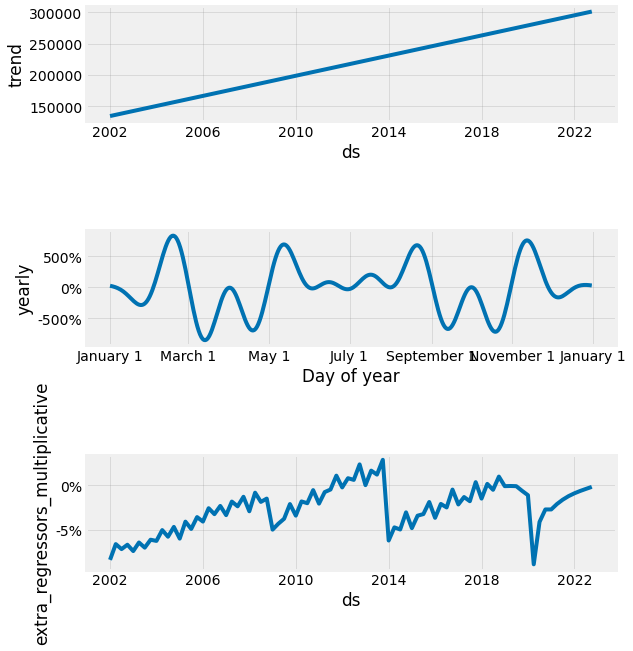
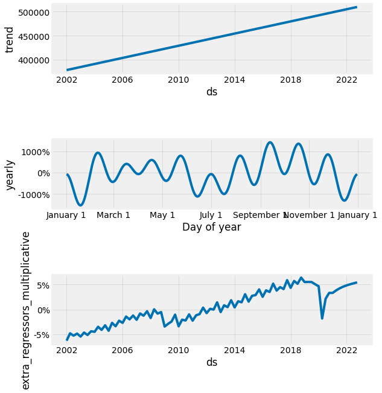
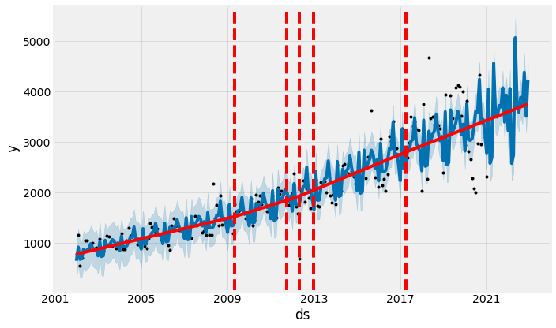
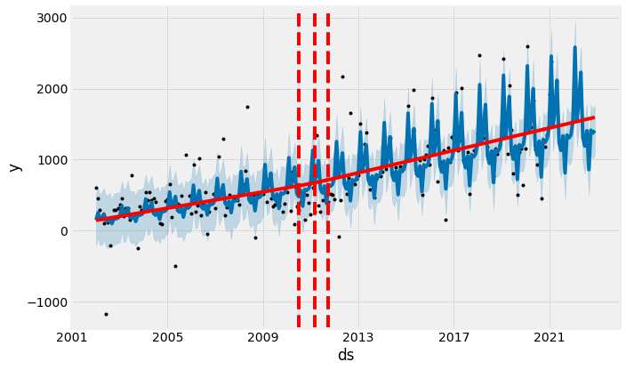
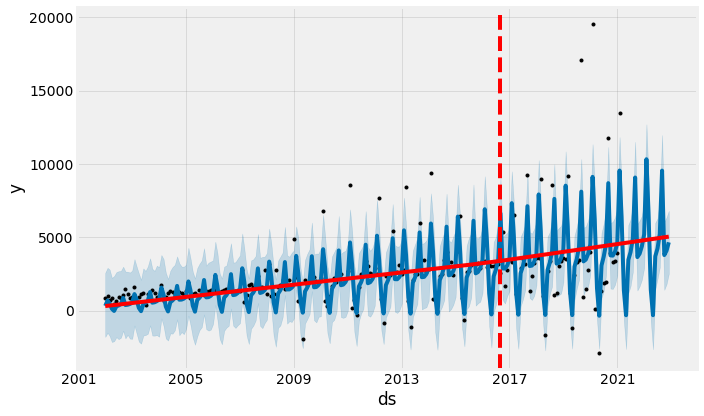
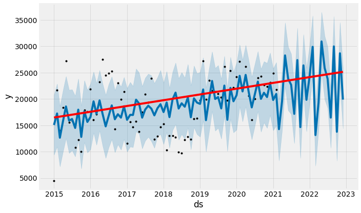
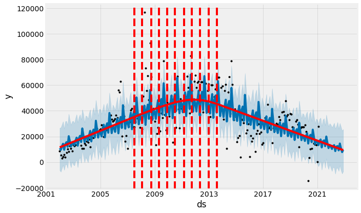

## 1. Introducción

En la [parte 1](https://gonzalezhomar.netlify.app/post/pronostico_1_manual/) presente el problema de hacer pronósticos para los principales impuestos de México, abordando el tema desde una metodología "a la vieja escuela". En la [parte 2](https://gonzalezhomar.netlify.app/post/pronostico_2_autoarima/) abordé el mismo problema a través de una *notebook* de manera automatizada, con lo que llamé "la nueva escuela". En esta parte 3 presento el mismo ejercicio, utilizando la herramienta [Prophet](https://facebook.github.io/prophet/) desarrollada por Facebook.

Al igual que en la parte 2, daré por sentado la construcción de la base de datos y buena parte del análisis estadístico que ya realicé en la parte 1. En este caso, leí sobre Prophet en [esta publicación de Medium](https://towardsdatascience.com/implementing-facebook-prophet-efficiently-c241305405a3), y la probe exitosamente con anterioridad, por lo que para mí, se convirtió en una alternativa a los tradicionales modelos ARIMA. La *notebook* con el código completo de esta publicación se puede encontrar en mi repositorio de [Github](https://github.com/gonzalezhomar/articulos_pronosticos) o la pueden ver directamente [aquí](https://nbviewer.jupyter.org/github/gonzalezhomar/articulos_pronosticos/blob/main/Pronostico_3.ipynb).

## 2. ¿Qué es Prophet?

De acuerdo a su misma página, [Prophet](https://facebook.github.io/prophet/) "es un procedimiento para pronosticar datos de series de tiempo basado en un modelo aditivo en el que las tendencias no lineales se ajustan a la estacionalidad anual, semanal y diaria, más los efectos de las vacaciones. Funciona mejor con series de tiempo que tienen fuertes efectos estacionales y varias temporadas de datos históricos. Prophet es robusto ante los datos faltantes y los cambios en la tendencia, y por lo general maneja bien los valores atípicos."

Con esta herramienta, el equipo de ciencia de datos de Facebook buscaba lograr los siguientes objetivos:
- Lograr modelos de pronóstico rápidoz y precisos.
- Obtener pronósticos razonablemente correctos de manera automática.
- No obstante el punto anterior, los resultados pueden ser adecuados manualmente.
- Librería disponible tanto en Python, como en R.

A diferencia de los modelos ARIMA que trabajan con una descomposición en 3 partes, [tendencia, componente estacional y error](https://en.wikipedia.org/wiki/X-13ARIMA-SEATS), Prophet utiliza una descomposición adicional, esto es en 4 partes [tendencia, componente estacional, días feriados y error](https://peerj.com/preprints/3190/). Esto porque Prophet está diseñado para trabajar con datos diarios, y considera está serie en lo individal para aislar sus efectos. 

Una de las grandes ventajas es que Prophet realiza todo de manera automática, incluso considerando quiebres estructurales. No obstante, Prophet se puede ajustar manualmente para lo cual leí [la documentación de Prophet](https://facebook.github.io/prophet/docs/quick_start.html#python-api) e introduje los cambios que consideré necesarios.

En comparación con el trabajo que hice en la [parte 2](https://gonzalezhomar.netlify.app/post/pronostico_2_autoarima/), los pronósticos con Prophet requieren menos código, por lo que son más fáciles de implementar y requieren menor interacción. Tomando como base el análisis hecho en la [parte 1](https://gonzalezhomar.netlify.app/post/pronostico_1_manual/), para el Impuesto al Valor Agregado (IVA) y para el Impuesto Sobre la Renta (ISR), utilizaré como variable explícativa el PIB y una dummy con la tasa del IVA y la reforma del ISR, respectivamente. En el resto de las series, haré el análisis de manera mensual. 

## 3. Análisis de las Series Trimestrales

### 3.1 Impuesto Sobre la Renta, ISR

Para utilizar Prophet, los datos deben ser cargados con una columna *ds* que tenga las fechas en formato estandar y una variable *y* que incluya la serie a estimar. Los ajustes que incluí al modelo estandar fueron 2:
- Dado que la serie a estimar es trimestral, tengo que indicar que la estacionalidad en multiplicativa.
- Puedo incluir variables explícativas a Prophet, por lo que consideré el PIB y la reforma ISR.
- Alternativamente al punto anterior, puedo indicar el punto de quiebre de manera manual.

De hecho, el código completo para correr el ajuste de Prophet lo hice con muy pocas líneas:

```python
isr=df[['fecha','isr_real','pib_reale4','reformaisr']]
isr.columns=['ds','y','pib','reformaisr']
pron_isr=Prophet(seasonality_mode='multiplicative') #,changepoints=['2014-01-01']
pron_isr.add_regressor('pib')
pron_isr.add_regressor('reformaisr')
pron_isr.fit(isr)
```
Y el código completo para hacer el pronóstico hacia adelante y su correspondiente gráfica, es el siguiente:

```python
future = pron_isr.make_future_dataframe(periods=8)
future = future.merge(isr, on='ds')
fcst = pron_isr.predict(future)
fig=plot_plotly(pron_isr, fcst)
py.iplot(fig)
```

Como resultado de estas pocas líneas, el pronóstico que obtuve me parece muy adecuado:

<iframe
    src='./static/ISR.html'
    width='150%'
    height='600px'
    style='border:none;'>
</iframe>


Además, el pronóstico que resulta se puede descomponer en 3 partes: tendencia, parte estacional y la parte que corresponde a las variables explícativas. No aplica la parte de días feriados puesto que la serie es trimestral; de ser diaria, se podría separar el efecto que tienen los días feriados en el pronóstico.



### 3.2 Impuesto al Valor Agregado, IVA

El análisis para el Impuesto al Valor Agregado (IVA), fue equivalente. La única diferencia es que en lugar de usar la variable explícativa dummy que señala cuando se implemento la reforma al ISR, se utiliza la variable que indica la tasa general del IVA. Como resultado, para el IVA obtuve el siguiente pronóstico:

<iframe
    src='./static/IVA.html'
    width='150%'
    height='600px'
    style='border:none;'>
</iframe>


En el caso del IVA, también presentó como se descompone el pronóstico:




## 4. Análisis de las Series Mensuales

### 4.1 IEPS Cervezas

Para utilizar Prophet en las series mensuales, solo tuve que indicar que la estacionalidad es multiplicativa. El resto del análisis que realiza Prophet es completamente automático y en cada serie hice lo mismo. 

Por ejemplo, el código completo para la serie del Impuesto Especial sobre Producción y Servicios (IEPS) aplicable a las cervezas y su gráfica, es el siguiente:

```python
iepsc2=df[['fecha','ieps_cervezas']]
iepsc=iepsc2.dropna()
iepsc.columns=['ds','y']
proniepsc=Prophet(seasonality_mode='multiplicative').fit(iepsc)
future = proniepsc.make_future_dataframe(periods=22, freq='M')
fcst = proniepsc.predict(future)
fig=plot_plotly(proniepsc, fcst)
py.iplot(fig)
```

Y con ello, el pronóstico de IEPS Cervezas:

<iframe
    src='./static/IEPS_C.html'
    width='150%'
    height='600px'
    style='border:none;'>
</iframe>


Otra función interesante que se puede hacer en series mensuales, es ver los quiebres en la tendencia detectados automáticamente con Prophet:



### 4.2 IEPS Bebidas

Para el IEPS a las bebidas alcohólicas, el código es completamente análogo. Los resultados de Prophet para esta serie son los siguientes:
    
<iframe
    src='./static/IEPS_B.html'
    width='150%'
    height='600px'
    style='border:none;'>
</iframe>




### 4.3 IEPS Bebidas

Para el IEPS a los tabacos labrados, los resultados de Prophet son los siguientes:

<iframe
    src='./static/IEPS_T.html'
    width='150%'
    height='600px'
    style='border:none;'>
</iframe>




### 4.4 IEPS Gasolinas y Diésel

Para el IEPS a la venta final de gasolinas y diésel, los resultados de Prophet son los siguientes:

<iframe
    src='./static/IEPS_G.html'
    width='150%'
    height='600px'
    style='border:none;'>
</iframe>




### 4.5 Ingresos Petroleros

Para los ingresos petroleros que conforman la RFP, los resultados de Prophet son los siguientes:

<iframe
    src='./static/Petroleros.html'
    width='150%'
    height='600px'
    style='border:none;'>
</iframe>




### 5. Conclusiones

En esta tercera parte, trabajé con las mismas series que en la [parte 1](https://gonzalezhomar.netlify.app/post/pronostico_1_manual/) y la [parte 2](https://gonzalezhomar.netlify.app/post/pronostico_2_autoarima/), pero implementando la herramienta Prophet. Una ventaja que me agrada mucho es la facilidad con la cual se pueden obtener pronósticos, por lo que se pueden hacer pronósticos a escala... osea muchos... de hecho, ese es el título del [paper de Facebook](https://peerj.com/preprints/3190/). Inclusive, la integración que tiene Prophet con [Plotly](https://plotly.com/python/plotly-fundamentals/) genera muy buenas gráficas con muy poco código. 

Sin embargo, al igual que en las partes anteriores, comencé este trabajo para llegar a los pronóticos para la siguiente observación. En esta parte 3, los pronósticos para el primer trimestre de 2021 que obtuve fueron los siguientes:

| Variable  | Primer Trimestre 2021   |
|--------------------- |---------------|
| ISR                  | 493,018.41    |
| IVA                  | 223,331.36     |
| IEPS Gasolinas       | 62,136.99      |
| IEPS Tabacos         | 7,769.49       |
| IEPS Bebidas         | 5,298.17       |
| IEPS Cervezas        | 9,834.98       |
| Ingresos Petroleros  | 45,549.01      |

Finalmente, la trílogía está completa, tengo las 3 cabezas del dragón blanco de ojos azules, las 3 cajas madre, la trifuerza, las 3 llaves de los 3 candados de la puerta negra... bueno... creo que me fuí... En fin, los pronósticos obtenidos en cada parte, para el primer trimestre de 2021 son los siguientes:
  
| Variable             | 1 Vieja Escuela| 2 Auto ARIMA   | 3 Prophet      |
|--------------------- |---------------:|---------------:|---------------:|
| ISR                  | 484,002.95     | 403,011.84     | 493,018.41    |
| IVA                  | 234,892.56     | 256,953.12     | 223,331.36     |
| IEPS Gasolinas       | 68,678.40      | 93,464.39      | 62,136.99      |
| IEPS Tabacos         | 3,889.50       | 11,055.46      | 7,769.49       |
| IEPS Bebidas         | 4,973.40       | 5,337.24       | 5,298.17       |
| IEPS Cervezas        | 7,954.10       | 10,590.54      | 9,834.98       |
| Ingresos Petroleros  | 39,429.80      | 85,570.68      | 45,549.01      |

Nos vemos en 3 meses... cuando se complete la información del trimestre y pueda evaluar cuál modelo fue el ganador. En sus marcas, listos, fuera.