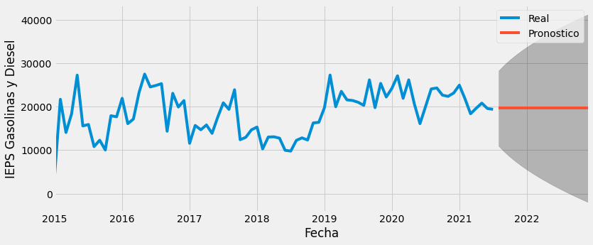

## 1. Introducción

Ah, el futuro... la última frontera. Cómo economista, hacer estimaciones de lo que pasará en el futuro es pan de cada día, tanto así que hay muchos chistes al respecto. Uno de ellos cuenta, "le pedí su número de teléfono a un economista ... y me dio una estimación". El chiste reside en que el experto en números ni siquiera tiene un número preciso de su propio número telefónico; sin embargo, para mí expresa una situación mucho más simple, y es que por mucho que cualquiera analice los datos, nadie sabe lo que pasará. NADIE[^1].

[^1]: Según [Sala-i-Martin](https://www.youtube.com/watch?v=SgQ5mO5fwqI) el trabajo de los economistas no es predecir el futuro. Y aquellos economistas que han atinado a predecirlo, han tenido suerte.

¿Entonces, por qué hacer pronósticos? Porque a través de diferentes herramientas se pueden hacer aproximaciones de lo que pasará en el futuro. En ese sentido en mi entrega anterior probé diferentes herramientas para hacer pronósticos de series de tiempo: [a la vieja escuela](https://gonzalezhomar.netlify.app/post/pronostico_1_manual/), [nueva escuela](https://gonzalezhomar.netlify.app/post/pronostico_2_autoarima/) y la herramienta [Prophet](https://gonzalezhomar.netlify.app/post/pronostico_3_prophet/). Cabe señalar que mi objetivo con dicho análisis era comparar los resultados entre diferentes metodologías con base en el pronóstico en sí y no hacer la evaluación con las típicas medidas intra muestra. Sin embargo, no estoy del todo conforme con [esos resultados](https://gonzalezhomar.netlify.app/post/pronostico_4_evaluacion/).

En ese sentido, las primeras 2 herramientas que utilicé, en el fondo usan la metodología ARIMA que aprendí de [mis profesores](https://www.researchgate.net/publication/46548261_Elasticidad_ingreso_de_los_impuestos_federales_en_Mexico_Efectos_en_la_recaudacion_federal_participable) y solo Prophet sale de este marco teórico. Por tanto, decidí repetir dicho ejercicio con más y diferentes herramientas, con lo cual, de paso practicaré su implementación en *Python* y *Jupyter*. 

Arrancaré este segundo round con el modelo SARIMAX, cuya *notebook* completa puede consultarse en mi repositorio de [Github](https://github.com/gonzalezhomar/articulos_pronosticos) o la pueden ver directamente [aquí](https://nbviewer.jupyter.org/github/gonzalezhomar/articulos_pronosticos/blob/main/PronR2_1.ipynb). Debido a que esta parte quedó muy extensa, me saltaré buena parte del código que esta inspirado en esta [publicación de Medium](https://towardsdatascience.com/hands-on-time-series-forecasting-with-python-d4cdcabf8aac), así que ¡a darle átomos!

## 2. Recordando el problema

Para esta nueva serie, vuelvo a analizar la Recaudación Federal Participable (RFP), siguiendo la referencia de un artículo desarrollado por mis profesores donde se estiman [la elasticidad ingreso de los impuestos federales en México](https://www.researchgate.net/publication/46548261_Elasticidad_ingreso_de_los_impuestos_federales_en_Mexico_Efectos_en_la_recaudacion_federal_participable) y sus efectos en la misma. La RFP está conformada por distintos ingresos del Gobierno Federal, y es de suma importancia porque a partir ella se determinan las participaciones federales, mismas que son la principal fuente de ingresos de libre disposición que tienen las Entidades Federativas. De manera breve, sólo señalaré que la RFP depende de diversos ingresos del Gobierno Federal, entre los que destacan: Impuesto Sobre la Renta, ISR, que es un impuesto a los ingresos; Impuesto al Valor Agregado, IVA, que es un impuesto al consumo; el Impuesto Especial sobre Producción y Servicios, IEPS, que a su vez se compone de diversos impuestos específicos para disminuir el consumo de ciertos bienes, como son el alcohol, el tabaco y las gasolinas; y finalmente una parte de los ingresos petroleros que recibe el Gobierno Federal vía el Fondo Mexicano del Petróleo para la Estabilización y el Desarrollo. 

Al igual que en mi proyecto anterior, los datos para la RFP los tomé de las [Estadísticas Oportunas de Finanzas Públicas](http://presto.hacienda.gob.mx/EstoporLayout/estadisticas.jsp) de donde se pueden consultar las series que componen dicha RFP a partir de 2002. Cabe señalar que existe un desfase de 2 meses entre dichos impuestos (según la RFP) con el período que lo causa, puesto que el ISR de marzo, corresponde a la recaudación de febrero, que a su vez, corresponde con la actividad del mes de enero. Debido a que son muchas las series, solo utilizaré las series más importantes: ISR, IVA, IEPS federal a las gasolinas y diésel, IEPS a tabacos, IEPS a bebidas alcohólicas, IEPS a cervezas, IEPS a las bebidas saborizadas, IEPS a los alimentos con alto contenido calórico, impuesto a la importación e ingresos petroleros. Dado que hay un retraso entre la publicación de las variables y el periodo al que corresponden, no tengo información completa sobre el segundo trimestre de 2021.

En cuanto a las variables explicativas, usaré el Producto Interno Bruto (PIB) de México que publica el [Instituto Nacional de Estadística y Geografía (INEGI)](https://www.inegi.org.mx/temas/pib/); y de esa misma fuente tomaré el Índice de Precios Implícito (IPI) para convertir las series de ISR e IVA a términos reales (ver siguiente sección). Para el PIB de periodos futuros utilicé las proyecciones del Banco de México de su [informe trimestral](https://www.banxico.org.mx/publicaciones-y-prensa/informes-trimestrales/%7BFD816858-44AB-58C4-DD58-1F58D2B52F3C%7D.pdf); de hecho, ya hay una nueva actualización [de esta información](https://www.banxico.org.mx/publicaciones-y-prensa/informes-trimestrales/%7B197BFCC0-C976-1F6F-5AE8-21C498B1E1C3%7D.pdf) pero al momento que trabajé en estas proyecciones aún no estaba disponible.

## 3. Análisis previo de cointegración y quiebre estructural

Este análisis lo hice para [mi primer proyecto](https://gonzalezhomar.netlify.app/post/pronostico_1_manual/), pero creo que vale la pena repetirlo, puesto que a través de éste, se confirma que es correcto utilizar el PIB como variable explicativa del ISR y del IVA, pero no del resto de las variables. Adelantando los resultados que mostraré serie por serie, es necesario verificar la existencia de raíz unitaria, porque de lo contrario, podría caer en regresiones espurias (relaciones estadísticas entre variables que no tienen relación alguna). 

Para hacer este análisis, apliqué la prueba de contraste aumentado de Dickey Fuller (ADF), con lo que se concluye que todas las series, con excepción del IEPS federal a las gasolinas y diésel y del IEPS a los alimentos, tienen raíz unitaria, pero esta se elimina al tomar las series en primera diferencia (* denota un valor p menor al 0.10, ** denota un valor p menor al 0.05 y *** denota un valor p menor al 0.01):

| Serie               | Series en niveles   |               | Series en 1a diferencia  |              |
|---------------------|---------------------|---------------|--------------------------|--------------|
|                     | Estadístico ADF-GLS | Decisión      | Estadístico ADF      | Decisión     |
| PIB Real            | -1.14535            | Raíz Unitaria | -2.5909***              | Estacionaria |
| ISR                 | -0.821204           | Raíz Unitaria | -5.457999***             | Estacionaria |
| IVA                 | -1.109062           | Raíz Unitaria | -7.997366***             | Estacionaria |
| IEPS Gasolinas      | -2.891800*          | Estacionaria  |                          |              |
| IEPS Tabacos        |  -0.809903          | Raíz Unitaria | -6.605603***             | Estacionaria |
| IEPS Bebidas Alcohólicas  | -0.640294     | Raíz Unitaria | -6.181862***             | Estacionaria |
| IEPS Cervezas       | -0.236237           | Raíz Unitaria | -6.233054***             | Estacionaria |
| IEPS Bebidas Saborizadas  | -0.195569     | Raíz Unitaria | -6.610010***             | Estacionaria |
| IEPS Alimentos      | -4.737662***        | Estacionaria  |                          |              |
| Impuesto a la Importación | -0.214093     | Raíz Unitaria | -5.421195***             | Estacionaria |
| Ingresos Petroleros | -2.313334           | Raíz Unitaria | -6.450070***             | Estacionaria | 

### 3.1 Cointegración de las Series

Una vez que se tienen los resultados de la prueba ADF, se puede verificar si las series estacionarias en efecto están relacionadas y es correcto utilizar a una para explicar a la otra. Para ello, utilizaré la prueba de cointegración de Engle-Granger, donde se verifica primero que las dos series a utilizar tengan raíz unitaria (paso que ya se realizó), luego se verifica si al hacer la regresión por Mínimos Cuadrados Ordinarios (MCO) entre ellas, su residual es estacionario. Los resultados se muestran a continuación:

| Variable Dependiente     | Variable Explicativa| ADF de res. MCO | Decisión |
|--------------------------|---------------------|---------------|--------|
| ISR                      | PIB Real            | -3.6334**     | Estacionaria |
| IVA                      | PIB Real            | -2.77879*     | Estacionaria |
| IEPS Tabacos             | PIB Real            | -4.66036***   | Estacionaria |
| IEPS Bebidas Alcohólicas | PIB Real            | -3.63147**    | Estacionaria |
| IEPS Cervezas            | PIB Real            | -2.50686   | Raíz Unitaria |
| IEPS Bebidas Saborizadas | PIB Real            | -2.78059   | Raíz Unitaria |
| Impuesto a la importación| PIB Real            | -1.4614   | Raíz Unitaria |
| Ingresos Petroleros      | PIB Real            | -1.30229   | Raíz Unitaria |

Por lo tanto, y dado que los residuales del MCO en el caso del ISR y del IVA con el PIB son estacionarios, concluyó que es correcto utilizar el PIB como variable para explicar el ISR y el IVA, y podría utilizarlo para los IEPS de tabacos y a las bebidas alcohólicas. Sin embargo, solo lo utilizaré para el ISR y el IVA, como es común en la literatura, y dejaré fuera al resto de las series para hacer su análisis mensual.

Lo hago así, porque al agregar el PIB como variable explicativa, necesito agregar el supuesto de cuál será el PIB a futuro y cuál será el IPI. Además evitó perder información por el rezago en los datos, y de hecho, en las series mensuales tengo información hasta el mes de julio. En cambio, al hacer el desfase en las series de ISR e IVA, no tengo información completa para el segundo trimestre de 2021.

### 3.2 Quiebres Estructurales

Por otro lado, es necesario identificar si las series que se analizan presentan cambios estructurales que pueden deberse a mofificaciones legislativas u otro hechos que sean económicamente relevantes. Para revisar esto, se hace primero una regresión entre las variables que se van a analizar, en este caso, ISR e IVA, y la variable explicativa PIB. Luego se aplican las pruebas CUSUM y CUSUMQ para identificar posibles quiebres. Estos posibles quiebres se verifican con la prueba de Chow:

| Variable  | Quiebres CUSUM  | Quiebres CUSUMQ    | Valor p, prueba de Chow |
|---------- |-----------      |---------------|--------|
| ISR       | 2008-T1  | 2012-T1, 2014-T1, 2017-T2     | 2008-T1***,  2012-T1***, 2014-T1***, 2017-T2*** |
| IVA       | 2018-T1         | 2010-T1     | 2018-T1, 2010-T1*** |

Como resultado de las pruebas, la prueba de Chow indica que todos los quiebres son significativos, mientras que en el caso del IVA, solo es significativo el quiebre del primer trimestre de 2010. Con estos resultados tengo que voltear a los cambios institucionales para identificar cuáles cambios coinciden con eventos económicos. 

En el caso del IVA, el quiebre significativo coincide con el incremento general de la tasa del IVA del 15% al 16%. Por lo anterior, considero adecuado agregar una variable dummy, que indique la tasa general del impuesto antes de 2010 (15%, indicado con un cero) y después (16%, indicado con un uno). De hecho, antes de 2002, la tasa estuvo cambiando entre 10% y 15%, pero los datos de mi muestra no llegan hasta esas fechas.

Para el caso del ISR, y en cuanto a los quiebres significativos, únicamente identifico la reforma del ISR que entró en vigor a partir de 2014. Como resultado de dicha reforma, se tuvo una Ley del Impuesto Sobre la Renta completamente nueva, por lo que considero adecuado a utilizar una variable dummy que indica el período en el cual entro en vígor la última reforma del ISR (ceros antes de 2014 y a partir de esa fecha, unos).

De hecho, en ambos análisis del ISR y del IVA, también hice el análisis de incluir una variable dummy que señalara que los últimos 3 trimestres de 2020, donde hubo crisis económica (causada por la pandemia del Covid-19), pero resultó no ser significativa, y no la incluí en el modelo final. Esto se debe a que a través de la variable del PIB ya se incluye el efecto económico de la crisis en la estimación.

Para el caso de las otras variables no realicé la prueba CUSUM pues no se tiene variable explícativa. Sin embargo, sí hice un ajuste en el IEPS federal a gasolinas y diésel intencionalmente para dejar fuera la parte de la serie anterior a 2015. Esto lo hago porque justo en ese año hubo una reforma importante en este impuesto que pasó a cobrarse a cuotas por litro, mientras que antes de dicha reforma, el IEPS se utilizaba para controlar el precio de las gasolinas, e incluso podía llegar a ser negativo (subsidio al precio final).

## 4. Series mensuales

Con el análisis que he presentado hasta el momento, puedo comenzar a utilizar el módelo SARIMAX:
- S, de *seasonal*, porque considera series que pueden tener estacionalidad.
- AR, de autoregresivo, por series que dependen de observaciones previas.
- I, de integradas, porque los modelos pueden considerar series que se integran, o dependen de si mismas de manera estacional (por ejemplo, anual).
- MA, de *moving average* o media móvil porque considera series que pueden ser medias móviles.
- X, por el vector X de variables regresivas que puede incluir.

En general, la metodología que sigue este modelo, es la [metodología Box-Jenkins](https://es.wikipedia.org/wiki/Metodología_de_Box-Jenkins): 1) identificar y seleccionar el modelo con variables son estacionarias; 2) estimar los parámetros que mejor ajusten el modelo ARIMA seleccionado; 3) comprobar el modelo obtenido mediante distintas pruebas y 4) en caso de una incorrecta especificación regresar al paso 1).

Sin embargo, en la sección anterior, concluí que sólo utilizaré el PIB como variable explicativa para mis series de ISR e IVA. Por tanto, analizaré estas series desde su perspectiva mensual. Solo mostraré el análisis completo para la primera serie, y en el resto, dejaré solo las gráficas con los pronósticos.

### 4.1 IEPS Cervezas

La serie de IEPS a la venta de cervezas, y su descomposición en sus componentes de tendencia, estacional y residuales, se ve como sigue:


    
Para analizar si esta serie es estacionaria, se puede analizar el correlograma y el autocorrelograma, donde se ve que la serie tiene fuerte autocorrelación y autocorrelación parcial:
   


Sin embargo, para poder concluirlo adecuadamente, apliqué la prueba ADF que falla en rechazar que la serie tenga raíz unitaria. Con ello concluyó que la serie tiene raíz unitaria.

    Results of Dickey-Fuller Test:
    Test Statistic                  -0.236237
    p-value                          0.934062
    #Lags Used                      12.000000
    Number of Observations Used    222.000000
    Critical Value (1%)             -3.460154
    Critical Value (5%)             -2.874649
    Critical Value (10%)            -2.573757
    dtype: float64
    

Por tanto, es necesario generar la serie en primeras diferencias, donde vuelvo a realizar la prueba ADF rechazó la hipótesis de que la serie tiene raíz unitaria, en favor de la hipótesis que la serie es estacionaria. En otras palabras, puedo concluir que la serie en primeras diferencias sí es estacionaria (como adelante desde la sección 3).

    Results of Dickey-Fuller Test:
    Test Statistic                -6.233054e+00
    p-value                        4.900097e-08
    #Lags Used                     1.500000e+01
    Number of Observations Used    2.060000e+02
    Critical Value (1%)           -3.462499e+00
    Critical Value (5%)           -2.875675e+00
    Critical Value (10%)          -2.574304e+00
    dtype: float64
    


Luego, con este comando del paquete *pmdarima*, automáticamente se evalúan diferentes propuestas de modelos ARIMA, seleccionando el mejor modelo con base en el criterio de Akaike:

```python
model = pm.auto_arima(ieps_cervezas, d=1, D=1,
                      seasonal=True, m=12, trend='c', 
                      start_p=0, start_q=0, max_order=9, test='adf', stepwise=True, trace=True)
```

    Performing stepwise search to minimize aic
     ARIMA(0,1,0)(1,1,1)[12]             : AIC=3292.063, Time=2.28 sec
     ARIMA(0,1,0)(0,1,0)[12]             : AIC=3360.414, Time=0.13 sec
     ARIMA(1,1,0)(1,1,0)[12]             : AIC=3291.291, Time=0.87 sec
     ARIMA(0,1,1)(0,1,1)[12]             : AIC=3217.454, Time=0.69 sec
     ARIMA(0,1,1)(0,1,0)[12]             : AIC=3296.440, Time=0.34 sec
     ARIMA(0,1,1)(1,1,1)[12]             : AIC=3219.324, Time=1.14 sec
     ARIMA(0,1,1)(0,1,2)[12]             : AIC=3219.155, Time=5.85 sec
     ARIMA(0,1,1)(1,1,0)[12]             : AIC=3270.511, Time=2.53 sec
     ARIMA(0,1,1)(1,1,2)[12]             : AIC=inf, Time=7.40 sec
     ARIMA(0,1,0)(0,1,1)[12]             : AIC=3290.610, Time=1.59 sec
     ARIMA(1,1,1)(0,1,1)[12]             : AIC=3213.099, Time=2.84 sec
     ARIMA(1,1,1)(0,1,0)[12]             : AIC=3298.430, Time=0.52 sec
     ARIMA(1,1,1)(1,1,1)[12]             : AIC=3214.994, Time=4.20 sec
     ARIMA(1,1,1)(0,1,2)[12]             : AIC=3214.897, Time=10.21 sec
     ARIMA(1,1,1)(1,1,0)[12]             : AIC=inf, Time=1.10 sec
     ARIMA(1,1,1)(1,1,2)[12]             : AIC=3213.140, Time=9.82 sec
     ARIMA(1,1,0)(0,1,1)[12]             : AIC=3245.988, Time=0.76 sec
     ARIMA(2,1,1)(0,1,1)[12]             : AIC=inf, Time=2.96 sec
     ARIMA(1,1,2)(0,1,1)[12]             : AIC=inf, Time=1.92 sec
     ARIMA(0,1,2)(0,1,1)[12]             : AIC=3215.092, Time=1.21 sec
     ARIMA(2,1,0)(0,1,1)[12]             : AIC=3229.670, Time=3.08 sec
     ARIMA(2,1,2)(0,1,1)[12]             : AIC=inf, Time=1.68 sec
     ARIMA(1,1,1)(0,1,1)[12] intercept   : AIC=3213.099, Time=3.52 sec
    
    Best model:  ARIMA(1,1,1)(0,1,1)[12]          
    Total fit time: 66.918 seconds
    


```python
model.summary()
```

<table class="simpletable">
<caption>SARIMAX Results</caption>
<tr>
  <th>Dep. Variable:</th>                  <td>y</td>               <th>  No. Observations:  </th>    <td>235</td>   
</tr>
<tr>
  <th>Model:</th>           <td>SARIMAX(1, 1, 1)x(0, 1, 1, 12)</td> <th>  Log Likelihood     </th> <td>-1601.550</td>
</tr>
<tr>
  <th>Date:</th>                   <td>Thu, 12 Aug 2021</td>        <th>  AIC                </th> <td>3213.099</td> 
</tr>
<tr>
  <th>Time:</th>                       <td>14:11:01</td>            <th>  BIC                </th> <td>3230.113</td> 
</tr>
<tr>
  <th>Sample:</th>                         <td>0</td>               <th>  HQIC               </th> <td>3219.968</td> 
</tr>
<tr>
  <th></th>                             <td> - 235</td>             <th>                     </th>     <td> </td>    
</tr>
<tr>
  <th>Covariance Type:</th>               <td>opg</td>              <th>                     </th>     <td> </td>    
</tr>
</table>
<table class="simpletable">
<tr>
      <td></td>         <th>coef</th>     <th>std err</th>      <th>z</th>      <th>P>|z|</th>  <th>[0.025</th>    <th>0.975]</th>  
</tr>
<tr>
  <th>intercept</th> <td>    0.1059</td> <td>    0.660</td> <td>    0.161</td> <td> 0.872</td> <td>   -1.187</td> <td>    1.399</td>
</tr>
<tr>
  <th>ar.L1</th>     <td>    0.2516</td> <td>    0.049</td> <td>    5.177</td> <td> 0.000</td> <td>    0.156</td> <td>    0.347</td>
</tr>
<tr>
  <th>ma.L1</th>     <td>   -0.9086</td> <td>    0.024</td> <td>  -37.853</td> <td> 0.000</td> <td>   -0.956</td> <td>   -0.862</td>
</tr>
<tr>
  <th>ma.S.L12</th>  <td>   -0.7614</td> <td>    0.044</td> <td>  -17.459</td> <td> 0.000</td> <td>   -0.847</td> <td>   -0.676</td>
</tr>
<tr>
  <th>sigma2</th>    <td> 1.031e+05</td> <td> 5163.368</td> <td>   19.973</td> <td> 0.000</td> <td>  9.3e+04</td> <td> 1.13e+05</td>
</tr>
</table>
<table class="simpletable">
<tr>
  <th>Ljung-Box (L1) (Q):</th>     <td>0.18</td> <th>  Jarque-Bera (JB):  </th> <td>825.59</td>
</tr>
<tr>
  <th>Prob(Q):</th>                <td>0.67</td> <th>  Prob(JB):          </th>  <td>0.00</td> 
</tr>
<tr>
  <th>Heteroskedasticity (H):</th> <td>9.40</td> <th>  Skew:              </th>  <td>-0.10</td>
</tr>
<tr>
  <th>Prob(H) (two-sided):</th>    <td>0.00</td> <th>  Kurtosis:          </th>  <td>12.45</td>
</tr>
</table><br/>Warnings:<br/>[1] Covariance matrix calculated using the outer product of gradients (complex-step).
<br/> <br/>

A diferencia de [la ocasión anterior](https://gonzalezhomar.netlify.app/post/pronostico_2_autoarima/), ahora trabajaré con la serie completa (sin partirla en parte para entrenar y parte para hacer pruebas), para que el siguiente comando me de los mejores coeficientes para explicar la serie, con base en el modelo que obtuve en el paso anterior:


```python
model = SARIMAX(ieps_cervezas,order=(1,1,1),seasonal_order=(0,1,1,12))
results = model.fit()
results.summary()
```

<table class="simpletable">
<caption>SARIMAX Results</caption>
<tr>
  <th>Dep. Variable:</th>            <td>ieps_cervezas</td>         <th>  No. Observations:  </th>    <td>235</td>   
</tr>
<tr>
  <th>Model:</th>           <td>SARIMAX(1, 1, 1)x(0, 1, 1, 12)</td> <th>  Log Likelihood     </th> <td>-1601.564</td>
</tr>
<tr>
  <th>Date:</th>                   <td>Thu, 12 Aug 2021</td>        <th>  AIC                </th> <td>3211.128</td> 
</tr>
<tr>
  <th>Time:</th>                       <td>14:11:03</td>            <th>  BIC                </th> <td>3224.738</td> 
</tr>
<tr>
  <th>Sample:</th>                    <td>01-01-2002</td>           <th>  HQIC               </th> <td>3216.623</td> 
</tr>
<tr>
  <th></th>                          <td>- 07-01-2021</td>          <th>                     </th>     <td> </td>    
</tr>
<tr>
  <th>Covariance Type:</th>               <td>opg</td>              <th>                     </th>     <td> </td>    
</tr>
</table>
<table class="simpletable">
<tr>
      <td></td>        <th>coef</th>     <th>std err</th>      <th>z</th>      <th>P>|z|</th>  <th>[0.025</th>    <th>0.975]</th>  
</tr>
<tr>
  <th>ar.L1</th>    <td>    0.2509</td> <td>    0.044</td> <td>    5.750</td> <td> 0.000</td> <td>    0.165</td> <td>    0.336</td>
</tr>
<tr>
  <th>ma.L1</th>    <td>   -0.9078</td> <td>    0.024</td> <td>  -37.752</td> <td> 0.000</td> <td>   -0.955</td> <td>   -0.861</td>
</tr>
<tr>
  <th>ma.S.L12</th> <td>   -0.7610</td> <td>    0.041</td> <td>  -18.506</td> <td> 0.000</td> <td>   -0.842</td> <td>   -0.680</td>
</tr>
<tr>
  <th>sigma2</th>   <td> 1.032e+05</td> <td> 5026.424</td> <td>   20.523</td> <td> 0.000</td> <td> 9.33e+04</td> <td> 1.13e+05</td>
</tr>
</table>
<table class="simpletable">
<tr>
  <th>Ljung-Box (L1) (Q):</th>     <td>0.18</td> <th>  Jarque-Bera (JB):  </th> <td>825.72</td>
</tr>
<tr>
  <th>Prob(Q):</th>                <td>0.67</td> <th>  Prob(JB):          </th>  <td>0.00</td> 
</tr>
<tr>
  <th>Heteroskedasticity (H):</th> <td>9.37</td> <th>  Skew:              </th>  <td>-0.09</td>
</tr>
<tr>
  <th>Prob(H) (two-sided):</th>    <td>0.00</td> <th>  Kurtosis:          </th>  <td>12.45</td>
</tr>
</table><br/>Warnings:<br/>[1] Covariance matrix calculated using the outer product of gradients (complex-step).
<br/> <br/>

Los estadísticos para diagnosticar este modelo se ven bastante prometedores:


Los pronósticos intra muestra de este modelo parecen ajustar adecuadamente:
    

    

Mientras que los pronósticos hacia adelante también se ven bastante prometedores. Cabe señalar que esta es la parte que más me interesa para cada serie.


### 4.2 IEPS Bebidas Alcohólicas

Luego de repetir esta metodología para el caso del IEPS a las bebidas alcohólicas, obtuve el siguiente pronóstico para esta serie:


### 4.3 IEPS Tabacos

A riesgo de ser repetitivo, y luego de repetir esta metodología, para esta serie obtuve el siguiente pronóstico:


### 4.4 IEPS Gasolinas y Diésel

A riesgo de ser repetitivo, y luego de repetir esta metodología, para esta serie obtuve el siguiente pronóstico:




### 4.5 IEPS Bebidas Saborizadas

A riesgo de ser repetitivo, y luego de repetir esta metodología, para esta serie obtuve el siguiente pronóstico:


### 4.6 IEPS Alimentos

A riesgo de ser repetitivo, y luego de repetir esta metodología, para esta serie obtuve el siguiente pronóstico:


### 4.7 Impuesto a la Importación

A riesgo de ser repetitivo, y luego de repetir esta metodología, para esta serie obtuve el siguiente pronóstico:


### 4.8 Ingresos Petroleros

A riesgo de ser repetitivo, y luego de repetir esta metodología, para esta serie obtuve el siguiente pronóstico (nótese que intencionalmente solo copie y pegué esta línea n-veces):


## 5. SARIMAX de las series trimestrales

De la sección 3.2 concluí que sí podía utilizar al PIB como una variable explicativa del ISR y del IVA, así como también era correcto utilizar una variable dummy para indicar los cortes estructurales de la serie. Por tanto, presentaré los resultados completos solo para la misma serie, y de la otra solo presentaré la gráfica con los pronósticos finales.

### 5.1 Impuesto Sobre la Renta, ISR

Para construir la serie trimestral, considere la serie mensual con un desfase de 2 meses (el ISR de marzo, corresponde a la recaudación de febrero, que a su vez, corresponde con la actividad del mes de enero) y la convertí en términos reales con el índice de precios implícitos (IPI). Al observar dicha serie, observó que mantuvo un crecimiento en términos reales hasta 2017-2018, y a partir de entonces mantiene un comportamiento un poco más volátil, que coincide con su descomposición en sus componentes de tendencia, estacional y residuales:


    
Siguiendo la metodología de series mensuales, aplicó la prueba ADF-GLS a la serie en niveles, la prueba falla en rechazar que la serie tiene raíz unitaria; de esta manera concluyó que la serie sí tiene raíz unitaria:

    Results of Dickey-Fuller Test:
    Test Statistic                 -0.821204
    p-value                         0.812814
    #Lags Used                      3.000000
    Number of Observations Used    74.000000
    Critical Value (1%)            -3.521980
    Critical Value (5%)            -2.901470
    Critical Value (10%)           -2.588072
    dtype: float64
    
Sin embargo, si aplicó la misma prueba a la serie en primeras diferencias, la prueba falla en aceptar que la serie tiene raíz unitaria (como adelante desde la sección 3)

    Results of Dickey-Fuller Test:
    Test Statistic                 -5.457999
    p-value                         0.000003
    #Lags Used                      7.000000
    Number of Observations Used    65.000000
    Critical Value (1%)            -3.535217
    Critical Value (5%)            -2.907154
    Critical Value (10%)           -2.591103
    dtype: float64
    
Ahora bien, a diferencia de las series mensuales, para estas series trimestrales sí tengo variables explicativas como señale desde la parte 3.2. Para ello, con estos comandos creo los objetos con las variables explicativas:

```python
pib1=df[['reformaisr','pib_reale4']]
pib1.drop(pib1.tail(6).index,inplace=True)
pib1.shape
```
    (78, 2)

```python
pib1x=df[['reformaisr','pib_reale4']]
pib1x.drop(pib1x.head(78).index,inplace=True)
pib1x.shape
```
    (6, 2)

Luego, puedo correr la función **auto_arima** para encontrar la mejor especificación de un modelo SARIMAX, destacando que en este caso sí puedo incluir variables explicativas:

```python
model = pm.auto_arima(isrp.dropna(), 
                      exogenous=pib1,
                      d=1, D=1,
                      seasonal=True, m=12, trend='c', 
                      start_p=0, start_q=0, max_order=12, test='adf', stepwise=True, trace=True)                     
```
    Performing stepwise search to minimize aic
     ARIMA(0,1,0)(1,1,1)[12]             : AIC=1575.515, Time=0.38 sec
     ARIMA(0,1,0)(0,1,0)[12]             : AIC=1577.838, Time=0.04 sec
     ARIMA(1,1,0)(1,1,0)[12]             : AIC=1576.940, Time=0.17 sec
     ARIMA(0,1,1)(0,1,1)[12]             : AIC=1548.889, Time=0.27 sec
     ARIMA(0,1,1)(0,1,0)[12]             : AIC=1551.240, Time=0.13 sec
     ARIMA(0,1,1)(1,1,1)[12]             : AIC=1550.073, Time=0.44 sec
     ARIMA(0,1,1)(0,1,2)[12]             : AIC=1547.372, Time=0.81 sec
     ARIMA(0,1,1)(1,1,2)[12]             : AIC=1548.038, Time=1.04 sec
     ARIMA(0,1,0)(0,1,2)[12]             : AIC=1569.838, Time=0.42 sec
     ARIMA(1,1,1)(0,1,2)[12]             : AIC=1547.311, Time=0.69 sec
     ARIMA(1,1,1)(0,1,1)[12]             : AIC=1549.518, Time=0.43 sec
     ARIMA(1,1,1)(1,1,2)[12]             : AIC=1547.571, Time=1.72 sec
     ARIMA(1,1,1)(1,1,1)[12]             : AIC=1550.554, Time=0.76 sec
     ARIMA(1,1,0)(0,1,2)[12]             : AIC=1568.217, Time=0.41 sec
     ARIMA(2,1,1)(0,1,2)[12]             : AIC=1521.708, Time=2.13 sec
     ARIMA(2,1,1)(0,1,1)[12]             : AIC=1518.753, Time=0.98 sec
     ARIMA(2,1,1)(0,1,0)[12]             : AIC=1535.405, Time=0.40 sec
     ARIMA(2,1,1)(1,1,1)[12]             : AIC=1520.574, Time=1.00 sec
     ARIMA(2,1,1)(1,1,0)[12]             : AIC=1525.539, Time=0.88 sec
     ARIMA(2,1,1)(1,1,2)[12]             : AIC=inf, Time=3.25 sec
     ARIMA(2,1,0)(0,1,1)[12]             : AIC=1535.980, Time=0.36 sec
     ARIMA(3,1,1)(0,1,1)[12]             : AIC=1507.434, Time=0.96 sec
     ARIMA(3,1,1)(0,1,0)[12]             : AIC=1522.599, Time=0.41 sec
     ARIMA(3,1,1)(1,1,1)[12]             : AIC=1509.193, Time=1.20 sec
     ARIMA(3,1,1)(0,1,2)[12]             : AIC=1509.517, Time=1.92 sec
     ARIMA(3,1,1)(1,1,0)[12]             : AIC=1515.306, Time=1.05 sec
     ARIMA(3,1,1)(1,1,2)[12]             : AIC=1511.529, Time=2.55 sec
     ARIMA(3,1,0)(0,1,1)[12]             : AIC=1507.354, Time=0.67 sec
     ARIMA(3,1,0)(0,1,0)[12]             : AIC=1522.637, Time=0.13 sec
     ARIMA(3,1,0)(1,1,1)[12]             : AIC=1509.352, Time=2.31 sec
     ARIMA(3,1,0)(0,1,2)[12]             : AIC=1509.351, Time=2.15 sec
     ARIMA(3,1,0)(1,1,0)[12]             : AIC=1515.460, Time=0.52 sec
     ARIMA(3,1,0)(1,1,2)[12]             : AIC=1511.093, Time=2.10 sec
     ARIMA(4,1,0)(0,1,1)[12]             : AIC=1507.384, Time=0.55 sec
     ARIMA(4,1,1)(0,1,1)[12]             : AIC=1508.949, Time=1.09 sec
     ARIMA(3,1,0)(0,1,1)[12] intercept   : AIC=1507.354, Time=0.59 sec
    
    Best model:  ARIMA(3,1,0)(0,1,1)[12] intercept
    Total fit time: 34.963 seconds
    

```python
model.summary()
```

<table class="simpletable">
<caption>SARIMAX Results</caption>
<tr>
  <th>Dep. Variable:</th>                   <td>y</td>                <th>  No. Observations:  </th>    <td>78</td>   
</tr>
<tr>
  <th>Model:</th>           <td>SARIMAX(3, 1, 0)x(0, 1, [1], 12)</td> <th>  Log Likelihood     </th> <td>-745.677</td>
</tr>
<tr>
  <th>Date:</th>                    <td>Thu, 12 Aug 2021</td>         <th>  AIC                </th> <td>1507.354</td>
</tr>
<tr>
  <th>Time:</th>                        <td>14:19:47</td>             <th>  BIC                </th> <td>1524.749</td>
</tr>
<tr>
  <th>Sample:</th>                     <td>01-01-2002</td>            <th>  HQIC               </th> <td>1514.217</td>
</tr>
<tr>
  <th></th>                           <td>- 04-01-2021</td>           <th>                     </th>     <td> </td>   
</tr>
<tr>
  <th>Covariance Type:</th>                <td>opg</td>               <th>                     </th>     <td> </td>   
</tr>
</table>
<table class="simpletable">
<tr>
       <td></td>         <th>coef</th>     <th>std err</th>      <th>z</th>      <th>P>|z|</th>  <th>[0.025</th>    <th>0.975]</th>  
</tr>
<tr>
  <th>intercept</th>  <td>  -68.3190</td> <td> 2364.896</td> <td>   -0.029</td> <td> 0.977</td> <td>-4703.430</td> <td> 4566.792</td>
</tr>
<tr>
  <th>reformaisr</th> <td>-4.675e+04</td> <td> 1.49e+04</td> <td>   -3.136</td> <td> 0.002</td> <td> -7.6e+04</td> <td>-1.75e+04</td>
</tr>
<tr>
  <th>pib_reale4</th> <td>    0.0370</td> <td>    0.014</td> <td>    2.641</td> <td> 0.008</td> <td>    0.010</td> <td>    0.064</td>
</tr>
<tr>
  <th>ar.L1</th>      <td>   -0.7212</td> <td>    0.184</td> <td>   -3.919</td> <td> 0.000</td> <td>   -1.082</td> <td>   -0.361</td>
</tr>
<tr>
  <th>ar.L2</th>      <td>   -0.8996</td> <td>    0.122</td> <td>   -7.351</td> <td> 0.000</td> <td>   -1.139</td> <td>   -0.660</td>
</tr>
<tr>
  <th>ar.L3</th>      <td>   -0.6559</td> <td>    0.165</td> <td>   -3.976</td> <td> 0.000</td> <td>   -0.979</td> <td>   -0.333</td>
</tr>
<tr>
  <th>ma.S.L12</th>   <td>   -0.7229</td> <td>    0.384</td> <td>   -1.883</td> <td> 0.060</td> <td>   -1.476</td> <td>    0.030</td>
</tr>
<tr>
  <th>sigma2</th>     <td> 7.251e+08</td> <td>    0.345</td> <td>  2.1e+09</td> <td> 0.000</td> <td> 7.25e+08</td> <td> 7.25e+08</td>
</tr>
</table>
<table class="simpletable">
<tr>
  <th>Ljung-Box (L1) (Q):</th>     <td>0.61</td> <th>  Jarque-Bera (JB):  </th> <td>3.09</td>
</tr>
<tr>
  <th>Prob(Q):</th>                <td>0.44</td> <th>  Prob(JB):          </th> <td>0.21</td>
</tr>
<tr>
  <th>Heteroskedasticity (H):</th> <td>1.47</td> <th>  Skew:              </th> <td>0.50</td>
</tr>
<tr>
  <th>Prob(H) (two-sided):</th>    <td>0.37</td> <th>  Kurtosis:          </th> <td>3.37</td>
</tr>
</table><br/>Warnings:<br/>[1] Covariance matrix calculated using the outer product of gradients (complex-step).<br/>[2] Covariance matrix is singular or near-singular, with condition number 4.77e+25. Standard errors may be unstable.

Con esta especificación puedo volver a correr el comando SARIMAX, para que a través de un breve entrenamiento, encuentre los mejores coeficientes para dicha especificación. Cabe señalar que en este caso lo hago considerando toda la serie y que puedo incluir las variables explicativas que ya había señalado. Lo primero para evitar perder el comportamiento de los últimos datos y con lo segundo ganó el efecto de las variables explícativas:

```python
model = SARIMAX(isr,order=(3,1,0),seasonal_order=(0,1,1,12),exog=pib1)
results = model.fit()
results.summary()
```

<table class="simpletable">
<caption>SARIMAX Results</caption>
<tr>
  <th>Dep. Variable:</th>               <td>isr_real</td>             <th>  No. Observations:  </th>    <td>78</td>   
</tr>
<tr>
  <th>Model:</th>           <td>SARIMAX(3, 1, 0)x(0, 1, [1], 12)</td> <th>  Log Likelihood     </th> <td>-745.667</td>
</tr>
<tr>
  <th>Date:</th>                    <td>Thu, 12 Aug 2021</td>         <th>  AIC                </th> <td>1505.333</td>
</tr>
<tr>
  <th>Time:</th>                        <td>14:19:48</td>             <th>  BIC                </th> <td>1520.554</td>
</tr>
<tr>
  <th>Sample:</th>                     <td>01-01-2002</td>            <th>  HQIC               </th> <td>1511.339</td>
</tr>
<tr>
  <th></th>                           <td>- 04-01-2021</td>           <th>                     </th>     <td> </td>   
</tr>
<tr>
  <th>Covariance Type:</th>                <td>opg</td>               <th>                     </th>     <td> </td>   
</tr>
</table>
<table class="simpletable">
<tr>
       <td></td>         <th>coef</th>     <th>std err</th>      <th>z</th>      <th>P>|z|</th>  <th>[0.025</th>    <th>0.975]</th>  
</tr>
<tr>
  <th>reformaisr</th> <td>-4.675e+04</td> <td> 1.49e+04</td> <td>   -3.133</td> <td> 0.002</td> <td> -7.6e+04</td> <td>-1.75e+04</td>
</tr>
<tr>
  <th>pib_reale4</th> <td>    0.0371</td> <td>    0.011</td> <td>    3.254</td> <td> 0.001</td> <td>    0.015</td> <td>    0.059</td>
</tr>
<tr>
  <th>ar.L1</th>      <td>   -0.7214</td> <td>    0.181</td> <td>   -3.996</td> <td> 0.000</td> <td>   -1.075</td> <td>   -0.368</td>
</tr>
<tr>
  <th>ar.L2</th>      <td>   -0.8996</td> <td>    0.122</td> <td>   -7.369</td> <td> 0.000</td> <td>   -1.139</td> <td>   -0.660</td>
</tr>
<tr>
  <th>ar.L3</th>      <td>   -0.6563</td> <td>    0.163</td> <td>   -4.015</td> <td> 0.000</td> <td>   -0.977</td> <td>   -0.336</td>
</tr>
<tr>
  <th>ma.S.L12</th>   <td>   -0.7232</td> <td>    0.352</td> <td>   -2.052</td> <td> 0.040</td> <td>   -1.414</td> <td>   -0.033</td>
</tr>
<tr>
  <th>sigma2</th>     <td> 7.251e+08</td> <td>    0.359</td> <td> 2.02e+09</td> <td> 0.000</td> <td> 7.25e+08</td> <td> 7.25e+08</td>
</tr>
</table>
<table class="simpletable">
<tr>
  <th>Ljung-Box (L1) (Q):</th>     <td>0.61</td> <th>  Jarque-Bera (JB):  </th> <td>3.06</td>
</tr>
<tr>
  <th>Prob(Q):</th>                <td>0.43</td> <th>  Prob(JB):          </th> <td>0.22</td>
</tr>
<tr>
  <th>Heteroskedasticity (H):</th> <td>1.48</td> <th>  Skew:              </th> <td>0.50</td>
</tr>
<tr>
  <th>Prob(H) (two-sided):</th>    <td>0.37</td> <th>  Kurtosis:          </th> <td>3.37</td>
</tr>
</table><br/>>Warnings:<br/>[1] Covariance matrix calculated using the outer product of gradients (complex-step).<br/>[2] Covariance matrix is singular or near-singular, with condition number 1.15e+25. Standard errors may be unstable.
<br/><br/>

Los residuales del modelo anterior se comportan bien:


Y los pronósticos intra muestra que resultan de este modelo parecen ajustar adecuadamente:
    


Mientras que los pronósticos hacia adelante también se ven bastante prometedores.


### 5.2 Impuesto al Valor Agregado, IVA

Así como en las series mensuales, apliqué esta misma metodología para la serie del IVA, modificando sus variables explicativas, con lo cual obtuve el siguiente pronóstico:


## 6. Conclusión

Con esto concluye la primera parte de este segundo round entre diferentes metodologías. Me salte por completo la que en su momento llamé [*vieja escuela*]() porque sigue esta metodología, pero de manera manual. Mientras que el análisis que aquí presentó, lo realicé por completo en una *notebook* que puede consultarse en mi repositorio de [Github](https://github.com/gonzalezhomar/articulos_pronosticos) o la pueden ver directamente [aquí](https://nbviewer.jupyter.org/github/gonzalezhomar/articulos_pronosticos/blob/main/PronR2_1.ipynb).

Sin embargo, al igual que en el primer round, quiero evaluar estos pronósticos en términos de qué tan cercanos resultan a la siguiente observación. De hecho, por eso no compararé los estadísticos clásicos (la R-Cuadrada, la suma cuadrada de los errores o la suma absoluta de los errores). En esta primera parte, los pronósticos para el tercer trimestre de 2021 resultaron los siguientes:

| Variable                  | Tercer Trimestre 2021   |
|---------------------------|---------------|
| ISR                       | 330,019.5 |
| IVA                       | 293,288.9 |
| IEPS Gasolinas            | 55,057.4 |
| IEPS Bebidas Alcohólicas  | 18,463.4 |
| IEPS Cervezas             | 3,424.7 |
| IEPS Tabacos              | 10,966.3 |
| IEPS Bebidas Saborizadas  | 8,211.8 |
| IEPS Alimentos            | 5,211.3 |
| Impuesto a la importación | 19,552.1 |
| Ingresos Petroleros       | 62,891.3 |
| RFP       | 807,086.7 |

Aprovechando el contexto en que realizó la presente estimación, con esta metodología obtuve el siguiente pronóstico de la RFP para 2022:

| Variable                 |SARIMAX |ILIF 2022 |
|---------------------------|---------------|---------------|
| ISR                       | 1,597,971.1 |1,687,013.2 |
| IVA                       | 1,127,658.3 |1,213,777.9 
| IEPS Gasolinas            | 235,284.8 |288,602.5 |
| IEPS Bebidas Alcohólicas  | 50,900.2 |46,103.1 |
| IEPS Cervezas             | 18,280.8 |20,169.2 |
| IEPS Tabacos              | 41,342.6 |42,651.0 |
| IEPS Bebidas Saborizadas  | 30,383.3 |32,950.6 |
| IEPS Alimentos            | 20,732.5 |26,962.3 |
| Impuesto a la importación | 78,120.9 |72,939.5 |
| Ingresos Petroleros       | 244,596.8 |297,818.2 |
| RFP       | 3,445,271.5 |3,728,987.5 |

Este pronóstico resulta importante pues el 8 de septiembre el Gobierno Federal presentó su Iniciativa de Ley de Ingresos de la Federación para 2022, donde incluiye un estimado de este dato. Si bien la estimación que incluya el Gobierno Federal puede atender [a otros criterios,](https://www.elfinanciero.com.mx/opinion/macario-schettino/2021/09/06/estabilidad-ficticia/) me parece adecuado guardar esta estimación para evaluar mi modelo y futuras referencias (la RFP 2022 real se conocerá hasta abril de 2023 cuando el Gobierno Federal presente su Cuenta Pública anual).

Sin más por el momento, eso es to, eso es to, eso es todo amigos.