## 1. Introducción

Ah, el futuro... la última frontera. Ah no... eso fue en la [primera parte](https://gonzalezhomar.netlify.app/post/pronr2_1sarimax/). En mi anterior entrega, ya plantee el problema, expuse las series que voy a analizar, y por qué fue necesario dividirlas en un grupo de series mensuales y un grupo de series trimestrales. También realicé ese primer análisis con la [metodología Box-Jenkins](https://es.wikipedia.org/wiki/Metodología_de_Box-Jenkins) para modelos SARIMAX.

Si bien estos modelos son una de las herramientas clásicas para hacer estimaciones de series de tiempo, existen otros métodos estadísticos con los que se pueden hacer pronósticos de series de tiempo. Para esta entrada decidí experimentar con los modelos de suavizamiento exponencial y en particular con el modelo Holt Winters. En esta ocasión me inspiré en [esta publicación de Medium](https://towardsdatascience.com/time-series-forecasting-with-statistical-models-in-python-code-da457a46d68a).

La *notebook* con el código completo de esta publicación se puede encontrar en mi repositorio de [Github](https://github.com/gonzalezhomar/articulos_pronosticos) o la pueden ver directamente [aquí](https://nbviewer.jupyter.org/github/gonzalezhomar/articulos_pronosticos/blob/main/PronR2_2.ipynb).

## 2. Holt-Winters

El método Holt-Winters se basa en una típica descomposición de la serie de tiempo, donde se le asigna mayor peso a las observaciones más recientes. La descomposición de este método puede ser lineal (la serie se descompone en partes que se suman) o multiplicativa (la serie se descompone en variables que se multiplican), pero en ambos casos utiliza los siguientes componentes: una parte de nivel, una parte de tendencia, una parte estacionaria y el error.

A diferencia del método SARIMAX que utilicé en la primera parte, este método se encuentra implementado en el paquete *statsmodels* casi de manera directa. Si bien tuve una pequeña complicación más adelante, preferí dejarla de lado y solucionarlo en otro momento, con el objetivo de concluir esta entrada en menor tiempo.

## 3. Series Mensuales

Al igual que en la primera parte, analizaré por separado las series mensuales de las series trimestrales. Presentaré el análisis más completo en la primer serie y en las que siguen solo dejaré los resultados. Como se verá este camino es mucho más sencillo, por lo que resulta casi inmediato.

### 3.1 IEPS Cervezas

Como señale antes, una descomposición de series de tiempo puede ser lineal (la serie se descompone en partes que se suman) o multiplicativa (la serie se descompone en variables que se multiplican). La descomposición lineal de la serie de IEPS cervezas es la siguiente:
    
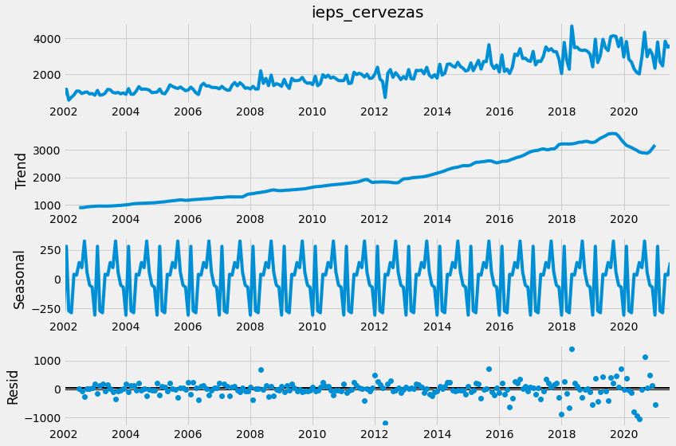
    
Mientras que la descomposición multiplicativa de la serie de IEPS cervezas es la siguiente:
 
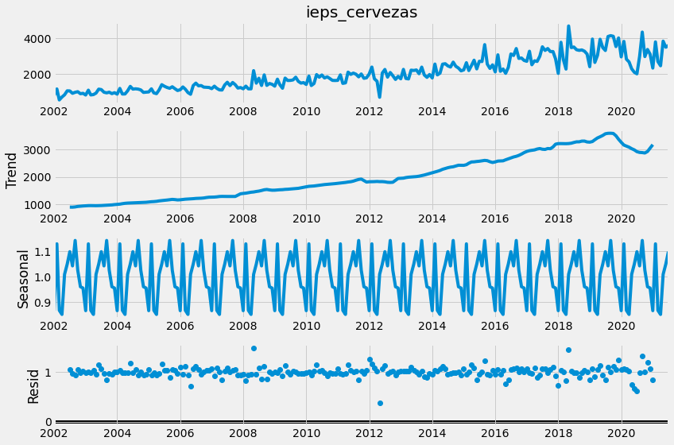
    
Aunque no quería dividir la serie en 2 partes, decidí seguir literalmente [esta publicación de Medium](https://towardsdatascience.com/time-series-forecasting-with-statistical-models-in-python-code-da457a46d68a) e implementar el suavizamiento Holt-Winters directamente, con el siguiente comando:

```python
fit1 = ExponentialSmoothing(train ,seasonal_periods=12 ,trend='add', seasonal='add').fit(use_boxcox=True)
holt_winter1 = fit1.forecast(len(test)+17)
plt.figure(figsize=(16,8))
plt.plot( train, label='Entrenamiento')
plt.plot(test, label='Prueba')
plt.plot(holt_winter1, label='Holt_Winter')
plt.legend(loc='best')
plt.title('IEPS Cervezas')
plt.show()
```

Básicamente la función *ExponentialSmoothing* ya incluye el modelo de suavizamiento Holt-Winters. En la implementación se este paquete se puede utilizar la descomposición lineal o la descomposición multiplicativa, pero me quede con la aditiva. Con ello, el resultado del suavizamiento Holt-Winters es el siguiente pronóstico:
    
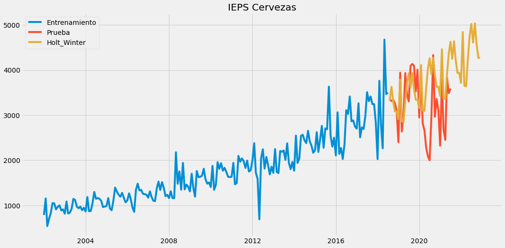

### 3.2 IEPS Gasolinas y Diésel

Para el caso del IEPS gasolinas y diésel, la implementación fue muy similar, con los siguientes resultados:
    
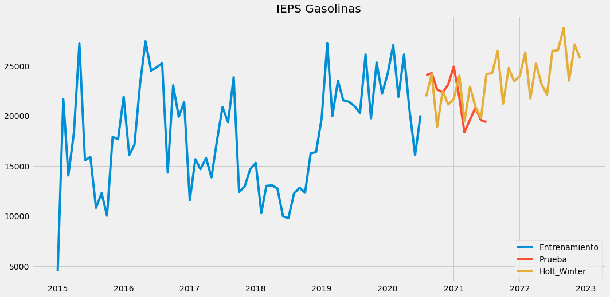
    
### 3.3 IEPS Bebidas Alcohólicas

En el caso de IEPS a las bebidas alcohólicas, tuve el problema de que la serie tiene algunos valores negativos, lo que generaba error en la aplicación del suavizamiento Holt-Winters. Al remover las observaciones negativas, la serie queda como sigue:
    
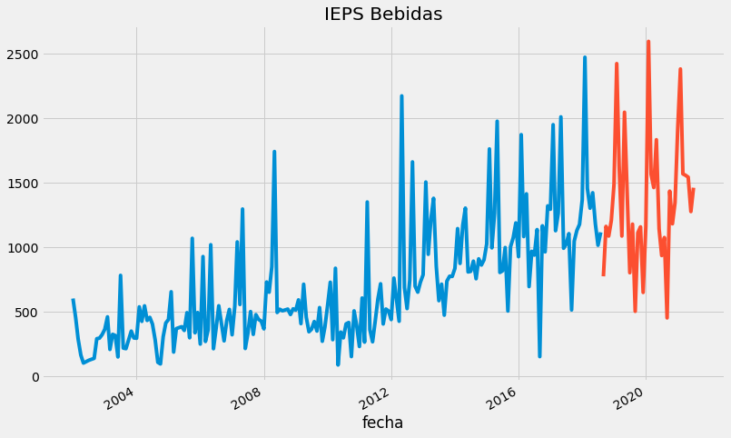
    
Con dicha modificación el modelo corre, pero se genera un error en los índices y la gráfica con el pronóstico no se encuentra alineada correctamente. Comparto mi código en caso de que tengan sugerencias o comentarios:

```python
fit1 = ExponentialSmoothing(train ,seasonal_periods=12 ,trend='add', seasonal='add').fit(use_boxcox=True)
holt_winter3 = fit1.forecast(len(test)+17)
plt.figure(figsize=(16,8))
plt.plot( train, label='Entrenamiento')
plt.plot(test, label='Prueba')
plt.plot(holt_winter3, label='Holt_Winter')
plt.legend(loc='best')
plt.title('IEPS Bebidas')
plt.show()
```
    C:\Users\Homar\anaconda3\lib\site-packages\statsmodels\tsa\base\tsa_model.py:581: ValueWarning: A date index has been provided, but it has no associated frequency information and so will be ignored when e.g. forecasting.
      warnings.warn('A date index has been provided, but it has no'
    C:\Users\Homar\anaconda3\lib\site-packages\statsmodels\tsa\base\tsa_model.py:376: ValueWarning: No supported index is available. Prediction results will be given with an integer index beginning at `start`.
      warnings.warn('No supported index is available.'
    
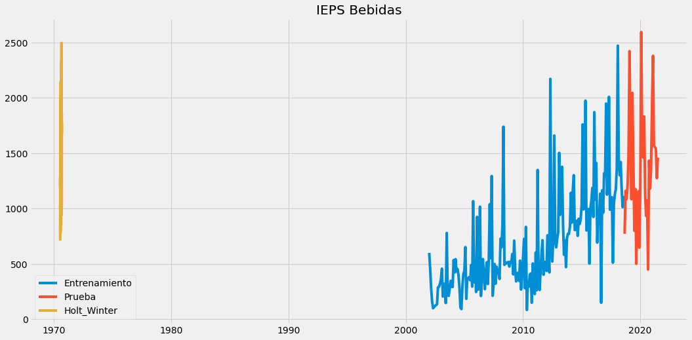
    
No obstante, alinearé dichos pronósticos por fuera para su evaluación.

### 3.4 IEPS Tabacos

Para la serie de IEPS Tabacos tuve el mismo problema por los valores negativos que la serie anterior. Por tanto, al quitarlos la serie queda como sigue:

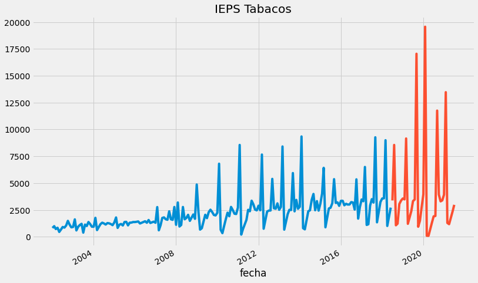
    
Y la serie con el pronóstico, no alinea correctamente los índices.

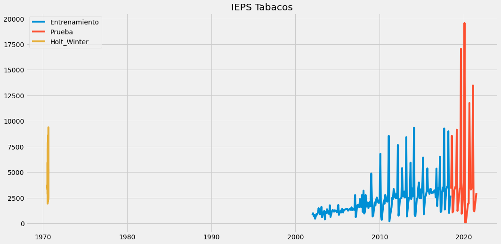
    
### 3.5 IEPS Bebidas Saborizadas

Para el caso del IEPS de bebidas saborizadas, la implementación fue directa con los siguientes resultados:

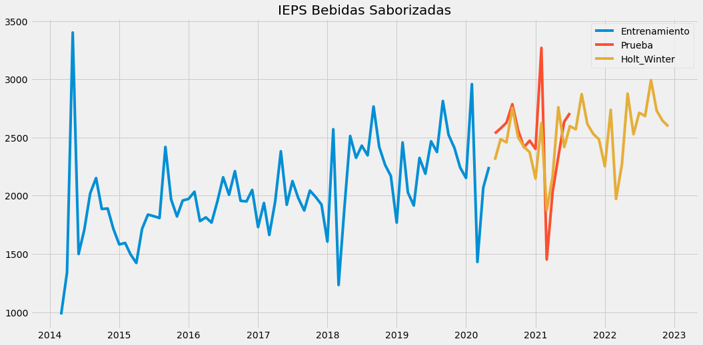
    
### 3.6 IEPS Alimentos

Para la serie de IEPS alimentos tuve el mismo problema por los valores negativos que otras series. Por tanto, al quitarlos esta serie queda como sigue:

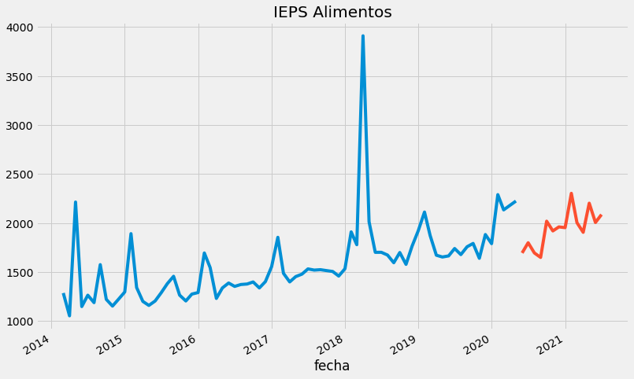
    
Y se repite el error en la gráfica del pronóstico.

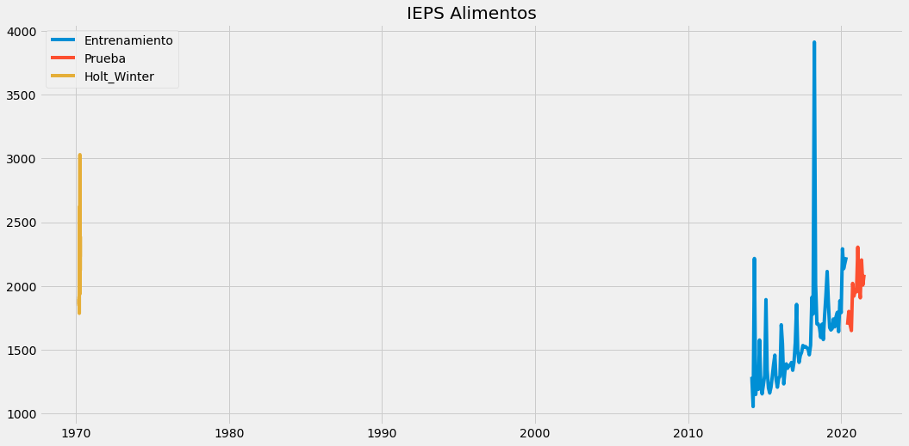
    
### 3.7 Impuesto a la Importación

Para el impuesto a la importación, la implementación fue directa con los siguientes resultados:
    
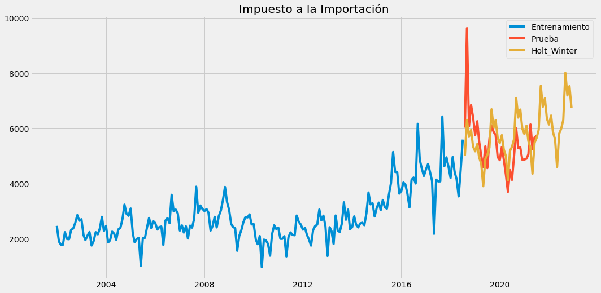

### 3.8 Ingresos Petroleros

En los ingresos petroleros de la RFP volví a tener el problema de los negativos. Al quitarlos la serie se ve así:

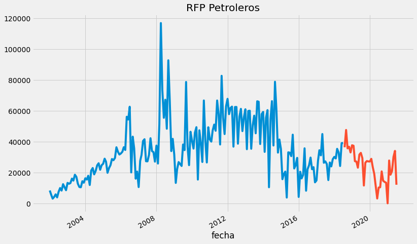
    
Y si bien, el modelo corre, en la gráfica del pronóstico que resulta no se alinean los índices.
    
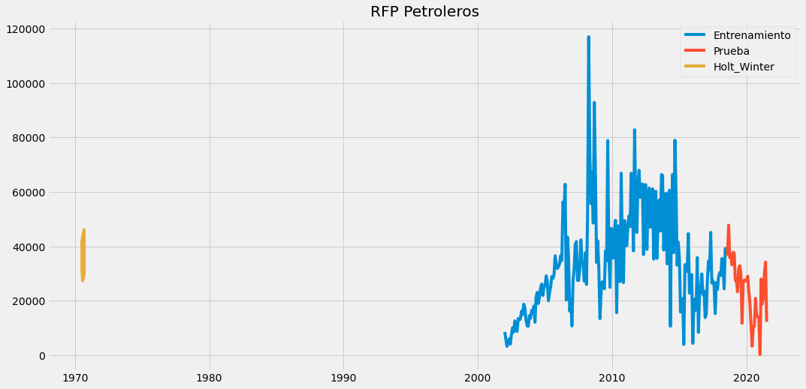
    
Cabe señalar que aun así pude extraer los pronósticos del suavizamiento Holt-Winters, y después alinearlos manualmente para su evaluación.

## 4. Series Trimestrales

Para el caso de las series trimestrales, ISR e IVA, quise hacer una implementación directa de [esta publicación de Medium](https://towardsdatascience.com/time-series-forecasting-with-statistical-models-in-python-code-da457a46d68a) solamente agregando mis variables explicativas. Luego de leer la documentación no encontré como agregar las variables explicativas por lo que me quede con los resultados directos.

### 4.1 Impuesto Sobre la Renta, ISR

En el caso del ISR, decidí hacer 2 pronósticos directos, uno con series en términos reales:
    
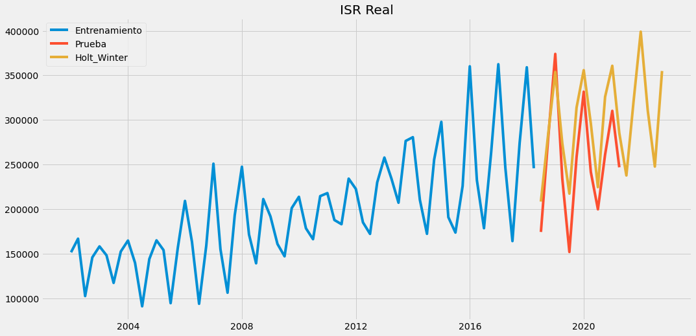
    
Y otro pronóstico con series en términos nominales.
    
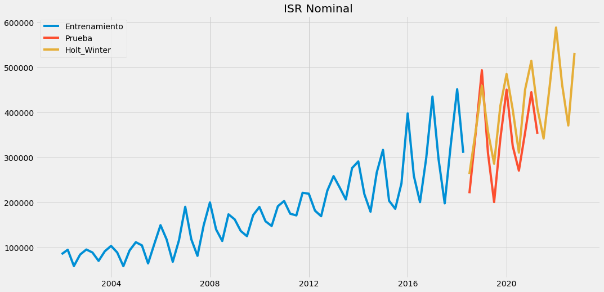
    
Lo hice para ver si el efecto de inflación (a través del índice de precios implícito) afecta las estimaciones del modelo. Las diferencias entre ambos modelos me parecen poco significativas por lo que me quedaré con la serie en términos nominales. En ambos casos, me parece que los pronósticos son un poco elevados.

### 4.2 Impuesto al Valor Agregado, IVA

En el caso del IVA, también hice la implementación de manera directa en términos reales:
    
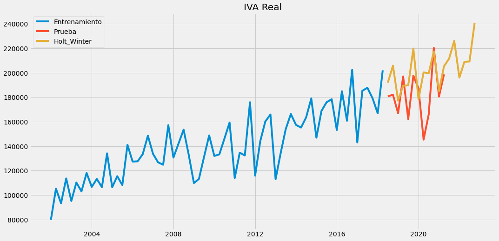
    
Y por separado la implementación del suavizamiento Holt-Winters en términos nominales:
    
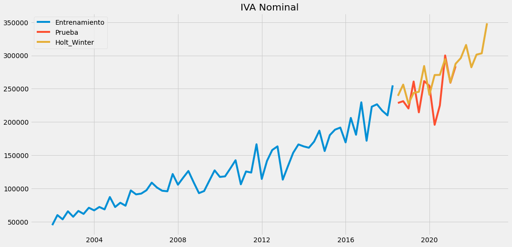

Al igual que en las series del ISR, las diferencias entre ambos modelos de IVA me parecen poco significativas por lo que me quedaré con la serie en términos nominales. Esto con el objetivo de no tener un supuesto adicional, que es estimar el índice de precios implícito que existirá en el futuro, y que el mismo modelo genere ese supuesto. 

## 5. Conclusión

Con esto concluye la segunda parte de este segundo round entre diferentes metodologías. Como señalé antes, esta herramienta me pareció interesante, por ser otro método estadístico, aunque tuve un par de dificultades al aplicarlo. Al momento de escribir esto, no quise solucionarlas porque iba a tardar más tiempo del que quería en resolverlas, mientras que yo lo que buscaba era una aplicación rápida como se verá en la siguiente entrega. 

El análisis que aquí presentó, lo realicé en una *notebook* que puede consultarse en mi repositorio de [Github](https://github.com/gonzalezhomar/articulos_pronosticos) o la pueden ver directamente [aquí](https://nbviewer.jupyter.org/github/gonzalezhomar/articulos_pronosticos/blob/main/PronR2_2.ipynb). Acepto sugerencias y comentarios.

Sin embargo, al igual que en mi primer ejercicio, quiero evaluar los pronósticos que vaya obteniendo en términos de qué tan cercanos resultan a la siguiente observación. En esta segunda parte, los pronósticos para el tercer trimestre de 2021 resultaron los siguientes:

| Variable                  | Tercer Trimestre 2021   |
|---------------------------|---------------|
| ISR                       | 345,776.8 |
| IVA                       | 298,731.4 |
| IEPS Gasolinas            | 66,563.0 |
| IEPS Bebidas Alcohólicas  | 8,606.5 |
| IEPS Cervezas             | 3,848.7 |
| IEPS Tabacos              | 12,231.3 |
| IEPS Bebidas Saborizadas  | 8,213.4 |
| IEPS Alimentos            | 6,194.1 |
| Impuesto a la importación | 19,784.7 |
| Ingresos Petroleros       | 97,973.4 |
| RFP       | 867,923.4 |

Aprovechando, que el 8 de septiembre, el Gobierno Federal presentó su Iniciativa de Ley de Ingresos de la Federación para 2022, me parece oportuno extraer y comparar el pronóstico que da esta metodología para la RFP para 2022 (en la última parte, juntaré todos los pronósticos):

| Variable                 |Holt Winters |ILIF 2022 |
|---------------------------|---------------|---------------|
| ISR                       | 1,898,554.9 |1,687,013.2 |
| IVA                       | 1,209,098.6 |1,213,777.9 
| IEPS Gasolinas            | 300,827.6 |288,602.5 |
| IEPS Bebidas Alcohólicas  | 59,502.7 |46,103.1 |
| IEPS Cervezas             | 21,255.8 |20,169.2 |
| IEPS Tabacos              | 52,611.6 |42,651.0 |
| IEPS Bebidas Saborizadas  | 30,999.6 |32,950.6 |
| IEPS Alimentos            | 28,548.3 |26,962.3 |
| Impuesto a la importación | 76,388.0 |72,939.5 |
| Ingresos Petroleros       | 439,307.8 |297,818.2 |
| RFP       | 4,117,094.9 |3,728,987.5 |

Sin más por el momento, eso es to, eso es to, eso es todo amigos.