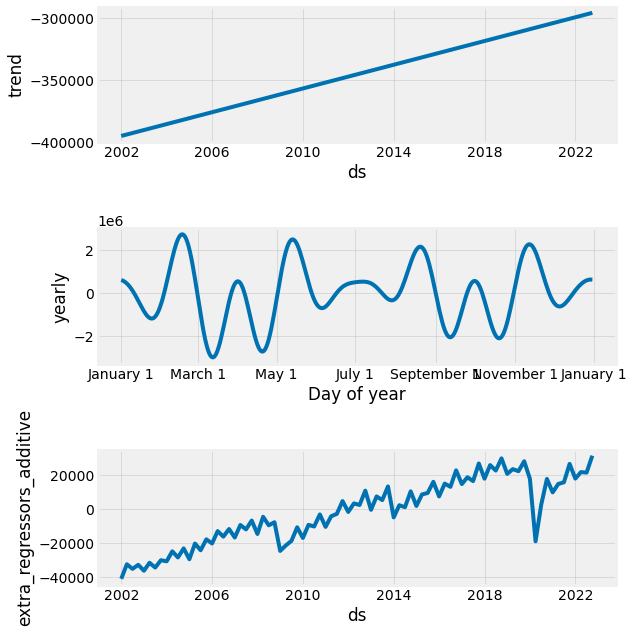
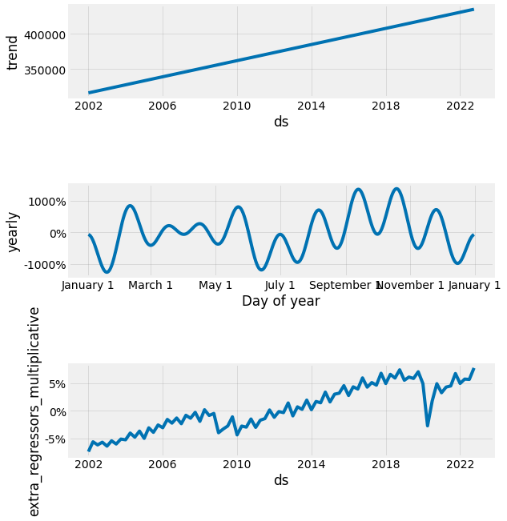
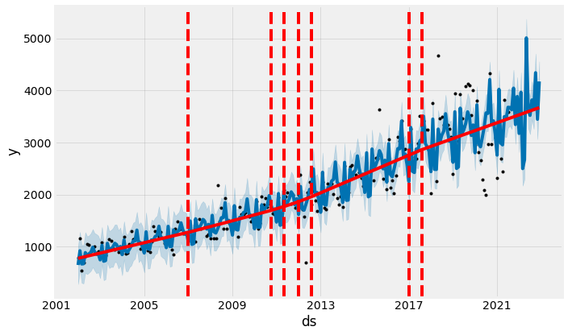
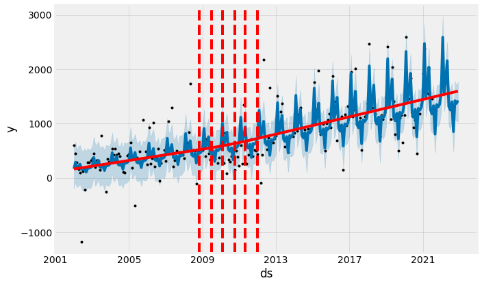
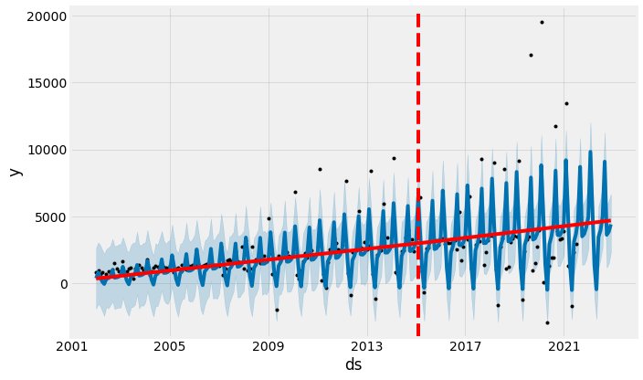
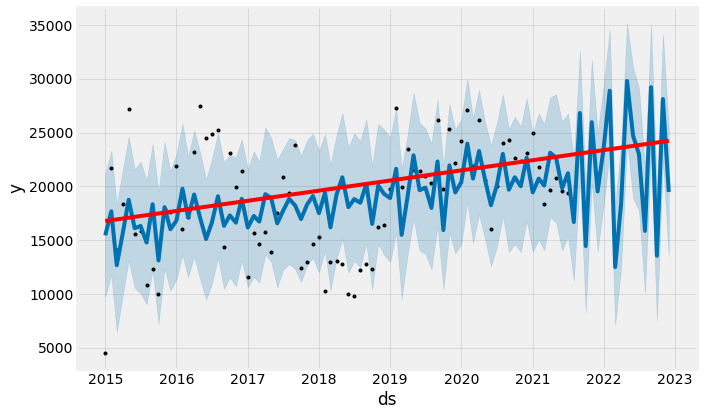
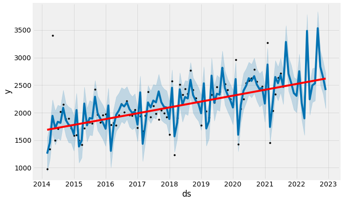
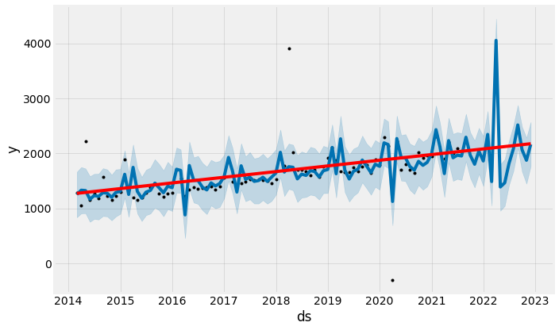
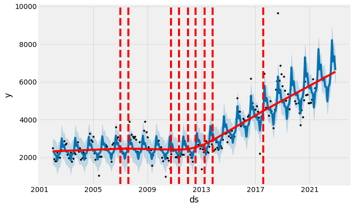
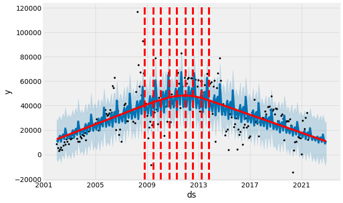

## 1. Introducción

En la anterior versión de este proyecto, este análisis correspondió a la [parte 3](https://gonzalezhomar.netlify.app/post/pronostico_3_prophet/) de mis estimaciones, por lo que esta actualización toma como base dicho código, y únicamente actualizo la base de datos para incluir la nueva información que se ha generado al respecto. La *notebook* con el código completo de esta publicación se puede encontrar en mi repositorio de [Github](https://github.com/gonzalezhomar/articulos_pronosticos) o la pueden ver directamente [aquí](https://nbviewer.jupyter.org/github/gonzalezhomar/articulos_pronosticos/blob/main/PronR2_3.ipynb).

## 2. ¿Por qué Prophet?

Recordando, [*Prophet*](https://facebook.github.io/prophet/) es una herramienta de ciencia de datos desarrollada por el equipo de inteligencia artificial de Facebook y consiste en "un procedimiento para pronosticar datos de series de tiempo basado en un modelo aditivo en el que las tendencias no lineales se ajustan a la estacionalidad anual, semanal y diaria, más los efectos de las vacaciones. Funciona mejor con series de tiempo que tienen fuertes efectos estacionales y varias temporadas de datos históricos. *Prophet* es robusto ante los datos faltantes y los cambios en la tendencia, y por lo general maneja bien los valores atípicos."

Como descubrí antes, una de las grandes ventajas es que *Prophet* realiza el análisis completo de manera automática, requiere mucho menos código que un análisis del tipo SARIMAX e incluso se pueden introducir pequeños ajustes manualmente leyendo [la documentación de *Prophet*](https://facebook.github.io/prophet/docs/quick_start.html#python-api). Con todas estas ventajas me era imposible dejar fuera a *Prophet*.

Al parecer esta herramienta ha tenido un fuerte impacto en el mundo de la ciencia de datos como puede verse [aquí](https://towardsdatascience.com/time-series-analysis-with-facebook-prophet-how-it-works-and-how-to-use-it-f15ecf2c0e3a), [aquí](https://towardsdatascience.com/prophet-in-a-loop-a875516ef2f9), [aquí](https://medium.com/gousto-engineering-techbrunch/stop-using-prophet-as-a-black-box-3-ways-it-can-go-wrong-1046f6c6ec73) y [aquí](https://towardsdatascience.com/a-quick-start-of-time-series-forecasting-with-a-practical-example-using-fb-prophet-31c4447a2274) e incluso, en este último caso se convierte en la primera herramienta a utilizar.

En este duelo, tomaré como base el análisis estadístico hecho [en la parte 1](https://gonzalezhomar.netlify.app/post/pronr2_1sarimax/), dado que de momento solo tengo nuevas observaciones. Con ello, para el Impuesto al Valor Agregado (IVA) y para el Impuesto Sobre la Renta (ISR), utilizaré como variables explícativas el PIB y una dummy con la tasa del IVA o la reforma del ISR, respectivamente. En el resto de las series, haré el análisis de manera mensual.

La *notebook* con el código completo de esta publicación se puede encontrar en mi repositorio de [Github](https://github.com/gonzalezhomar/articulos_pronosticos) o la pueden ver directamente [aquí](https://nbviewer.jupyter.org/github/gonzalezhomar/articulos_pronosticos/blob/main/PronR2_3.ipynb).

## 3. Series Trimestrales

Buscando no ser repetitivo, en esta parte iniciaré con las series trimestrales. Al igual que en mis otras publicaciones, solo dejaré comentarios completos para la serie de ISR, mientras que para la serie del IVA dejo el análisis con muchos menos comentarios.

### 3.1 Impuesto Sobre la Renta, ISR

Para utilizar *Prophet*, los datos deben ser cargados con una columna *ds* que tenga las fechas en formato estándar y una variable *y* que incluya la serie a estimar. Los ajustes que incluí al modelo básico fueron los siguientes:
- Indiqué que la estacionalidad en multiplicativa.
- Incluí variables explicativas a *Prophet*, para lo cual consideré el PIB y la reforma ISR.

Para hacer el análisis, la serie se ajusta de manera automática con *Prophet* utilizando el siguiente código:

```python
isr=df[['fecha','isr_real','pib_reale4','reformaisr']]
isr.columns=['ds','y','pib','reformaisr']
pron_isr=Prophet(seasonality_mode='multiplicative')
pron_isr.add_regressor('pib')
pron_isr.add_regressor('reformaisr')
pron_isr.fit(isr)
```
Y el código completo para hacer el pronóstico hacia adelante y su correspondiente gráfica, es el siguiente:

```python
future = pron_isr.make_future_dataframe(periods=6)
future = future.merge(isr, on='ds')
fcst = pron_isr.predict(future)
py.init_notebook_mode()
fig=plot_plotly(pron_isr, fcst)
py.iplot(fig)
```

Con estas pocas líneas, el pronóstico que obtuve me parece muy adecuado:

<iframe
    src='./static/ISR.html'
    width='150%'
    height='600px'
    style='border:none;'>
</iframe>

Además, el pronóstico que resulta se puede descomponer en 3 partes: tendencia, parte estacional y la parte que corresponde a las variables explicativas. No aplica la parte de la descomposición por los días feriados puesto que la serie es trimestral; de ser diaria, se podría separar el efecto que tienen los días feriados en el pronóstico.



### 3.2 Impuesto al Valor Agregado, IVA

Repitiendo la misma metodología que para el ISR, obtuve resultados que igualmente me parecen adecuados para el IVA:

<iframe
    src='./static/IVA.html'
    width='150%'
    height='600px'
    style='border:none;'>
</iframe>

Además, el pronóstico que resulta se puede descomponer en sus 3 partes:



## 4. Series Mensuales

Ahora bien, para el análisis de las series mensuales comenzaré con el IEPS Cervezas. El resto de las series mensuales tienen pocos comentarios, y solo dejaré los principales resultados.

### 4.1 IEPS Cervezas

Para utilizar *Prophet* en las series mensuales, el código es incluso más simple que en el análisis trimestral debido a que no tengo variables explicativas y solo hay que adecuar la frecuencia. De hecho, el código para hacer el análisis, y generar su respectiva gráfica es el siguiente:

```python
iepsc2=df[['fecha','ieps_cervezas']]
iepsc=iepsc2.dropna()
iepsc.columns=['ds','y']
proniepsc=Prophet(seasonality_mode='multiplicative').fit(iepsc)
future = proniepsc.make_future_dataframe(periods=17, freq='M')
fcst = proniepsc.predict(future)
fig=plot_plotly(proniepsc, fcst)
py.iplot(fig)
```

A pesar de su sencillez, me sorprende cómo con este código se obtienen muy buenos resultados:

<iframe
    src='./static/IEPS_C.html'
    width='150%'
    height='600px'
    style='border:none;'>
</iframe>

Incluso, con el siguiente código se pueden extraer los quiebres estructurales que detecta *Prophet*:

```python
fig=proniepsc.plot(fcst)
a=add_changepoints_to_plot(fig.gca(),proniepsc,fcst)
```



### 4.2 IEPS Bebidas Alcohólicas

Repitiendo la metodología mensual, el pronóstico que obtuve para el IEPS a las bebidas alcohólicas es el siguiente:

<iframe
    src='./static/IEPS_B.html'
    width='150%'
    height='600px'
    style='border:none;'>
</iframe>



### 4.3 IEPS Tabacos

Repitiendo la metodología mensual, el pronóstico que obtuve para el IEPS de tabacos es el siguiente:

<iframe
    src='./static/IEPS_T.html'
    width='150%'
    height='600px'
    style='border:none;'>
</iframe>



### 4.4 IEPS Gasolinas y Diésel

Repitiendo la metodología mensual, el pronóstico que obtuve para el IEPS federal a las gasolinas y diésel es el siguiente:

<iframe
    src='./static/IEPS_G.html'
    width='150%'
    height='600px'
    style='border:none;'>
</iframe>



### 4.5 IEPS Bebidas Saborizadas

Repitiendo la metodología mensual, el pronóstico que obtuve para el IEPS a las bebidas saborizadas es el siguiente:

<iframe
    src='./static/IEPS_BS.html'
    width='150%'
    height='600px'
    style='border:none;'>
</iframe>



### 4.6 IEPS Alimentos

Repitiendo la metodología mensual, el pronóstico que obtuve para el IEPS a los alimentos de alta densidad calórica es el siguiente:

<iframe
    src='./static/IEPS_A.html'
    width='150%'
    height='600px'
    style='border:none;'>
</iframe>



### 4.7 Impuesto a la importación

Repitiendo la metodología mensual, el pronóstico que obtuve para el impuesto a la importación es el siguiente:

<iframe
    src='./static/importacion.html'
    width='150%'
    height='600px'
    style='border:none;'>
</iframe>



### 4.8 Ingresos Petroleros

Repitiendo la metodología mensual, el pronóstico que obtuve para los ingresos petroleros de la RFP es el siguiente:

<iframe
    src='./static/Petroleros.html'
    width='150%'
    height='600px'
    style='border:none;'>
</iframe>



## 5. Conclusión

Con esto concluye la tercera parte de este segundo round entre diferentes metodologías. *Prophet* resultó ser una de las herramientas que más llamó mi atención porque difiere profundamente de las metodologías anteriores, resulta de fácil implementación y de buenos resultados. De hecho, por la sencillez de este método no me detuve tanto en otros, puesto que quería una competencia rápida. Para ver la versión completa de este análisis, lo pueden consultar en mi repositorio de [Github](https://github.com/gonzalezhomar/articulos_pronosticos) o la pueden ver directamente [aquí](https://nbviewer.jupyter.org/github/gonzalezhomar/articulos_pronosticos/blob/main/PronR2_3.ipynb).

Sin embargo, y como señale en las entregas anteriores, quiero evaluar los pronósticos que vaya obteniendo en términos de qué tan cercanos resultan a la siguiente observación. En esta segunda parte, los pronósticos para el tercer trimestre de 2021 resultaron los siguientes:

| Variable                  | Tercer Trimestre 2021   |
|---------------------------|---------------|
| ISR                       | 335,920.2 |
| IVA                       | 290,548.8 |
| IEPS Gasolinas            | 59,340.4 |
| IEPS Bebidas Alcohólicas  | 17,439.8 |
| IEPS Cervezas             | 3,497.6 |
| IEPS Tabacos              | 10,651.0 |
| IEPS Bebidas Saborizadas  | 8,518.7 |
| IEPS Alimentos            | 6,323.5 |
| Impuesto a la importación | 20,128.9 |
| Ingresos Petroleros       | 56,735.0 |
| RFP       | 809,103.8 |

Aprovechando, que el 8 de septiembre, el Gobierno Federal presentó su Iniciativa de Ley de Ingresos de la Federación para 2022, me parece oportuno extraer y comparar el pronóstico que da esta metodología para la RFP para 2022 (en la última parte, juntaré todos los pronósticos):

| Variable                 |Prophet |ILIF 2022 |
|---------------------------|---------------|---------------|
| ISR                       | 1,657,308.2 |1,687,013.2 |
| IVA                       | 1,150,655.2 |1,213,777.9
| IEPS Gasolinas            | 267,167.2 |288,602.5 |
| IEPS Bebidas Alcohólicas  | 55,286.0 |46,103.1 |
| IEPS Cervezas             | 18,729.1 |20,169.2 |
| IEPS Tabacos              | 43,904.3 |42,651.0 |
| IEPS Bebidas Saborizadas  | 31,306.5 |32,950.6 |
| IEPS Alimentos            | 25,128.9 |26,962.3 |
| Impuesto a la importación | 76,164.2 |72,939.5 |
| Ingresos Petroleros       | 149,831.1 |297,818.2 |
| RFP       | 3,475,480.6 |3,728,987.5 |

Sin más por el momento, eso es to, eso es to, eso es todo amigos.
