## 1. Introducción

Finalizó con esta serie de pronósticos, con un quinto competidor *Neural Prophet*. Como su nombre lo indica es pariente de *Prophet* el modelo desarrollado por el equipo de inteligencia artificial de Facebook, y que ya utilice con gusto en el [primer round](https://gonzalezhomar.netlify.app/post/pronostico_3_prophet), y en este [segundo round](https://gonzalezhomar.netlify.app/post/pronr2_3prophet). Por tanto, al haber tenido el gusto de usar *Prophet* quise probar los resultados de este primo suyo.

Seguiré trabajando el problema planteado [en esta carrera](https://gonzalezhomar.netlify.app/post/pronr2_1sarimax). La *notebook* que acompaña a esta publicación se puede encontrar en mi repositorio de [Github](https://github.com/gonzalezhomar/articulos_pronosticos) o la pueden ver directamente [aquí](https://nbviewer.jupyter.org/github/gonzalezhomar/articulos_pronosticos/blob/main/PronR2_5.ipynb).

Debido a que no cuento con más tiempo para introducir nuevos competidores a esta carrera, aquí dejaré un resumen de los resultados hasta el momento:

## 2. *Neural Prophet* 

[*Neural Prophet*](https://github.com/ourownstory/neural_prophet) es un paquete desarrollado para mantener las mismas características que ya tiene *Prophet*: simplicidad de uso, posibilidad de añadir variables explicativas y fácil implementación. Me cruce con la existencia de este paquete en Medium [aquí](https://towardsdatascience.com/facebooks-prophet-deep-learning-neuralprophet-76796aed1d86), aunque me gustó más su implementación [aquí](https://towardsdatascience.com/how-to-use-facebooks-neuralprophet-and-why-it-s-so-powerful-136652d2da8b)

La principal diferencia entre *Prophet* y *Neural Prophet*, radica en que este último utiliza redes neuronales que permiten mejorar el pronóstico como son:
- Método de gradiente descendente para optimización basado en *PyTorch* en lugar del paquete estadístico *Stan* que es base de *Prophet*.
- Modela la autocorrelación de series de tiempo usando redes autoregresivas (*AR-Net*).
- Modela los regresores retrasados usando una red neuronal separada.
- Tiene capas internas no lineales (de la red neuronal) que son configurables.
- Se puede ajustar a horizontes específicos de pronóstico.
- Pérdidas y métricas personalizadas.

Por el lado de las desventajas, se pierde la ecuación modelo de *Prophet*, por lo cual *Neural Prophet* prácticamente se convierte en una caja negra. Si bien parece que hay gente trabajando en cómo explicar el modelo subyacente, de manera similar a como funciona [*Greykite*](https://gonzalezhomar.netlify.app/post/pronr2_4greykite), estos modelos son prácticamente imposibles de explicar. El trabajo que hacen las redes neuronales es aproximar el comportamiento observado de las funciones, pero sin una ecuación base para el modelo.

Finalmente, vale la pena señalar que [*Neural Prophet*](http://neuralprophet.com) aún se encuentra en versión beta, por lo que espero en un futuro probar sus actualizaciones. De hecho, al igual que *Greykite*, no se encuentra en conda, por lo que recomiendo crear su propio ambiente:

```python
conda create -n myenv
conda activate myenv
pip install neuralprophet
```

## 3. Series Mensuales

Otra vez comenzaré con la serie de IEPS de bebidas alcohólicas, para la cual presentaré el análisis completo y en el resto de las series sólo dejaré los resultados.

### 3.1 IEPS Bebidas Alcohólicas

Al usar *Neural Prophet* veo que los comandos para hacer el ajuste de la serie son completamente análogos a *Prophet* (me gustó la animación de como la red neural se va ajustando y al final queda una pequeña barra al 100%):

```python
nprophet = NeuralProphet(seasonality_mode='multiplicative')
metrics = nprophet.fit(iepsb, freq="MS")
future = nprophet.make_future_dataframe(iepsb, 
                                        periods = 17, 
                                        n_historic_predictions=len(iepsb)
                                       )
```

    WARNING: nprophet - fit: Parts of code may break if using other than daily data.
    INFO: nprophet.utils - set_auto_seasonalities: Disabling weekly seasonality. Run NeuralProphet with weekly_seasonality=True to override this.
    INFO: nprophet.utils - set_auto_seasonalities: Disabling daily seasonality. Run NeuralProphet with daily_seasonality=True to override this.
    INFO: nprophet.config - set_auto_batch_epoch: Auto-set batch_size to 8
    INFO: nprophet.config - set_auto_batch_epoch: Auto-set epochs to 136
    


      0%|          | 0/100 [00:00<?, ?it/s]


    INFO: nprophet - _lr_range_test: learning rate range test found optimal lr: 5.34E-03
    Epoch[136/136]: 100%|██████████| 136/136 [00:14<00:00,  9.42it/s, SmoothL1Loss=0.00391, MAE=194, RegLoss=0] 
  
Al igual que en *Prophet*, puedo graficar como se ven los componentes de *Neural Prophet*:

```python
fig_comp = nprophet.plot_components(forecast, residuals=True)
```
    
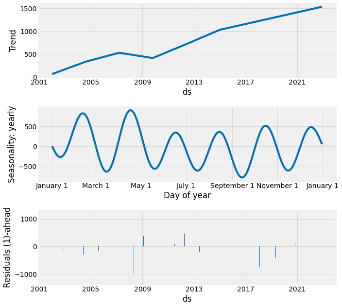
    
Una función que llamó mi atención en *Neural Prophet* es graficar el efecto de los parámetros, lo cual es, hasta cierto punto, una visualización del modelo subyacente. Me parece que esta gráfica reemplaza la gráfica de quiebres estructurales de *Prophet*:

```python
fig_param = nprophet.plot_parameters()
```

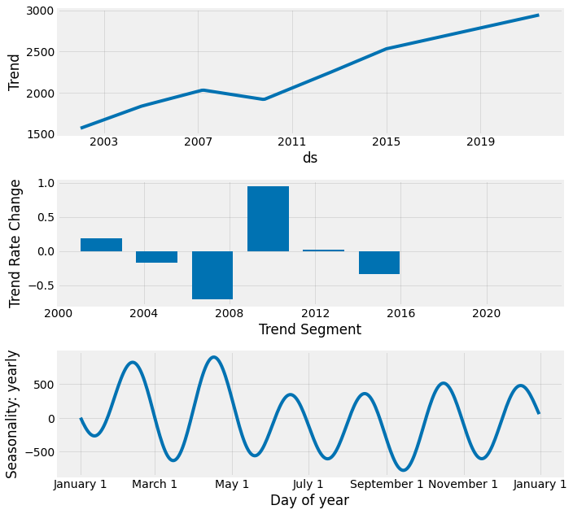

Y finalmente, los comandos para graficar los pronósticos de *Neural Prophet* son similares a aquellos de *Prophet*. Cabe señalar que usó la versión sencilla de las gráficas que corre usando paquete matplotlib, en lugar de las gráficas interactivas que hice para *Prophet* con *plotly*; de momento no exploré dichas gráficas:

```python
forecast = nprophet.predict(future)
forecasts_plot = nprophet.plot(forecast)
```

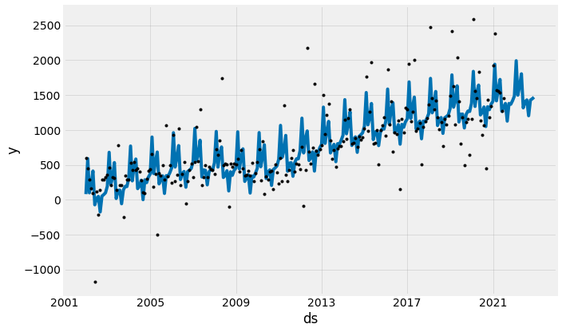

### 3.2 IEPS Cervezas

Luego de correr *Neural Prophet* a la serie de IEPS de cervezas, estos son los pronósticos que obtuve:

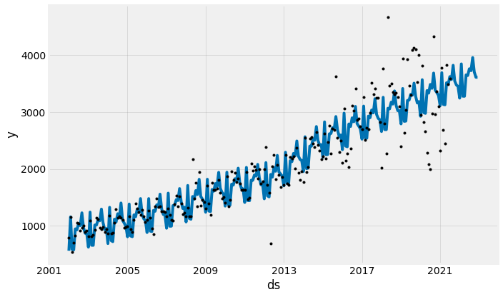

### 3.3 IEPS Gasolinas y Diésel

Luego de correr *Neural Prophet* a la serie del IEPS federal a la venta de gasolinas y diésel, estos son los pronósticos que obtuve:

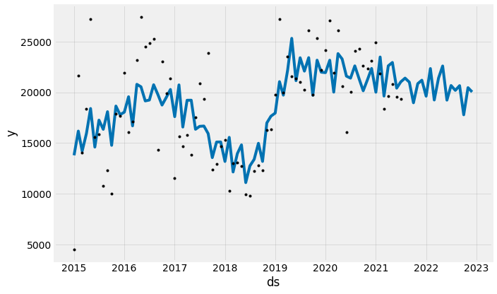

### 3.4 IEPS Tabacos

Luego de correr *Neural Prophet* a la serie del IEPS a tabacos, estos son los pronósticos que obtuve:

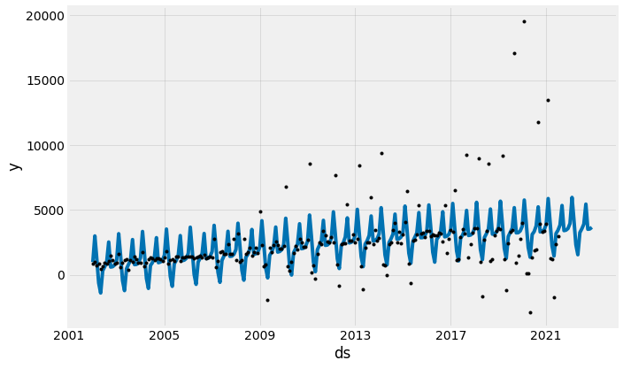

### 3.5 IEPS Bebidas Saborizadas

Luego de correr *Neural Prophet* a la serie del IEPS a tabacos, estos son los pronósticos que obtuve:

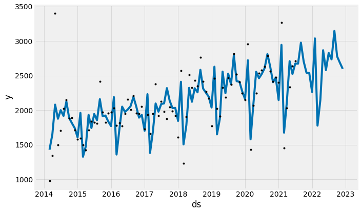

### 3.6 IEPS Alimentos

Luego de correr *Neural Prophet* a la serie del IEPS a los alimentos de alta densidad calórica, estos son los pronósticos que obtuve:

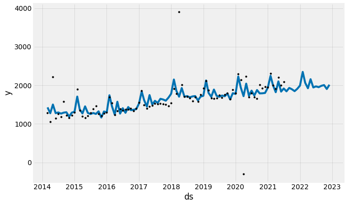

### 3.7 Impuesto a la Importación

Luego de correr *Neural Prophet* a la serie del impuesto a la importación, estos son los pronósticos que obtuve:

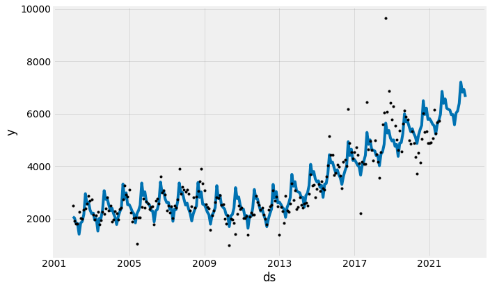

### 3.8 Ingresos Petroleros

Luego de correr *Neural Prophet* a la serie de los ingresos petroleros de la RFP, estos son los pronósticos que obtuve:

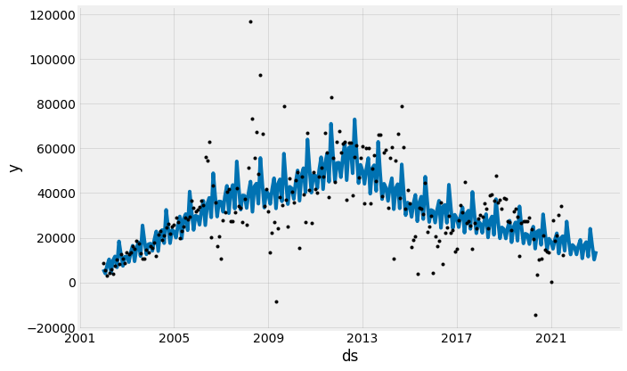

Con las series mensuales completas, las extraigo para su comparación:

```python
iepsg_r=forecast.yhat1
iepst_r=forecast.yhat1
iepsb_r=forecast.yhat1
iepsc_r=forecast.yhat1
iepsbs_r=forecast.yhat1
iepsa_r=forecast.yhat1
importacion_r=forecast.yhat1
petr_r=forecast.yhat1
np_men=pd.DataFrame({'ieps_gas': iepsg_r,
    'ieps_tabacos': iepst_r,
    'ieps_bebidas': iepsb_r,
    'ieps_cervezas': iepsc_r,
    'ieps_bebidassab': iepsbs_r,
    'ieps_alimentos': iepsa_r,
    'importacion': importacion_r,
    'rfp_petroleros': petr_r
})
np_men.to_csv('neural_prophet_mensuales.csv')
```

## 4. Series Trimestrales

Ahora pasaré a las series trimestrales. Aquí sí realicé algunos ajustes al modelo base, que incluyeron agregar mis variables explícativas que determiné en la [primera parte de este duelo]().

### 4.1 Impuesto Sobre la Renta, ISR

En el caso de esta serie, las variables explicativas que utilizaré, son el Producto Interno Bruto (PIB) y una variable dummy para señalar cuando ocurrió una reforma a Ley de este impuesto. Para agregar estas variables explicativas tuve que generar por un lado el bloque hasta las observaciones que tengo, y por otro (cortando los datos donde aún no tengo observaciones):

```python
isr=df[['fecha','isr_real','pib_reale4','reformaisr']]
isr.columns=['ds','y','pib','reformaisr']
isr.drop(isr.tail(6).index,inplace=True)
isr.tail(7)
```

Y en otra base, tengo que colocar las variables explicativas "a futuro". Para el PIB utilicé las proyecciones del Banco de México y supuse que no habrá otra reforma importante del ISR.

```python
x=df[['reformaisr','pib_reale4']]
x.columns=['reformaisr','pib']
x.drop(x.head(78).index,inplace=True)
x.tail()
```

Esto es un poco diferente a *Prophet*, pues éste automáticamente hace la estimación en el rango donde tengo observaciones y expande su horizonte hasta donde tiene variables explicativas. En cambio, *Neural Prophet* interpreta los huecos como observaciones pérdidas ("missing values") y no hace este ajuste. Inclusive en la documentación de *Neural Prophet* el comando para agregar este tipo de variables explicativas se llama [*add_future_regressor*](http://neuralprophet.com/model/future-regressors/). Para ello, el ajuste de la serie lo hice como sigue:

```python
nprophet1 = NeuralProphet(seasonality_mode='multiplicative')
nprophet1.add_future_regressor(name='pib')
nprophet1.add_future_regressor(name='reformaisr')
metrics = nprophet1.fit(isr, freq="QS")
```

    WARNING: nprophet - fit: Parts of code may break if using other than daily data.
    INFO: nprophet.utils - set_auto_seasonalities: Disabling weekly seasonality. Run NeuralProphet with weekly_seasonality=True to override this.
    INFO: nprophet.utils - set_auto_seasonalities: Disabling daily seasonality. Run NeuralProphet with daily_seasonality=True to override this.
    INFO: nprophet.config - set_auto_batch_epoch: Auto-set batch_size to 2
    INFO: nprophet.config - set_auto_batch_epoch: Auto-set epochs to 205
    


      0%|          | 0/100 [00:00<?, ?it/s]


    INFO: nprophet - _lr_range_test: learning rate range test found optimal lr: 2.85E-05
    Epoch[205/205]: 100%|██████████| 205/205 [00:31<00:00,  6.56it/s, SmoothL1Loss=0.352, MAE=1.7e+5, RegLoss=0] 
    
Luego de lo cuál, calcule el pronóstico de *Neural Prophet* como sigue:

```python
future = nprophet1.make_future_dataframe(df=isr, 
                                        periods = 6,
                                        regressors_df=x,
                                        n_historic_predictions=len(isr)                                                                         )
forecast = nprophet1.predict(future)
forecasts_plot = nprophet1.plot(forecast)
```
    
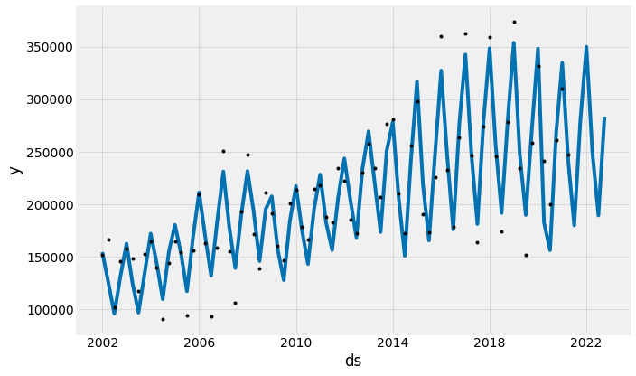

Los componentes y los efectos de los parámetros de esta serie trimestral, se sacan de manera idéntica que para el caso mensual:


```python
fig_comp = nprophet1.plot_components(forecast, residuals=True)
```
 
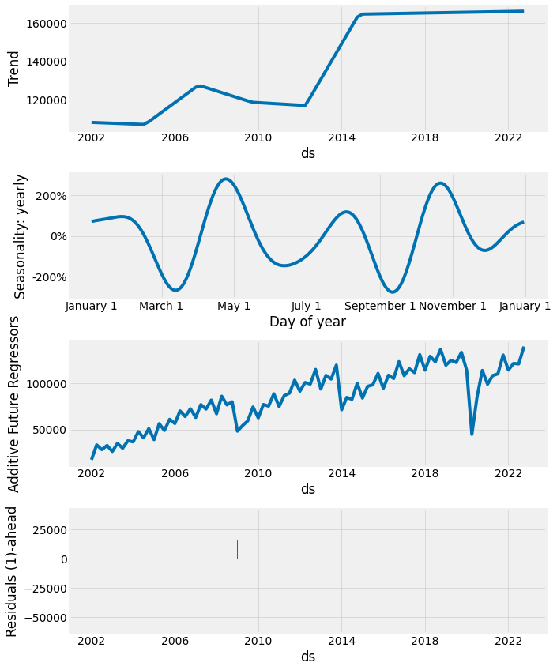
    
```python
fig_param = nprophet1.plot_parameters()
```
    
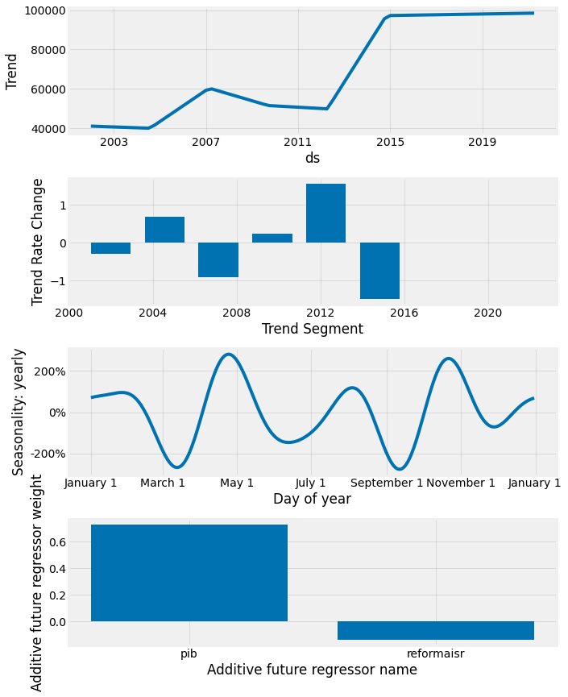

### 4.2 Impuesto al Valor Agregado, IVA

Al usar *Neural Prophet* para la serie del IVA, pero con variables explicativas de la tasa vigente del IVA y el mismo PIB, obtuve el siguiente pronóstico:

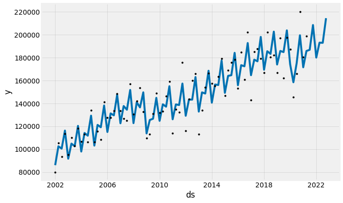

## 5. Pre Cierre

Siendo fan de *Prophet*, *Neural Prophet* resulta igualmente sencillo de utilizar, y sus pronósticos también lucen bastante prometedores. Y a diferencia de [*Greykite*](https://gonzalezhomar.netlify.app/post/pronr2_3greykite) me parece que son más adecuados, aún utilizando el módelo recién salido de la caja. 

Al final de este breve análisis, me gustó que pude implementar una nueva herramienta. Sin embargo, y de manera similar a *Prophet* y a *Greykite*, *Neural Prophet* resulta en una caja negra donde se introducen datos y arroja pronósticos. No obstante, también me gustó.

Lamentablemente, me encontré con que al correr el mismo módelo, con los mismos datos, a veces me generaba diferentes pronósticos. Esto me parece que le resta un poco de confianza a este modelo.

Llegando a lo bueno, como objetivo de esta carrera, quiero evaluar estos pronósticos en términos de qué tan cercanos resultan a la siguiente observación. En esta quinta parte, los pronósticos para el tercer trimestre de 2021 resultaron los siguientes:

| Variable                  | Tercer Trimestre 2021   |
|---------------------------|---------------|
| ISR                       | 317,209.1 |
| IVA                       | 289,094.0 |
| IEPS Gasolinas            | 58,249.0 |
| IEPS Bebidas Alcohólicas  | 13,144.5 |
| IEPS Cervezas             | 3,868.4 |
| IEPS Tabacos              | 10,741.1 |
| IEPS Bebidas Saborizadas  | 8,419.8 |
| IEPS Alimentos            | 5,851.0 |
| Impuesto a la importación | 19,096.3 |
| Ingresos Petroleros       | 63,146.3 |
| RFP       | 788,819.5 |


Aprovechando, que el próximo 8 de septiembre, el Gobierno Federal presentará su Iniciativa de Ley de Ingresos de la Federación para 2022, me parece oportuno extraer el siguiente pronóstico de la RFP para 2022:

| Variable                 |Neural Prophet |ILIF 2022 |
|---------------------------|---------------|---------------|
| ISR                       | 1,580,278.0 |1,687,013.2 |
| IVA                       | 1,146,857.5 |1,213,777.9 
| IEPS Gasolinas            | 244,259.9 |288,602.5 |
| IEPS Bebidas Alcohólicas  | 44,844.3 |46,103.1 |
| IEPS Cervezas             | 18,120.7 |20,169.2 |
| IEPS Tabacos              | 43,310.8 |42,651.0 |
| IEPS Bebidas Saborizadas  | 31,443.5 |32,950.6 |
| IEPS Alimentos            | 24,265.3 |26,962.3 |
| Impuesto a la importación | 75,910.9 |72,939.5 |
| Ingresos Petroleros       | 186,201.0 |297,818.2 |
| RFP       | 3,395,492.0 |3,728,987.5 |


Para ver la versión completa de este análisis, lo pueden consultar en mi repositorio de [Github](https://github.com/gonzalezhomar/articulos_pronosticos) o la pueden ver directamente [aquí](https://nbviewer.jupyter.org/github/gonzalezhomar/articulos_pronosticos/blob/main/PronR2_5.ipynb). 

## 6. Competencia

En resumen, los pronósticos de los 5 competidores para el tercer trimestre de 2021 resultaron los siguientes:

| Variable                  |SARIMAX    |Holt Winters |Prophet    |Greykite  |Neural Prophet |
|---------------------------|-----------|-------------|-----------|----------|---------------|
| ISR                       | 330,019.5 |345,776.8    |335,920.2  |349,287.4 |317,209.1 |
| IVA                       | 293,288.9 |298,731.4    |290,548.8  |287,634.6 |289,094.0 |
| IEPS Gasolinas            | 55,057.4  |66,563.0     |59,340.4   |59,268.8  |58,249.0 |
| IEPS Bebidas Alcohólicas  | 18,463.4  |8,606.5      |17,439.8   |12,208.6  |13,144.5 |
| IEPS Cervezas             | 3,424.7   |3,848.7      |3,497.6    |4,101.4   |3,868.4 |
| IEPS Tabacos              | 10,966.3  |12,231.3     |10,651.0   |9,896.3   |10,741.1 |
| IEPS Bebidas Saborizadas  | 8,211.8   |8,213.4      |8,518.7    |7,642.2   |8,419.8 |
| IEPS Alimentos            | 5,211.3   |6,194.1      |6,323.5    |5,894.6   |5,851.0 |
| Impuesto a la importación | 19,552.1  |19,784.7     |20,128.9   |15,353.1  |19,096.3 |
| Ingresos Petroleros       | 62,891.3  |97,973.4     |56,735.0   |87,746.2  |63,146.3 |
| RFP                       | 807,086.7 |867,923.4    |809,103.8  |839,033.1 |788,819.5 |

Aprovechando, que el 8 de septiembre, el Gobierno Federal presentó su Iniciativa de Ley de Ingresos de la Federación para 2022, me parece oportuno extraer y comparar los pronósticos que me da cada una de las metodologías de la RFP para 2022, y compararlas con el pronóstico federal:

| Variable                  |SARIMAX        |Holt Winters   |Prophet       |Greykite     |Neural Prophet|ILIF 2022 |
|---------------------------|---------------|---------------|--------------|-------------|--------------|---------------|
| ISR                       | 1,597,971.1   |1,898,554.9    |1,657,308.2   |1,649,276.8  |1,580,278.0   |1,687,013.2 |
| IVA                       | 1,127,658.3   |1,209,098.6    |1,150,655.2   |1,126,938.8  |1,146,857.5   |1,213,777.9 |
| IEPS Gasolinas            | 235,284.8     |300,827.6      |267,167.2     |264,023.0    |244,259.9     |288,602.5 |
| IEPS Bebidas Alcohólicas  | 50,900.2      |59,502.7       |55,286.0      |49,659.2     |44,844.3      |46,103.1 |
| IEPS Cervezas             | 18,280.8      |21,255.8       |18,729.1      |17,550.1     |18,120.7      |20,169.2 |
| IEPS Tabacos              | 41,342.6      |52,611.6       |43,904.3      |40,554.6     |43,310.8      |42,651.0 |
| IEPS Bebidas Saborizadas  | 30,383.3      |30,999.6       |31,306.5      |30,695.3     |31,443.5      |32,950.6 |
| IEPS Alimentos            | 20,732.5      |28,548.3       |25,128.9      |24,439.6     |24,265.3      |26,962.3 |
| Impuesto a la importación | 78,120.9      |76,388.0       |76,164.2      |55,796.6     |75,910.9      |72,939.5 |
| Ingresos Petroleros       | 244,596.8     |439,307.8      |149,831.1     |396,734.8    |186,201.0     |297,818.2 |
| RFP                        | 3,445,271.5  |4,117,094.9    |3,475,480.6   |3,655,668.7  |3,395,492.0   |3,728,987.5 |


No quiero evualar el pronóstico del Gobierno Federal, y sólo comentaré que los pronósticos de Holt Winters me parecieron sobreestimados... y así paracer comportarse cuando se comparan contra las otras metodologías. De momento aquí dejaré este trabajo, y esperaré que sea el tiempo el que indique cuál era el mejor modelo, pues la RFP 2022 real se conocerá hasta abril de 2023 cuando el Gobierno Federal presente su Cuenta Pública anual. Yo seguiré prácticando con más herramientas. Que comiencé la carrera, y ¡que las probabilidades estén siempre en su favor!... ¿Poco conocida? Bueno, pues ¡qué la fuerza los acompañe!
