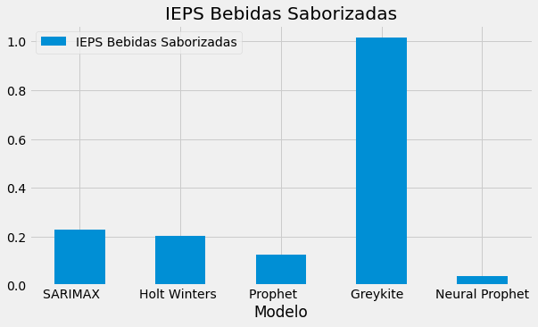
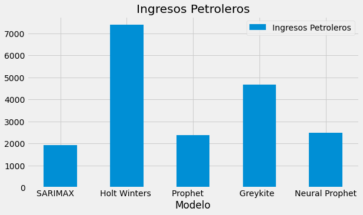

## 1. Introducción

Hace mucho tiempo, en una galaxia muy lejana, comencé este proyecto para hacer pronósticos de series de tiempo, para evaluar los resultados de diferentes modelos y metodologías, desde una óptica *ex-post*. Es decir, quiero evaluar los modelos de series de tiempo, en función de los pronósticos que generan y no en función del ajuste histórico.

Resumiendo el proyecto, utilicé difentes herramientas para hacer pronósticos de los principales impuestos que componen una bolsa llamada Recaudación Federal Participable (RFP). Dicha bolsa es importante para las Entidades Federativas, puesto que a partir de la RFP se determinan los ingresos por participaciones que reciben las Entidades Federativas y los Municipios.

Han pasado algunos meses, pero apenas tengo una nueva observación, por lo que veamos como le fue a los competidores:
- [SARIMAX](https://gonzalezhomar.netlify.app/post/pronr2_1sarimax/)
- [Holt-Winters](https://gonzalezhomar.netlify.app/post/pronr2_2holtwinters/)
- [Prophet](https://gonzalezhomar.netlify.app/post/pronr2_3prophet/)
- [Greykite](https://gonzalezhomar.netlify.app/post/pronr2_4greykite/)
- [Neural Prophet](https://gonzalezhomar.netlify.app/post/pronr2_5neuralprophet/)

Las bases de datos y las notebooks con el código completo de esta serie de publicaciones se pueden encontrar en mi repositorio de [Github](https://github.com/gonzalezhomar/articulos_pronosticos).

## 2. Resultados

Luego de tener estos modelos guardados en el cajón, para el tercer trimestre de 2021 tengo los siguientes pronósticos:

| Variable                  |SARIMAX    |Holt Winters |Prophet    |Greykite  |Neural Prophet|
|---------------------------|-----------|-------------|-----------|----------|--------------|
| Impuesto Sobre la Renta   | 330,019.5 |345,776.8    |335,920.2  |349,287.4 |317,209.1     |
| Impuesto al Valor Agregado| 293,288.9 |298,731.4    |290,548.8  |287,634.6 |289,094.0     |
| IEPS Gasolinas            | 55,057.4  |66,563.0     |59,340.4   |59,268.8  |58,249.0      |
| IEPS Bebidas Alcohólicas  | 18,463.4  |8,606.5      |17,439.8   |12,208.6  |13,144.5      |
| IEPS Cervezas             | 3,424.7   |3,848.7      |3,497.6    |4,101.4   |3,868.4       |
| IEPS Tabacos              | 10,966.3  |12,231.3     |10,651.0   |9,896.3   |10,741.1      |
| IEPS Bebidas Saborizadas  | 8,211.8   |8,213.4      |8,518.7    |7,642.2   |8,419.8       |
| IEPS Alimentos            | 5,211.3   |6,194.1      |6,323.5    |5,894.6   |5,851.0       |
| Impuesto a la importación | 19,552.1  |19,784.7     |20,128.9   |15,353.1  |19,096.3      |
| Ingresos Petroleros       | 62,891.3  |97,973.4     |56,735.0   |87,746.2  |63,146.3      |
**| Recaudación Federal Participable | 807,086.7 |867,923.4    |809,103.8  |839,033.1 |788,819.5  |**

Antes de adelantarnos y ver como le fue a la RFP, veamos cómo le fue estas proyecciones para cada uno de los impuestos, utilizando la clásica medida de la suma de los errores cuadrados.

```python
import numpy as np 
import pandas as pd 
import matplotlib.pyplot as plt
%matplotlib inline
plt.style.use('fivethirtyeight')
df = pd.read_csv('RFP_20213TSSR.csv', sep=',', encoding = 'utf-8')
#list(df.columns)
```

### 2.1 Impuesto Sobre la Renta

En cuanto al Impuesto Sobre la Renta (ISR), que es el principal componente de la RFP, el pronóstico más cercano fue el que obtuve ocn Neural Prophet. 

```python
isr = df.plot.bar(x='Variable', y='ISR', rot=0,
                  figsize=(9,5), #color=['blue','blue','blue','blue','blue','black'],
                 title='Impuesto Sobre la Renta')
```


    
### 2.2 Impuesto al Valor Agregado

En cuanto al Impuesto al Valor Agregado (IVA), que es el segundo principal componente de la RFP, el pronóstico más cercano fue el que obtuve ocn *Holt-Winters*. 

```python
iva = df.plot.bar(x='Variable', y='IVA', rot=0, 
                  figsize=(9,5), 
                 #color=['blue','blue','blue','blue','blue','black'],
                  title='Impuesto al Valor Agregado')
```


    
### 2.3 IEPS Gasolinas y Diésel

En cuanto al Impuesto Especial sobre Producción y Servicios (IEPS) a la venta final de gasolinas y diésel, el pronóstico más cercano fue también con *Holt-Winters*. 

```python
iepsg = df.plot.bar(x='Variable', y='IEPS Gasolinas', rot=0, 
                    figsize=(9,5), #color=['blue','blue','blue','blue','blue','black'],
                   title='IEPS Gasolinas y Diesel')
```


    
### 2.4 IEPS Bebidas Alcohólicas

En cuanto al IEPS a las bebidas alcohólicas, el pronóstico más cercano fue *SARIMAX*. 

```python
iepsb = df.plot.bar(x='Variable', y='IEPS Bebidas Alcoholicas', rot=0, 
                    figsize=(9,5), #color=['blue','blue','blue','blue','blue','black'],
                  title='IEPS Bebidas Alcohólicas' )
```


    
### 2.5 IEPS Cervezas

En cuanto al IEPS a las cervezas, el pronóstico más cercano fue *Greykite*. 

```python
iepsc = df.plot.bar(x='Variable', y='IEPS Cervezas', rot=0, 
                    figsize=(9,5), #color=['blue','blue','blue','blue','blue','black'],
                   title='IEPS Cervezas')
```


    
### 2.6 IEPS Tabacos

En cuanto al IEPS a los tabacos, el pronóstico más cercano fue *Holt-Winters*. 

```python
iepst = df.plot.bar(x='Variable', y='IEPS Tabacos', rot=0, 
                    figsize=(9,5), #color=['blue','blue','blue','blue','blue','black'],
                  title='IEPS Tabacos' )
```
 

    
### 2.7 IEPS Bebidas Saborizadas

En cuanto al IEPS a las bebidas saborizadas, el pronóstico más cercano fue *Prophet*. 

```python
iepsbs = df.plot.bar(x='Variable', y='IEPS Bebidas Saborizadas', rot=0, 
                    figsize=(9,5), #color=['blue','blue','blue','blue','blue','black'],
                  title='IEPS Bebidas Saborizadas' )
```


    
### 2.8 IEPS Alimentos

En cuanto al IEPS a los alimentos de alta densidad calórica, el pronóstico más cercano fue *Prophet*. 

```python
iepsa = df.plot.bar(x='Variable', y='IEPS Alimentos', rot=0, 
                    figsize=(9,5), #color=['blue','blue','blue','blue','blue','black'],
                  title='IEPS Alimentos' )
```


    
### 2.9 Impuesto a la Importación

En cuanto al impuesto a la importación, el pronóstico más cercano fue *Prophet*. 

```python
imp = df.plot.bar(x='Variable', y='Impuesto a la importacion', rot=0, 
                    figsize=(10,6), #color=['blue','blue','blue','blue','blue','black'],
                  title='Impuesto a la importacion' )
```
    

    
### 2.10 Ingresos Petroleros

En cuanto a los ingresos petroleros que forman parte de la RFP, el pronóstico más cercano fue *Holt-Winters*. 


```python
petro = df.plot.bar(x='Variable', y='Ingresos Petroleros', rot=0, 
                    figsize=(9,5), #color=['blue','blue','blue','blue','blue','black'],
                  title='Ingresos Petroleros' )
```
    

    
### 2.11 Recaudación Federal Participable

En cuanto al gran total de la Recaudación Federal Participable, el ganador en esta primera observación es el modelo *Neural Prophet*, seguido muy de cerca por *SARIMAX* y *Prophet*

```python
rfp = df.plot.bar(x='Variable', y='RFP', rot=0, 
                    figsize=(9,5), #color=['blue','blue','blue','blue','blue','black'],
                  title='Recaudación Federal Participable' )
```
    


## 3. Conclusión

Si bien, en el gran total ganó el módelo *Neural Prophet*, en general, me parece que los modelos generaron muy buenos pronósticos de la RFP, pues se ajustaron bastante bien a lo observado realmente, por lo que no actualizaré las proyecciones, sino que continuaré evaluando estos mismos pronósticos para el siguiente trimestre. Para la siguiente observación estimó lo siguiente:

| Variable                  |SARIMAX    |Holt Winters |Prophet    |Greykite  |Neural Prophet|
|---------------------------|-----------|-------------|-----------|----------|--------------|
| ISR                       | 330,019.5 |345,776.8    |335,920.2  |349,287.4 |317,209.1     |
| IVA                       | 293,288.9 |298,731.4    |290,548.8  |287,634.6 |289,094.0     |
| IEPS Gasolinas            | 55,057.4  |66,563.0     |59,340.4   |59,268.8  |58,249.0      |
| IEPS Bebidas Alcohólicas  | 18,463.4  |8,606.5      |17,439.8   |12,208.6  |13,144.5      |
| IEPS Cervezas             | 3,424.7   |3,848.7      |3,497.6    |4,101.4   |3,868.4       |
| IEPS Tabacos              | 10,966.3  |12,231.3     |10,651.0   |9,896.3   |10,741.1      |
| IEPS Bebidas Saborizadas  | 8,211.8   |8,213.4      |8,518.7    |7,642.2   |8,419.8       |
| IEPS Alimentos            | 5,211.3   |6,194.1      |6,323.5    |5,894.6   |5,851.0       |
| Impuesto a la importación | 19,552.1  |19,784.7     |20,128.9   |15,353.1  |19,096.3      |
| Ingresos Petroleros       | 62,891.3  |97,973.4     |56,735.0   |87,746.2  |63,146.3      |
| RFP                       | 807,086.7 |867,923.4    |809,103.8  |839,033.1 |788,819.5     |

Sin más por el momento, nos vemos en un par de meses más. Que siga la carrera, y ¡que las probabilidades estén siempre en su favor!… ¿Poco conocida? Bueno, pues ¡qué la fuerza los acompañe!