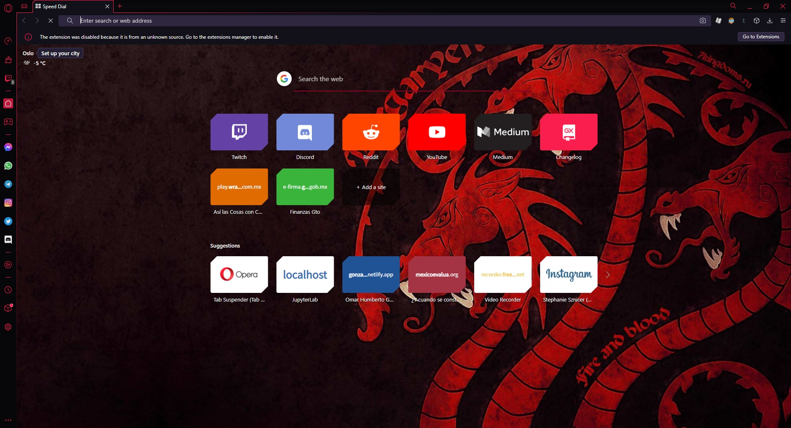
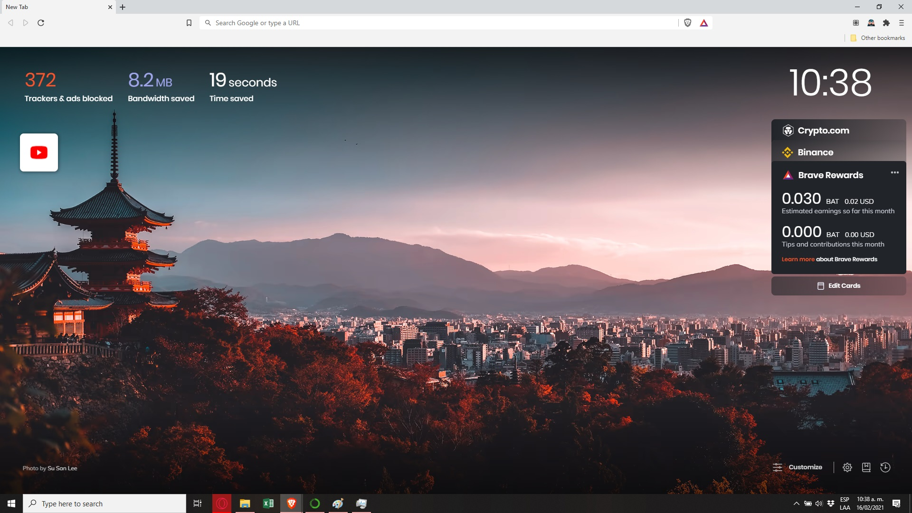

## Surfeando por internet

Lamentablemente no he podido publicar mucho estos días, en especial porque quería publicar algo más grande, pero una charla con un amigo, me dio la idea de publicar este pequeño blog.  Sucede que como toda persona que usa el internet, mi amigo estaba acostumbrado a utilizar solo 2 navegadores, que junto con un 3er hermano, con fama de lento, y un 4to hermano, con fama por su sistema operativo, son los navegadores más populares, así que no los mencionaré.

Sin embargo, hay 2 alternativas muy interesantes, que a continuación recomiendo, incluyendo algunas extensiones para hacer de tu navegación por internet, una experiencia un poco más divertida.

## Navegadores

### [Opera GX](https://www.opera.com/es/gx )
Es un navegador que se promociona como el navegador de los gamers. Me gustó su diseño moderno y la integración que tiene con Facebook Messenger, Whatsapp, Telegram, Twitter, Twitch, entre otras, incorporando todas estas redes del lado izquierdo, evitando tener que abrir pestañas por cada una de ellas.

Este navegador es el que actualmente me encuentro utilizando, y tiene una función muy simple, que me pareció muy divertida: al teclear, se activa un sonido de mecanografía. Dado que utilizó mucho mi correo electrónico, este sonido me genera un microincentivo para continuar escribiendo e inclusive, intentar aumentar mi velocidad de tecleo. Además, también trabajo en Jupyter a través de este navegador y dicho sonido me motiva a seguir escribiendo. De hecho, esta misma página la estoy escribiendo a través de Jupyter en Opera GX.

### [Brave](https://brave.com/es/ )

Una alternativa interesante a los navegadores tradicionales, que se oferta como un navegador seguro, veloz, que respeta la privacidad de sus usuarios, a diferencia de [otros](https://adssettings.google.com/authenticated )

Sin embargo, la función que más me llamó la atención de este navegador es que puedes ganar dinero con solo utilizarlo. 

Aún estoy probando este navegador, por lo que no puedo dar una reseña más amplia, pero a primera vista se ve ampliamente recomendable.

## Extensiones

De manera general, las extensiones son herramientas que incorporan a los navegadores nuevas funciones. Sin embargo, existen tantas extensiones, que es difícil identificar aquellas que pueden ser de utilidad, por lo cual a continuación incluyo las que personalmente uso. Aclaró que como hasta hace poco usaba Google Chrome, la mayoría de ellas proviene de allí.

En el caso de Brave, es compatible con todas las extensiones disponibles para Google Chrome, por lo que se puede hacer la transición de manera muy sencilla. En el caso de Opera GX, encontré que tiene su propia tienda de extensiones (aún no termino de explorarla) y que no es directamente compatible con las extensiones de Chrome. Excepto por,

### [Install Chrome Extensions](https://addons.opera.com/es/extensions/details/install-chrome-extensions/ )
Permite utilizar las extensiones de Google Chrome en Opera GX. Y ya. 

### [uBlock Origin](https://chrome.google.com/webstore/detail/ublock-origin/cjpalhdlnbpafiamejdnhcphjbkeiagm)
Si bien, tanto Brave como Opera GX tienen incorporadas funciones para bloquear anuncios, después de un poco de prueba y error, me parece que esta extensión es mucho más eficiente en bloquear anuncios y no interferir con la navegación. Hay otras alternativas para bloquear anuncios, pero esta me ha gustado bastante.

### [SwiftRead](https://chrome.google.com/webstore/detail/swiftread-read-faster-lea/ipikiaejjblmdopojhpejjmbedhlibno )
Si eres como yo, y te gusta ler, esta aplicación te va a gustar (¿ustedes van a ler?). Si estás leyendo una página web, al usar esta extensión, se abre un cuadro de dialogo a pantalla completa que solo tiene el texto de la página, mostrando una palabra a la vez, con una letra en color amarillo. Uno concentra su vista en la letra amarilla, y a medida que avanza, permite leer cualquier texto a una alta velocidad. Estoy practicando para incrementar mi velocidad, pero apenas voy en 500 palabras por minuto.

### [StayFocusd](https://chrome.google.com/webstore/detail/stayfocusd/laankejkbhbdhmipfmgcngdelahlfoji)
Esta aplicación es de utilidad si te distraes muy fácilmente viendo páginas web que te gustaría dejar de ver y deseas tener un poco de autocontrol. Diariamente te ofrece un límite de tiempo para distraerte en las páginas que tú elijas  y una vez que se agota el tiempo diario, ya no puedes verlas; también puede funcionar al revés y solo permitir ciertas páginas las cuales no consumirán tu tiempo de distracción. Lo malo es que siempre la puedes desintalar o navegar en modo incógnito, lo que dificulta el autocontrol. No obstante, la recomiendo.

### [Stylish](https://chrome.google.com/webstore/detail/stylish-custom-themes-for/fjnbnpbmkenffdnngjfgmeleoegfcffe  )
Esta extensión simplemente sirve para personalizar la vista de sitios populares. Deseas que la barra de carga de video en youtube sea un gatito, lo puedes hacer. Quieres cambiar la vista clásica de la Wikipedia, aquí lo puedes hacer. También incluye temas para Facebook, Netflix, Amazon, entre otros.

### [Evernote Web Clipper](https://chrome.google.com/webstore/detail/evernote-web-clipper/pioclpoplcdbaefihamjohnefbikjilc?hl=en)
Lo que hace esta extensión es guardar contenido que desees leer más tarde en notas. Es compatible con la aplicación evernote de Android y iOS, por lo cual se puede leer el contenido más tarde en el móvil. Esto es interesante si deseas continuar leyendo el documento o página actual, pero luego quieres ver la referencia señalada.

### [ScraperAI](https://chrome.google.com/webstore/detail/scraperai-an-ai-powered-w/acffgfiikphcopeiadpdmlpageboncak) e [Instant Data Scrapper](https://chrome.google.com/webstore/detail/instant-data-scraper/ofaokhiedipichpaobibbnahnkdoiiah )
En este apartado recomiendo 2 extensiones que tienen el mismo objetivo: web-scraping o tomar datos de internet. A través de estas extensiones, puedes tomar información en internet, que normalmente no se encuentra disponible, y convertirla en tablas o en otros formatos. No obstante, preferí utilizar Python puro para extraer la información que utilice [aquí](https://gonzalezhomar.netlify.app/post/mi-primer-mapa/ ).

### [Screen Recorder](https://recorder.freeonlineapps.net/   )
Con esta extension puedes grabar lo que estés viendo en tú pantalla, grabar una pestaña del navegador, e incluir o no incluir grabación de voz. Luego estas grabaciones se pueden incluir en otros formatos.

### [The Great Suspender](https://chrome.google.com/webstore/detail/the-great-suspender-origi/ahmkjjgdligadogjedmnogbpbcpofeeo )
Una de las razones por las que quise cambiar de navegador es por la cantidad de memoria RAM que consumía Google Chrome, cuando tenía varias pestañas abiertas. Y dado que quiero continuar con mis 10 pestañas abiertas al mismo tiempo, esta extensión me pudo ayudar. Lo que hace es dejar en suspenso las pestañas que no usas y así, evitar que se agote la memoria RAM. Ideal para computadoras con poca capacidad.

### [Open with Overleaf](https://chrome.google.com/webstore/detail/open-with-overleaf/ogkcgcbjhhpamnmaaplbafkmedigofaa?hl=es-ES )
Entramos a las extensiones académicas o científicas. Lo que hace esta aplicación, es abrir documentos generados con código LaTeX, en dicho formato , dentro del mismo navegador. Así, si estas en una computadora sin editor LaTeX, puedes abrir directamente el código, editar, guardar  y compilar el código. Lamentablemente, solo funciona en aquellos documentos cuyo código está disponible públicamente. 

### [Arxiv Vanity Plugin](https://chrome.google.com/webstore/detail/arxiv-vanity-plugin/jfnlkegibnoaagfdabjkchhocdhnoofk)
Esta extensión es de utilidad si lees o públicas contenido académico y científico en la página arxiv La X, en realidad no es X, sino la letra griega chi, po lo cual en inglés se lee como “archiv” y se pronuncia como “arcaib” (jeje), y proviene de la palabra archivo (doble jeje). 

[Arxiv](https://arxiv.org/) y [Medrxiv](https://www.medrxiv.org/) son repositorios de acceso libre, donde se publican investigaciones científicas en la frontera del conocimiento (mucha investigación del coronavirus se encuentra disponible [aquí](https://www.medrxiv.org/search/coronavirus ) ). Muchas de estas publicaciones ya fueron revisadas, pero aún no pasan el filtro de arbitraje (peer review) mientras otras se encuentran en la etapa final de publicación.

Lo que hace esta extensión, es cambiar la vista de los archivos disponibles en Arxiv, de un formato en [pdf aburrido](https://arxiv.org/pdf/1709.10478.pdf)  a una página web, que se puede [leer de mejor manera](https://www.arxiv-vanity.com/papers/1709.10478/).

### [CatalyzeX](https://chrome.google.com/webstore/detail/%F0%9F%92%BB-catalyzex-link-all-aim/aikkeehnlfpamidigaffhfmgbkdeheil )
Otra extensión para publicaciones académicas o científicas. A través de esta extensión, puedes ver el código computacional mediante el cual fue creado algún artículo científico. Si bien, esta extensión está concentrada en artículos de aprendizaje automático o de inteligencia artificial, creo que puede ser de gran utilidad para ver los códigos que se encuentren disponibles.

### [Scener](https://chrome.google.com/webstore/detail/scener-%E2%80%93-virtual-movie-th/lkhjgdkpibcepflmlgahofcmeagjmecc )
Me consideró muy afortunado porque no he tenido que usar esta extensión, pero me recomendaron ampliamente su versión en app para Android. Básicamente permite que varias personas vean la misma película al mismo tiempo. Incluye la opción de platicar… aunque no me gusta platicar durante las películas. Ideal para quienes quieren compartir un tiempo de cine y respetar la sana distancia. 

Finalmente, cierro con otras aplicaciones que estoy por probar:
- [Añadir el juego 2048 a la barra lateral de Opera GX](https://addons.opera.com/es/extensions/details/2048-sidebar/).
- [Notificaciones de nuevos correos de Gmail](https://addons.opera.com/es/extensions/details/gmail-notifier/).
